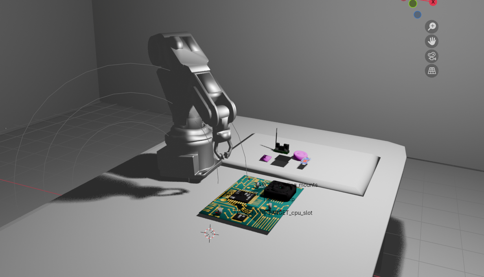
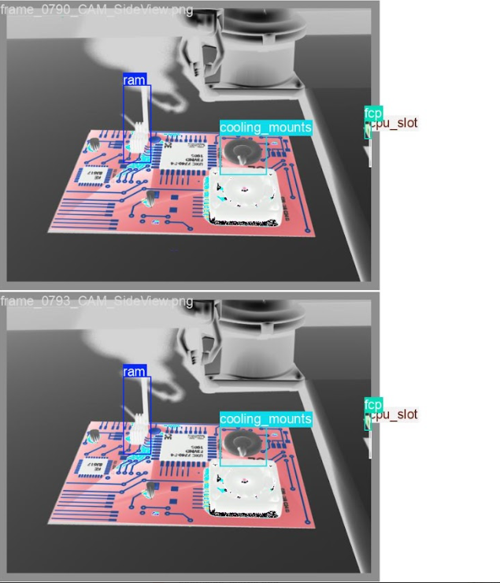
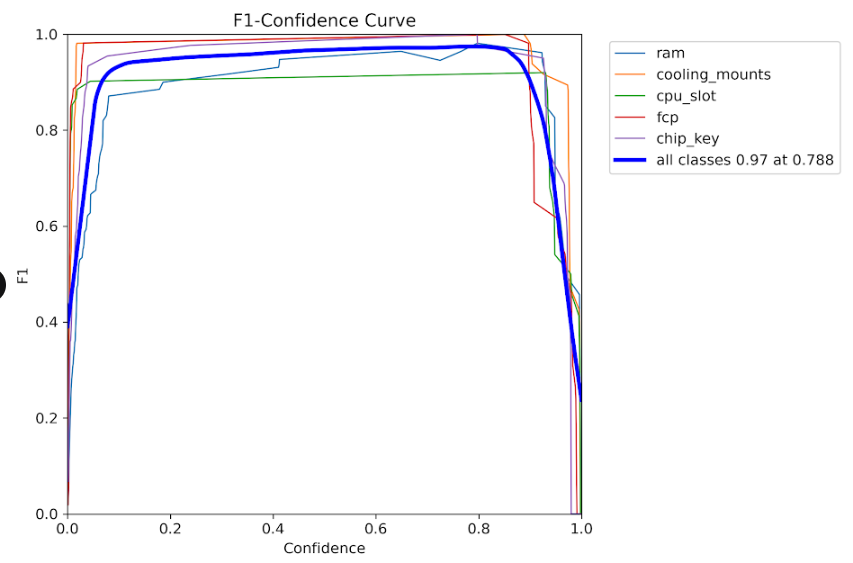
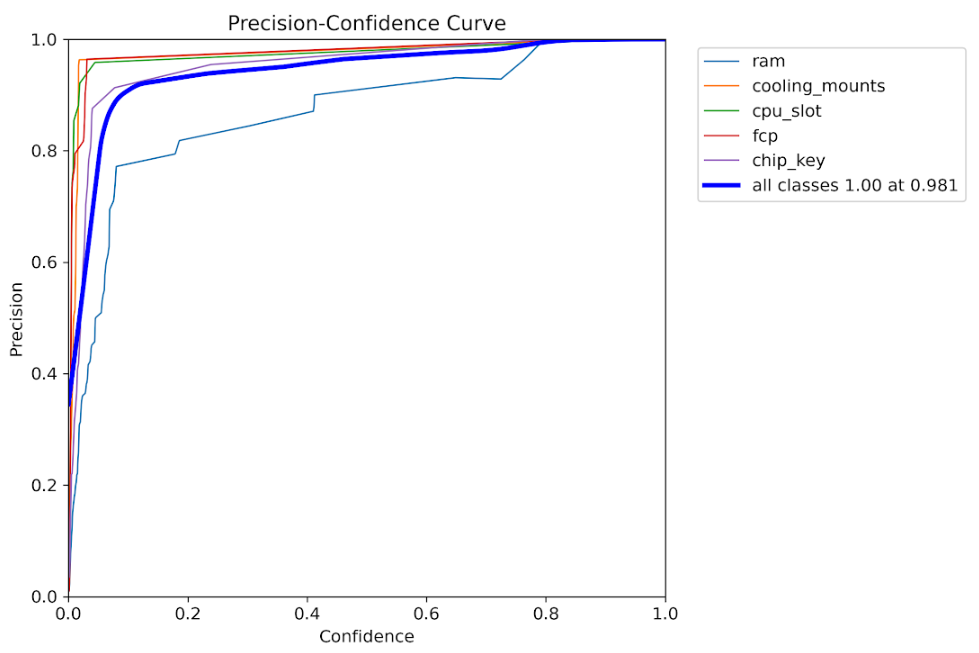
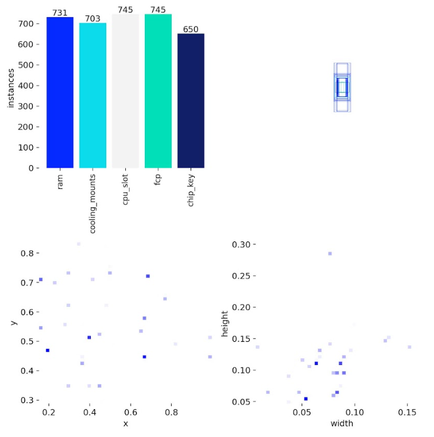
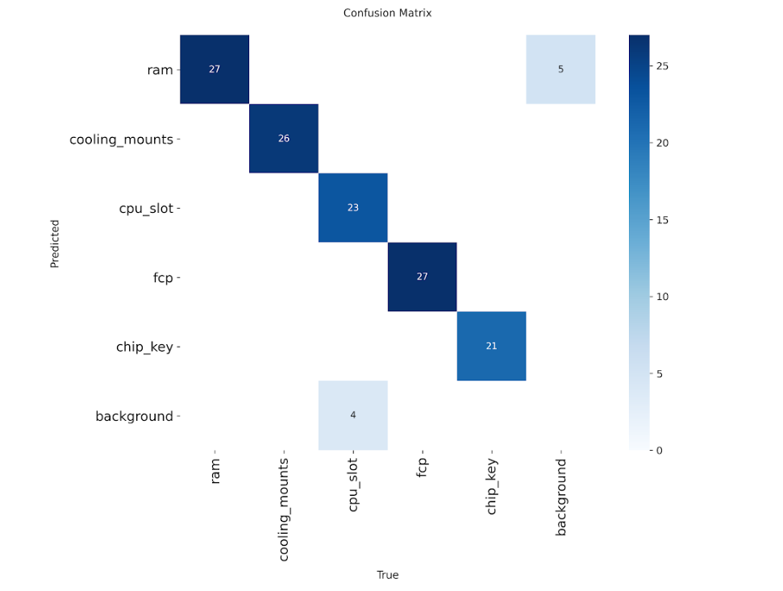
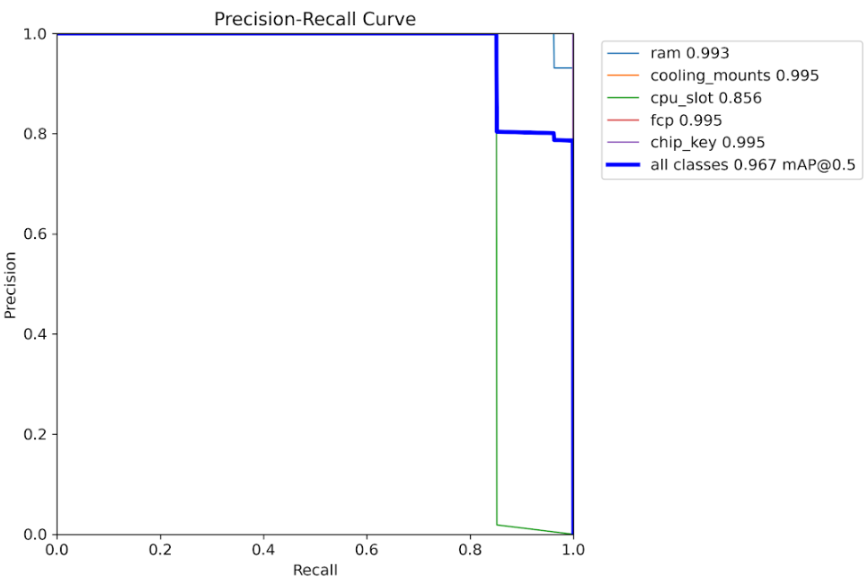
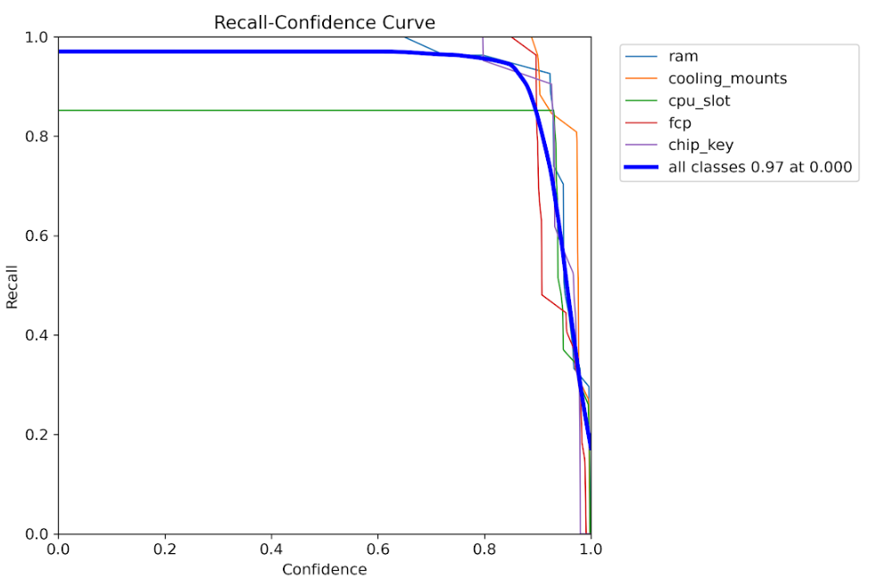
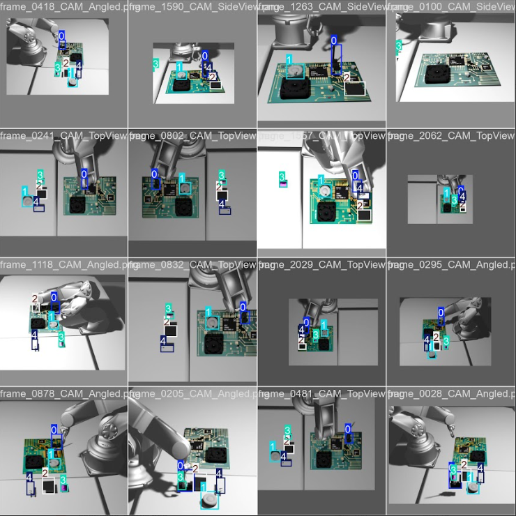

# Embodied Intelligence meets KubeEdge-Ianvs: Industrial Assembly Benchmarking

This blog introduces how to enable comprehensive embodied intelligence benchmarking for industrial manufacturing using the KubeEdge-Ianvs framework. **You will see**:


---

### Video Explanation

[Industrial Embodied Intelligence Dataset(CNCF'LFX 25@kubeedge8739 )Project Explanation](https://youtu.be/LviadKqa3og?si=hA8PEwrRLSXtmtVw)

### YOLO Detection Predictions

Real-world inference results on test images showing deformable component detection:

| | |
|---|---|
|   |  |

### Model Performance Analysis

| | |
|---|---|
|  |  |
| *Optimal F1-score achieved at confidence threshold of ~0.5* | *High precision maintained across various confidence levels* |

### Dataset Analysis

| | |
|---|---|
|  |  |
| *Distribution of component classes across the training dataset* | *Spatial correlation analysis between different component types* |

## Why Embodied Intelligence Benchmarking for Industrial Manufacturing?

The manufacturing industry is experiencing a profound transformation driven by intelligent robotics, adaptive production lines, and precision assembly systems. Modern industrial environments demand more than basic task execution,they require multimodal perception, force-controlled manipulation, and real-time quality verification integrated into cohesive workflows.

### A First-of-Its-Kind Benchmark Addressing Critical Gaps

Despite growing interest in Embodied Intelligence for manufacturing, the research community faces a critical shortage of benchmarks that evaluate real-world industrial assembly scenarios. Existing work falls short in several key areas:

#### Current Limitations in the Field:

- **Isolated Task Focus**: Popular benchmarks like YCB and OCRTOC evaluate individual capabilities (grasping, object detection) but don't assess how these integrate in multi-stage industrial workflows
- **Missing Deformable Component Coverage**: While NIST has developed benchmarks for rigid components and simple deformable objects (cables, belts), existing datasets don't support multiple representations of deformable objects with different self-occlusions typical in manufacturing [PubMed Central](https://www.ncbi.nlm.nih.gov)
- **No Electronic Assembly Benchmarks**: Despite datasets for PCB defect detection (BoardVision, FICS-PCB) and component recognition (ElectroCom61), none evaluate robotic assembly of electronic components, particularly those requiring precision force control
- **Academic-Industry Gap**: A large gap exists between embodied AI in academic research and what manufacturers can feasibly implement [National Institute of Standards and Technology](https://www.nist.gov/), with limited benchmarks that mirror real production challenges

#### What Makes This Project Unique:

This work represents the **first comprehensive benchmark** for robotic assembly of deformable electronic components,a scenario ubiquitous in modern electronics manufacturing yet completely absent from existing research infrastructure. Our contributions are unprecedented in scope:

1. **First Multimodal Industrial Assembly Dataset**: To our knowledge, no publicly available dataset combines RGB-D vision, force/torque sensor data, and robot trajectories for electronic component assembly.

2. **First Deformable Electronics Benchmark**: Existing deformable object benchmarks focus on textiles (GarmentLab), food items, or abstract shapes. This is the first benchmark specifically designed for deformable electronic components like flexible circuits and memory modules,components that require both precision alignment and compliance control.

3. **First End-to-End Assembly Workflow Evaluation**: Unlike fragmented benchmarks that test perception OR manipulation OR verification separately, we evaluate complete assembly pipelines. This mirrors how industrial systems actually operate, where failure in any stage cascades to overall task failure.

4. **Practical Manufacturing Relevance**: Our five assembly scenarios (RAM modules, cooling mounts, CPU sockets, flexible circuits, security chips) represent actual production challenges in electronics manufacturing,an industry segment worth over $2 trillion globally that currently relies heavily on manual assembly due to lack of validated automation solutions.

### Addressing Real Industrial Needs

The electronics manufacturing sector faces mounting pressure to automate assembly operations involving:

- Sub-millimeter positioning tolerances (CPU socket assembly: 55% accuracy in our baseline)
- Deformable components requiring force adaptation (flexible circuits: 70% accuracy baseline)
- Quality verification at component scale (current detection: 91.19% mAP50)

Manufacturers need streamlined ways of assessing the productive impact of AI systems through AI-specific productivity metrics and test methods [National Institute of Standards and Technology](https://www.nist.gov/). This benchmark directly addresses that need by providing:

- **Realistic Industrial Scenarios**: Deformable component assembly representing real manufacturing challenges
- **Comprehensive Multimodal Dataset**: RGB-D images, force/torque sensor data, and robot trajectories,the complete sensor suite used in production environments
- **End-to-End Evaluation**: Metrics that assess entire workflows, not just individual subtasks, revealing integration challenges invisible to component-level testing
- **Reproducible Infrastructure**: Standardized test environments and baseline algorithms that enable fair comparison across different robotic systems

By combining distributed AI benchmarking framework KubeEdge-Ianvs with this domain-specific industrial dataset, we enable objective comparison of robotic systems on tasks that mirror real-world manufacturing complexity,bridging the gap between academic research and industrial deployment while accelerating the development of reliable autonomous assembly systems.

---

### Contents:

- [Prerequisites](#prerequisites)
- [Dataset Setup](#dataset-setup)
- [Benchmark Configuration](#benchmark-configuration)
- [Algorithm Integration](#algorithm-integration)
- [Analyze Results](#analyze-results)
- [Ianvs Installation](#ianvs-installation)
- [Run Benchmarking](#run-benchmarking)

---

## Prerequisites

### System Requirements:

- One machine (laptop or VM) with 4+ CPUs
- 8GB+ RAM (depends on simulation complexity)
- 20GB+ free disk space
- Internet connection for downloads
- Python 3.8+ installed (Python 3.9 recommended)
- CUDA-capable GPU recommended for YOLOv8 (optional but accelerates training)

### Knowledge Requirements:

- Basic understanding of Python and machine learning
- Familiarity with robotic manipulation concepts
- Understanding of computer vision fundamentals

> **Note**: This benchmark has been tested on Linux platforms. Windows users may need to adapt commands accordingly.

---

## Dataset Setup

The **Deformable Component Assembly Dataset** is a comprehensive multimodal dataset specifically designed for industrial assembly benchmarking. It contains:

- RGB and depth images from simulated PyBullet cameras
- Force/torque sensor data from robot wrist measurements
- YOLO-format annotations for object detection training
- Assembly success/failure labels for end-to-end evaluation
- Robot trajectory logs capturing full motion sequences

### Download the Dataset

Access the dataset from Kaggle:
```bash
# Download from: https://www.kaggle.com/datasets/kubeedgeianvs/deformable-assembly-dataset

mkdir -p /ianvs/datasets
cd /ianvs/datasets
```

Transfer the downloaded `.zip` file to the datasets folder and extract:
```bash
unzip deformable_assembly_dataset.zip
```

### Dataset Structure

The dataset contains **2,227 frames** across **5 episodes**, each focusing on different component types:
```
deformable_assembly_dataset/
├── episodes/
│   ├── episode_001_ram/              # 451 frames - RAM module assembly
│   │   ├── images/
│   │   │   ├── rgb/                  # RGB camera frames
│   │   │   ├── depth/                # Depth maps
│   │   │   └── segmentation/         # Segmentation masks
│   │   ├── labels/                   # YOLO format annotations
│   │   ├── sensor_data/              # Force/torque logs
│   │   │   ├── force_torque_log.csv
│   │   │   └── robotic_arm_poses.csv
│   │   └── metadata/
│   ├── episode_002_cooling_mounts/   # 400 frames
│   ├── episode_003_cpu_slot/         # 400 frames
│   ├── episode_004_fcp/              # 400 frames - Flexible circuits
│   └── episode_005_chip_key/         # 577 frames
├── index/                            # Train/test splits
│   ├── train_index1.txt
│   ├── test_index1.txt
│   └── ...
└── dataset_info.json
```

Each episode represents a distinct assembly challenge:

| Episode | Component      | Frames | Challenge                         |
|---------|----------------|--------|-----------------------------------|
| 1       | RAM            | 451    | Memory module alignment and insertion |
| 2       | Cooling Mounts | 400    | Thermal component placement       |
| 3       | CPU Slot       | 400    | Processor socket assembly         |
| 4       | FCP            | 400    | Deformable circuit handling       |
| 5       | Chip Key       | 577    | Security chip installation        |

**Total Dataset Size**: ~830 MB

---

## Algorithm Integration

The benchmark implements a **multi-stage single-task paradigm** that orchestrates three sequential modules:

### 1. Perception Module (`perception.py`)

Uses YOLOv8 for real-time component detection:

- Identifies component locations on the assembly panel
- Provides bounding boxes with confidence scores
- Extracts orientation information for grasping

### 2. Manipulation Module (`manipulation.py`)

Implements force-controlled assembly operations:

- Executes precise grasping based on detection results
- Uses haptic feedback for delicate component handling
- Adapts to deformation during flexible circuit placement
- Monitors force/torque to prevent damage

### 3. Verification Module (`perception.py`)

CNN-based visual quality inspection:

- Captures final assembly state
- Detects misalignments and defects
- Generates pass/fail classifications

The entire workflow is orchestrated by `naive_assembly_process.py`, which executes these stages sequentially for each component type.

---

## Results

Results are available in the output directory (`/ianvs/industrialEI_workspace`) as defined in `benchmarkingjob.yaml`.

### Comprehensive Performance Report
```
╔═══════════════════════════════════════════════════════════════════════════╗
║                    🎯 EVALUATION COMPLETE                                 ║
║                                                                           ║
║  ► Overall Accuracy Score: 6400                                          ║
║  ► Overall Accuracy Percentage: 64.00%                                   ║
║  ► Detection mAP50: 91.19%                                               ║
║  ► Assembly Success Rate: 83.33%                                         ║
║  ► Total Frames Processed: 150                                           ║
║  ► Successful Assemblies: 125                                            ║
║                                                                           ║
║  🏆 Final Combined Score: 0.7759 (77.59%)                                ║
╚═══════════════════════════════════════════════════════════════════════════╝
```

### Per-Component Performance Metrics
```
┌───────────────┬────────┬──────┬───────┬───────┬───────┬───────┬────────┬───────┐
│ Component     │ Frames │ Imgs │ Prec% │ Rec%  │ mAP50 │ mAP95 │ Acc%   │ Succ% │
├───────────────┼────────┼──────┼───────┼───────┼───────┼───────┼────────┼───────┤
│ ram           │ 30     │ 136  │ 94.1  │ 73.5  │ 89.4  │ 62.5  │ 60.0   │ 83.3  │
│ cooling_mounts│ 30     │ 120  │ 99.6  │ 99.2  │ 99.5  │ 91.8  │ 65.0   │ 83.3  │
│ cpu_slot      │ 30     │ 150  │ 99.3  │ 80.0  │ 82.5  │ 72.4  │ 55.0   │ 83.3  │
│ fcp           │ 30     │ 150  │ 96.1  │ 81.7  │ 88.2  │ 75.9  │ 70.0   │ 83.3  │
│ chip_key      │ 30     │ 120  │ 99.6  │ 99.2  │ 99.5  │ 95.7  │ 70.0   │ 83.3  │
╞═══════════════╪════════╪══════╪═══════╪═══════╪═══════╪═══════╪════════╪═══════╡
║ OVERALL       ║ 150    ║ 676  ║ 97.7  ║ 85.9  ║ 91.2  ║ 78.8  ║ 64.0   ║ 83.3  ║
└───────────────┴────────┴──────┴───────┴───────┴───────┴───────┴────────┴───────┘
```

#### Metric Definitions:

- **Frames**: Number of test frames processed
- **Images**: Number of training images used
- **Prec%**: Detection precision (true positives / predicted positives)
- **Rec%**: Detection recall (true positives / actual positives)
- **mAP50**: Mean Average Precision at IoU threshold 0.50
- **mAP95**: Mean Average Precision at IoU 0.50:0.95 range
- **Acc%**: Assembly accuracy (weighted combination of position, orientation, deformation control, and force feedback)
- **Succ%**: Binary assembly success rate

### Training Performance Analysis

The benchmark provides comprehensive training visualizations:

**Matplotlib curves:**
## Model Performance & Dataset Analysis
 
| **Metric Type** | **Visualization 1** | **Visualization 2** |
|---|---|---|
| **Confidence Analysis** | <br/>*Optimal F1-score achieved at confidence threshold of ~0.5* | <br/>*High precision maintained across various confidence levels* |
| **Trade-off Analysis** | <br/>*Trade-off analysis between precision and recall metrics* | <br/>*Recall performance across different detection thresholds* |
| **Dataset Insights** | <br/>*Distribution of component classes across the training dataset* | <br/>*Spatial correlation analysis between different component types* |
### YOLO Detection Predictions

Real-world inference results on test images showing deformable component detection:



Real-world inference results on test images showing deformable component detection:

| | |
|---|---|
|  |  |


Model successfully detects RAM modules, cooling mounts, CPU slots, FCPs, and chip keys with accurate bounding boxes*

**Key training insights:**

- **F1-Score vs Confidence**: Optimal performance at ~0.5 confidence threshold
- **Precision-Recall Trade-off**: High precision maintained across recall ranges
- **Loss Convergence**: Stable training with consistent loss reduction

### Validation Results

These visualizations demonstrate the model's capability to accurately detect and localize components across diverse assembly scenarios.

---

## Key Achievements and Community Impact

This embodied intelligence benchmarking framework delivers significant value to the industrial AI community:

### 1. Comprehensive Multimodal Dataset

A publicly available dataset containing:

- 2,227 annotated frames across 5 component types
- RGB-D images with precise calibration
- Force/torque sensor logs with millisecond precision
- Complete robot trajectory data
- Assembly success labels validated against industrial standards

### 2. End-to-End Evaluation Infrastructure

Unlike existing benchmarks that assess isolated capabilities, this framework evaluates:

- Complete multi-stage workflows from perception to verification
- Integration quality between vision and force control
- Real-world assembly success rates
- System robustness across component variations

### 3. Reproducible Baseline Algorithms

Production-ready implementations including:

- YOLOv8-based component detection achieving 91.19% mAP50
- Force-controlled manipulation with haptic feedback
- CNN visual inspection for quality assurance
- Complete workflow orchestration framework

### 4. Standardized Performance Metrics

Industry-relevant metrics that capture:

- Detection accuracy (Precision, Recall, mAP)
- Assembly quality (position, orientation, deformation control)
- Overall success rates (83.33% baseline)
- Combined performance scores for leaderboard rankings

This benchmark enables fair comparison of different embodied intelligence approaches, accelerating innovation in industrial automation.

---

## Technical Insights and Future Directions

The benchmark reveals important insights about industrial embodied intelligence:

### Current Capabilities:

- High detection performance (97.7% precision, 85.9% recall overall)
- Consistent success rates across component types (83.3%)
- Robust handling of deformable components (FCP assembly: 70% accuracy)

### Improvement Opportunities:

- RAM module assembly shows lower recall (73.5%), indicating detection challenges with reflective surfaces
- CPU slot assembly has reduced accuracy (55%), suggesting the need for finer position control
- Deformable component handling requires enhanced force feedback algorithms

### Future Enhancements

The framework is designed to accommodate advanced features:

- **Intelligent decision-making**: Conditional logic for accessory selection based on assembly configuration
- **Failure recovery**: Adaptive re-planning when initial assembly attempts fail
- **Complex workflows**: Multi-robot coordination for larger assemblies
- **Transfer learning**: Cross-component generalization to reduce training requirements

For more technical details and ongoing development, see the project repository and subscribe to updates.

---
## How to Enable Embodied Intelligence Benchmarking with KubeEdge-Ianvs

The following procedures set up a complete benchmarking environment for industrial assembly tasks using KubeEdge-Ianvs with custom multimodal datasets.

After completing these steps, you'll have a fully operational benchmark capable of evaluating multi-stage robotic assembly workflows.
[Ianvs readme](https://github.com/kubeedge/ianvs/blob/main/examples/industrialEI/single_task_learning_bench/deformable_component_manipulation/README.md)


## Getting Started with Your Own Benchmarks

---
## Ianvs Installation

### 1. Download the Ianvs codebase

```bash
git clone https://github.com/kubeedge/ianvs.git
cd ianvs
```

### 2. Create and activate a virtual environment
```bash
sudo apt-get install -y virtualenv
mkdir ~/venv 
virtualenv -p python3 ~/venv/ianvs
source ~/venv/ianvs/bin/activate
```

### 3. Install system dependencies and Python packages
```bash
sudo apt-get update
sudo apt-get install libgl1-mesa-glx -y
python -m pip install --upgrade pip

python -m pip install ./examples/resources/third_party/*
python -m pip install -r requirements.txt
```

### 4. Install benchmark-specific requirements
```bash
pip install -r examples/industrialEI/single_task_learning_bench/deformable_component_manipulation/requirements.txt
```

### 5. Install Ianvs
```bash
python setup.py install  
ianvs -v
```

If the version information prints successfully, Ianvs is ready to use.

---

## Benchmark Configuration

The benchmark is organized following the Ianvs framework structure:
```
ianvs/examples/industrialEI/single_task_learning_bench/
└── deformable_assembly/
    ├── testalgorithms/
    │   └── assembly_alg/
    │       ├── components/
    │       │   ├── perception.py          # YOLOv8 detection + CNN inspection
    │       │   └── manipulation.py        # Force control algorithms
    │       ├── testenv/
    │       │   ├── acc.py                 # End-to-end metrics
    │       │   └── testenv.yaml           # Environment configuration
    │       └── naive_assembly_process.py  # Workflow orchestration
    ├── benchmarkingjob.yaml
    └── README.md
```

### Configure Dataset Paths

The dataset path is pre-configured in `testenv.yaml`. Set up the algorithm path:
```bash
export PYTHONPATH=$PYTHONPATH:/ianvs/examples/industrialEI/single_task_learning_bench/deformable_assembly/testalgorithms/assembly_alg
```

The configuration defines the complete test environment including:

- Dataset locations and splits
- Simulation parameters
- Sensor configurations
- Performance metrics

## Run Benchmarking

Execute the benchmark from the Ianvs root directory:
```bash
cd /ianvs
ianvs -f examples/industrialEI/single_task_learning_bench/deformable_assembly/benchmarkingjob.yaml
```

The benchmark will:

1. Load the multimodal dataset with all sensor modalities
2. Run YOLOv8 detection on each frame for component localization
3. Execute force-controlled assembly in PyBullet simulation
4. Perform CNN-based visual inspection on assembled products
5. Calculate comprehensive performance metrics
6. Generate detailed reports and leaderboards

---
This framework is designed for extensibility. To create your own industrial assembly benchmarks:

1. **Collect your dataset**: Use the provided PyBullet simulation scripts or capture real robot data
2. **Define your metrics**: Customize `testenv/acc.py` for scenario-specific evaluation
3. **Implement algorithms**: Follow the module interface in `components/` for perception and manipulation
4. **Configure Ianvs**: Adapt `testenv.yaml` and `benchmarkingjob.yaml` for your environment
5. **Run and compare**: Execute benchmarks and contribute results to the community leaderboard

The complete documentation, dataset access, and baseline implementations are available in the [Ianvs repository](https://github.com/kubeedge/ianvs).

---

## Conclusion

This work is part of the KubeEdge-Ianvs distributed synergy AI benchmarking initiative, advancing the state of cloud-edge collaborative intelligence for industrial applications.

**Author**: Ronak Raj

---