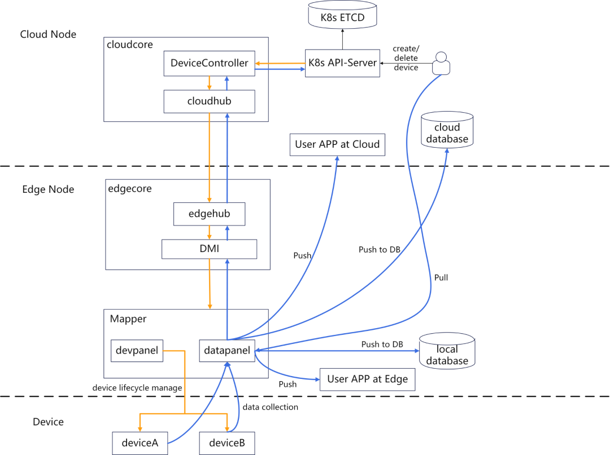

---
authors:
- KubeEdge
categories:
- General
date: 2024-12-24
draft: false
lastmod: 2024-12-24
summary: This article, the second in the series, will detail some of the work done on the DMI data plane in version 1.15.0.
tags:
- KubeEdge
- kubeedge
- edge computing
- kubernetes edge computing
- K8S edge orchestration
- edge computing platform
- security
title: "KubeEdge Edge Device Management Series (Part 2): DMI Data Plane Design and Implementation"
---

In response to the new version of the `Device-IoT` update, we plan to release a series of articles to introduce these features in detail. The general outline of the articles is as follows:

1. [Design and Implementation of Device Management API Based on Object Model](/blog/device-mgmt-series-part1)
2. [DMI Data Plane Capability Design and Implementation](/blog/device-mgmt-series-part2)
3. [Mapper Development Framework: Design and Implementation](/blog/device-mgmt-series-part3)
4. [How to use Mapper to process video stream data](/blog/device-mgmt-series-part4)
5. [How to implement device data writing using Mapper](/blog/device-mgmt-series-part5)
6. [How to develop a Mapper from scratch (using `Modbus` as an example)](/blog/device-mgmt-series-part6)

In the [previous article](/blog/device-mgmt-series-part1), we designed and implemented a device management API based on an object model to meet users' needs for edge device management. Building on this, we improved the capabilities of the DMI data plane, providing multiple ways to process device data at the edge, enabling KubeEdge to manage edge devices more flexibly and in a standardized manner. **This article, the second in the series, will detail some of the work done on the DMI data plane in version 1.15.0.**

## Introduction to the DMI Framework

In version 1.12, KubeEdge introduced the Device Management Framework (DMI). The DMI framework provides unified interfaces for device management, allowing device application developers and users to manage devices by implementing standardized interfaces within DMI. This enables edge devices to provide services in the form of microservices, making them more aligned with cloud-native architectures.

The architecture diagram of DMI is shown below:



A key feature of the DMI framework is **the decoupling of the device management plane from the device data plane.** The device management plane, based on the Device CRD, handles the lifecycle management of the device itself, as shown by the yellow line in the diagram; the device data plane, on the other hand, allows device data to be provided to data consumer applications through microservices, offering various data push methods, as shown by the blue line in the diagram.

The DMI device management plane data mainly includes device metadata, device attributes, configuration, lifecycle, etc. It is characterized by relative stability and infrequent updates after creation. This type of data is transmitted via the cloud-edge channel. Device data plane data primarily consists of device data collected by device sensors. Compared to management plane data, this data volume is larger, and transmitting it via the cloud-edge channel may cause channel congestion, affecting the normal functioning of the cluster. Version 1.15.0 improves the DMI data plane functionality, allowing for more diverse ways to push device data, which is more efficient than transmitting data via the cloud-edge channel.

## DMI Data Plane Capability Support

The DMI data plane system architecture is shown in the following figure:


After the v1.15.0 update, the DMI data plane supports processing push device data in four ways as shown in the figure:

**1. Push to user applications.** According to the Device Instance API definition in version v1beta1, users can configure the pushMethod field in the Device Instance configuration file to push device data to user applications periodically via HTTP or MQTT.

**2. Push to user database.** The latest version of KubeEdge DMI has built-in data push methods for InfluxDB, Redis, TDengine, and MySQL databases. Users can set the corresponding database parameters in the dbMethod field of the Device Instance configuration file to periodically transfer device data to the database.

**3. Push to the cloud.** Users can configure the reportToCloud field in the Device Instance configuration file to determine whether to push device data to the cloud.

**4. Users can actively retrieve device data through the RESTful API provided by Mapper.**

Below is a sample Device Instance configuration file that uses DMI data plane capabilities to process device data:

```yaml
apiVersion: devices.kubeedge.io/v1beta1
kind: Device
...
spec:
  properties:
    - name: temp
      collectCycle: 10000     # The frequency of reporting data to the cloud. once every 10 seconds
      reportCycle: 10000      # The frequency of data push to user applications or databases.
      reportToCloud: true     # Device data will be reported to cloud
      desired:
        value: "100"
      pushMethod:
        mqtt:                 # define the MQTT config to push device data to user app
          address: tcp://127.0.0.1:1883
          topic: temp
          qos: 0
          retained: false
      dbMethod:
        influxdb2:            # define the influx database config to push device data to user database
          influxdb2ClientConfig:
            url: http://127.0.0.1:8086
            org: test-org
            bucket: test-bucket
          influxdb2DataConfig:
            measurement: stat
            tag:
              unit: temperature
            fieldKey: devicetest
```

In the example file, users can define whether the Mapper pushes device data to the cloud using the reportToCloud field; additionally,

- **The pushmethod.mqtt** field defines the configuration information that the Mapper pushes to the user application. In the example, it means that the Mapper will periodically push device data to the user application at the address 127.0.0.1:1883 using the MQTT protocol.

- **The pushmethod.dbMethod** field defines the configuration information that the Mapper pushes to the user's database. In the example, it means that the Mapper will periodically push device data to the InfluxDB database at the address 127.0.0.1:8086.

Based on the capabilities of the DMI data plane, users only need to define relevant fields in the Device Instance configuration file to process the collected device data in various ways, effectively reducing the risk of cloud-edge channel congestion.

The functional interfaces provided by DMI are ultimately handled by the device management plugin Mapper. Mapper needs to implement the DMI management interface to register with KubeEdge and manage devices. For users, independently integrating with the DMI interface to create a custom Mapper still presents a significant learning curve. Therefore, in version 1.15.0, we introduced the Mapper Framework, which can automatically generate a Mapper project using simple commands, effectively reducing the learning curve for users.

In the next article in this series, we will provide a detailed introduction to **the architecture and usage of the Mapper Framework.**

Learn more about KubeEdge:

- KubeEdge: https://kubeedge.io/
- Website: https://kubeedge.io/
- GitHub Repository: https://github.com/kubeedge/kubeedge
- Documentation: https://kubeedge.io/docs/
- Slack: https://kubeedge.io/docs/community/slack
- X: https://x.com/kubeedge
