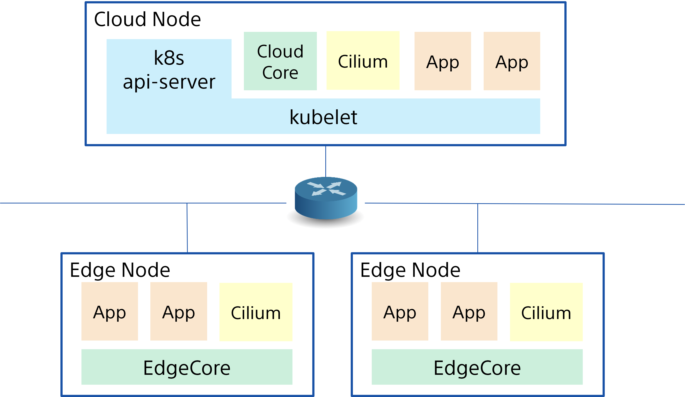

---
authors:
- Tomoya Fujita
categories:
- General
- Announcements
date: 2024-06-04
draft: false
lastmod: 2024-06-04
summary: KubeEdge meets Cilium !!!
tags:
- KubeEdge
- kubeedge
- edge computing
- kubernetes edge computing
- K8s edge orchestration
- edge computing platform
- cloud native
- iot
- iiot
- Cilium
- CNI
title: KubeEdge meets Cilium !!!
---

This blog introduces how to enable [Cilium](https://github.com/cilium/cilium) Container Network Interface with KubeEdge.

## Why [Cilium](https://github.com/cilium/cilium) for KubeEdge

[Cilium](https://github.com/cilium/cilium) is one of the most advanced and efficient container network interface plugin for Kubernetes, that provides network connectivity and security for containerized applications in Kubernetes clusters.
It leverages [eBPF (extended Berkeley Packet Filter)](https://ebpf.io/) technology to implement networking and security policies at the Linux kernel level, allowing for high-performance data plane operations and fine-grained security controls.

And KubeEdge extends the cluster orchestration capability down to edge environments to provide unified cluster management and sophisticated edge specific features.

Enabling [Cilium](https://github.com/cilium/cilium) with KubeEdge allows us to take advantage of both benefits even for edge computing environments.
We can deploy the application containers where `EdgeCore` running and bind [Cilium](https://github.com/cilium/cilium) to connect with workloads in the cloud infrastructure.
This is because [Cilium](https://github.com/cilium/cilium) can also enable [WireGuard](https://docs.cilium.io/en/latest/security/network/encryption-wireguard/) VPN with transparent encryption of traffic between Cilium-managed endpoints.

Further more, we can also rely on [Cilium Tetragon Security Observability and Runtime Enforcement](https://github.com/cilium/tetragon) to confine security risk and vulnerability in edge environment.

<!--truncate-->

## How to enable [Cilium](https://github.com/cilium/cilium) with KubeEdge

The following procedures to set up a simple cluster system with Kubernetes and KubeEdge with [Cilium](https://github.com/cilium/cilium).
Since this is a new approach and still **beta** phase, the following manual operations are required to do so.

After all the operations, we can develop the following cluster configuration with KubeEdge with [Cilium](https://github.com/cilium/cilium).



<!--truncate-->

- [Prerequisites](#prerequisites)
- [Kubernetes Master](#kubernetes-master)
- [Cilium Install and Setup](#cilium-install-and-setup)
- [KubeEdge CloudCore](#kubeedge-cloudcore)
- [KubeEdge EdgeCore](#kubeedge-edgecore)
- [Check Cilium Connectivity from Pods](#Check-cilium-connectivity-from-pods)

<!--truncate-->

### Prerequisites

- [KubeEdge Release v1.16](https://github.com/kubeedge/kubeedge/blob/master/CHANGELOG/CHANGELOG-1.16.md) or later required.

  To enable Cilium with KubeEdge, we must use [KubeEdge Release v1.16](https://github.com/kubeedge/kubeedge/blob/master/CHANGELOG/CHANGELOG-1.16.md) or later.
  This is because that `cilium-agent` needs to issue `InClusterConfig` APIs to Kubernetes API server to configure `cilium-agent`.
  This should be no problem with Kubernetes nodes, but with KubeEdge those API requests and responses need to be bypassed via [KubeEdge MetaManager](https://kubeedge.io/docs/architecture/edge/metamanager/).
  You can see [KubeEdge EdgeCore supports Cilium CNI](https://github.com/kubeedge/kubeedge/issues/4844) for more details.

- Compatible Kubernetes version with [KubeEdge Release v1.16](https://github.com/kubeedge/kubeedge/blob/master/CHANGELOG/CHANGELOG-1.16.md).

  You can find compatible and supported Kubernetes version [here]([KubeEdge Release v1.16](https://github.com/kubeedge/kubeedge/blob/master/CHANGELOG/CHANGELOG-1.16.md)).

- It Requires super user rights (or root rights) to run commands.

<!--truncate-->

### Kubernetes Master

Refer to [KubeEdge Setup Prerequisites](https://kubeedge.io/docs/category/prerequisites), and set up the Kubernetes API server as following.

```
### Check node status
> kubectl get nodes -o wide
NAME           STATUS   ROLES           AGE   VERSION    INTERNAL-IP     EXTERNAL-IP   OS-IMAGE             KERNEL-VERSION       CONTAINER-RUNTIME
tomoyafujita   Ready    control-plane   25s   v1.26.15   AA.BBB.CCC.DD   <none>        Ubuntu 20.04.6 LTS   5.15.0-102-generic   containerd://1.6.32

### Taint this node so that CloudCore can be deployed on the control-plane
> kubectl taint node tomoyafujita node-role.kubernetes.io/control-plane:NoSchedule-
node/tomoyafujita untainted
> kubectl get nodes -o json | jq '.items[].spec.taints'
null
```

<!--truncate-->

### Cilium Install and Setup

Refer to [Cilium Quick Installation](https://docs.cilium.io/en/stable/gettingstarted/k8s-install-default/), install and set up cilium deployments in the cluster.

```
> cilium version
cilium-cli: v0.16.9 compiled with go1.22.3 on linux/amd64
cilium image (default): v1.15.5
cilium image (stable): v1.15.5
cilium image (running): unknown. Unable to obtain cilium version. Reason: release: not found
```

and install Cilium with enabling wireguard VPN in the cluster,

```
> cilium install --set encryption.enabled=true --set encryption.type=wireguard --set encryption.wireguard.persistentKeepalive=60
...

> cilium status
    /¯¯\
 /¯¯\__/¯¯\    Cilium:             OK
 \__/¯¯\__/    Operator:           OK
 /¯¯\__/¯¯\    Envoy DaemonSet:    disabled (using embedded mode)
 \__/¯¯\__/    Hubble Relay:       disabled
    \__/       ClusterMesh:        disabled

Deployment             cilium-operator    Desired: 1, Ready: 1/1, Available: 1/1
DaemonSet              cilium             Desired: 1, Ready: 1/1, Available: 1/1
Containers:            cilium             Running: 1
                       cilium-operator    Running: 1
Cluster Pods:          1/2 managed by Cilium
Helm chart version:
Image versions         cilium             quay.io/cilium/cilium:v1.15.5@sha256:4ce1666a73815101ec9a4d360af6c5b7f1193ab00d89b7124f8505dee147ca40: 1
                       cilium-operator    quay.io/cilium/operator-generic:v1.15.5@sha256:f5d3d19754074ca052be6aac5d1ffb1de1eb5f2d947222b5f10f6d97ad4383e8: 1
```

Add `nodeAffinity` for Cilium `DaemonSet` to make sure these pods are only created on cloud nodes.
These Cilium pods are generic Cilium `DaemonSet`, so supposed to be running on cloud nodes but where `EdgeCore` running.

```
### Edit Cilium DaemonSet with the following patch
>  kubectl edit ds -n kube-system cilium
```

```patch
diff --git a/cilium-kubelet.yaml b/cilium-kubelet.yaml
index 21881e1..9946be9 100644
--- a/cilium-kubelet.yaml
+++ b/cilium-kubelet.yaml
@@ -29,6 +29,12 @@ spec:
         k8s-app: cilium
     spec:
       affinity:
+        nodeAffinity:
+          requiredDuringSchedulingIgnoredDuringExecution:
+            nodeSelectorTerms:
+              - matchExpressions:
+                - key: node-role.kubernetes.io/edge
+                  operator: DoesNotExist
         podAntiAffinity:
           requiredDuringSchedulingIgnoredDuringExecution:
           - labelSelector:
```

After editing, Cilium pods will be restarted.

<!--truncate-->

### KubeEdge CloudCore

1st, we need to install `Keadm` with the official procedure [Installing KubeEdge with Keadm](https://kubeedge.io/docs/setup/install-with-keadm).

In this blog, we use `Keadm v1.16.1` as following.

```bash
### Install v1.16.1 keadm command
> wget https://github.com/kubeedge/kubeedge/releases/download/v1.16.1/keadm-v1.16.1-linux-amd64.tar.gz
> tar -zxvf keadm-v1.16.1-linux-amd64.tar.gz
> cp keadm-v1.16.1-linux-amd64/keadm/keadm /usr/local/bin

> keadm version
version: version.Info{Major:"1", Minor:"16", GitVersion:"v1.16.1", GitCommit:"bd7b42acbfbe3a453c7bb75a6bb8f1e8b3db7415", GitTreeState:"clean", BuildDate:"2024-03-27T02:57:08Z", GoVersion:"go1.20.10", Compiler:"gc", Platform:"linux/amd64"}
```

and then, start the `CloudCore` with `v1.16.1`.

```
> keadm init --advertise-address="AA.BBB.CCC.DD" --profile version=v1.16.1 --kube-config=/root/.kube/config
Kubernetes version verification passed, KubeEdge installation will start...
CLOUDCORE started
=========CHART DETAILS=======
NAME: cloudcore
LAST DEPLOYED: Tue Jun  4 17:19:15 2024
NAMESPACE: kubeedge
STATUS: deployed
REVISION: 1
```

After `CloudCore` is started, we also need to enable `DynamicControllers`.

```
### edit ConfigMap of CloudCore to enable dynamicController
> kubectl edit cm -n kubeedge cloudcore
> kubectl rollout restart deployment -n kubeedge cloudcore

### Check ConfigMap
> kubectl get cm -n kubeedge cloudcore -o yaml | grep "dynamicController" -A 1
      dynamicController:
        enable: true
```

To manage and handle the APIs from `MetaManager` that are originally come from Cilium running in the edge nodes, we need to give access permission to `CloudCore` by editing `clusterRole` and `clusterRolebinding`.

`clusterRole`:

```
### Edit and apply the following patch
> kubectl edit clusterrole cilium
```

```patch
diff --git a/cilium-clusterrole.yaml b/cilium-clusterrole.yaml
index 736e35c..fd5512e 100644
--- a/cilium-clusterrole.yaml
+++ b/cilium-clusterrole.yaml
@@ -66,6 +66,7 @@ rules:
   verbs:
   - list
   - watch
+  - get
 - apiGroups:
   - cilium.io
   resources:
```

`clusterRolebinding`:

```
### Edit and apply the following patch
> kubectl edit clusterrolebinding cilium
```

```patch
diff --git a/cilium-clusterrolebinding.yaml b/cilium-clusterrolebinding.yaml
index 9676737..ac956de 100644
--- a/cilium-clusterrolebinding.yaml
+++ b/cilium-clusterrolebinding.yaml
@@ -12,3 +12,9 @@ subjects:
 - kind: ServiceAccount
   name: cilium
   namespace: kube-system
+- kind: ServiceAccount
+  name: cloudcore
+  namespace: kubeedge
+- kind: ServiceAccount
+  name: cloudcore
+  namespace: default
```

Finally, we get the token after `CloudCore` has restarted.

```
> keadm gettoken
<TOKEN_HASH>
```

<!--truncate-->

### KubeEdge EdgeCore

With the token provided above, we can start the `EdgeCore` to join the cluster system.

```
> keadm join --cloudcore-ipport=AA.BBB.CCC.DD:10000 --kubeedge-version=v1.16.1 --cgroupdriver=systemd --token <TOKEN_HASH>
...<snip>
I0604 21:36:31.040859 2118064 join_others.go:265] KubeEdge edgecore is running, For logs visit: journalctl -u edgecore.service -xe
I0604 21:36:41.050154 2118064 join.go:94] 9. Install Complete!

> systemctl status edgecore
● edgecore.service
     Loaded: loaded (/etc/systemd/system/edgecore.service; enabled; vendor preset: enabled)
     Active: active (running) since Tue 2024-06-04 21:36:31 PDT; 40s ago
   Main PID: 2118341 (edgecore)
      Tasks: 24 (limit: 18670)
     Memory: 31.8M
        CPU: 849ms
     CGroup: /system.slice/edgecore.service
             └─2118341 /usr/local/bin/edgecore
```

After `EdgeCore` is started, we need to enable `ServiceBus` and `MetaServer` to edit `edgecore.yaml`.


```
### Edit and apply the following patch
> vi /etc/kubeedge/config/edgecore.yaml
```

```patch
diff --git a/edgecore.yaml b/edgecore.yaml
index 8d17418..5391776 100644
--- a/edgecore.yaml
+++ b/edgecore.yaml
@@ -62,6 +62,8 @@ modules:
       cgroupDriver: systemd
       cgroupsPerQOS: true
       clusterDomain: cluster.local
+      clusterDNS:
+      - 10.96.0.10
       configMapAndSecretChangeDetectionStrategy: Get
       containerLogMaxFiles: 5
       containerLogMaxSize: 10Mi
@@ -151,7 +151,7 @@ modules:
     enable: true
     metaServer:
       apiAudiences: null
-      enable: false
+      enable: true
       server: 127.0.0.1:10550
       serviceAccountIssuers:
       - https://kubernetes.default.svc.cluster.local
@@ -161,7 +161,7 @@ modules:
       tlsPrivateKeyFile: /etc/kubeedge/certs/server.key
     remoteQueryTimeout: 60
   serviceBus:
-    enable: false
+    enable: true
     port: 9060
     server: 127.0.0.1
     timeout: 60
```

And then, we need to create another `DaemonSet` of `cilium-agent` for `EdgeCore` nodes.
we need to deploy `cilium-agent` pods to the nodes where KubeEdge `EdgeCore` runs (labeled with `kubernetes.io/edge=`).

```
### Dump original Cilium DaemonSet configuration
> kubectl get ds -n kube-system cilium -o yaml > cilium-edgecore.yaml

### Edit and apply the following patch
> vi cilium-edgecore.yaml
```

```patch
diff --git a/cilium-edgecore.yaml b/cilium-edgecore.yaml
index bff0f0b..3d941d1 100644
--- a/cilium-edgecore.yaml
+++ b/cilium-edgecore.yaml
@@ -8,7 +8,7 @@ metadata:
     app.kubernetes.io/name: cilium-agent
     app.kubernetes.io/part-of: cilium
     k8s-app: cilium
-  name: cilium
+  name: cilium-kubeedge
   namespace: kube-system
 spec:
   revisionHistoryLimit: 10
@@ -29,6 +29,12 @@ spec:
         k8s-app: cilium
     spec:
       affinity:
+        nodeAffinity:
+          requiredDuringSchedulingIgnoredDuringExecution:
+            nodeSelectorTerms:
+              - matchExpressions:
+                - key: node-role.kubernetes.io/edge
+                  operator: Exists
         podAntiAffinity:
           requiredDuringSchedulingIgnoredDuringExecution:
           - labelSelector:
@@ -39,6 +45,8 @@ spec:
       containers:
       - args:
         - --config-dir=/tmp/cilium/config-map
+        - --k8s-api-server=127.0.0.1:10550
+        - --auto-create-cilium-node-resource=true
         - --debug
         command:
         - cilium-agent
@@ -178,7 +186,9 @@ spec:
       dnsPolicy: ClusterFirst
       hostNetwork: true
       initContainers:
-      - command:
+      - args:
+        - --k8s-api-server=127.0.0.1:10550
+        command:
         - cilium
         - build-config
         env:
```

We can see below that `cilium-pq45v` (normal cilium-agent pod) running on cloud node, and `cilium-kubeedge-kkb7z` (edgecore specific `DaemonSet`) is running with edgecore.

```
> kubectl get pods -A -o wide
NAMESPACE     NAME                                   READY   STATUS    RESTARTS   AGE     IP               NODE           NOMINATED NODE   READINESS GATES
kube-system   cilium-kubeedge-kkb7z                  1/1     Running   0          32s     43.135.146.155   edgemaster     <none>           <none>
kube-system   cilium-operator-fdf6bc9f4-445p6        1/1     Running   0          3h40m   AA.BBB.CCC.DD    tomoyafujita   <none>           <none>
kube-system   cilium-pq45v                           1/1     Running   0          3h32m   AA.BBB.CCC.DD    tomoyafujita   <none>           <none>
kube-system   coredns-787d4945fb-2bbdf               1/1     Running   0          8h      10.0.0.104       tomoyafujita   <none>           <none>
kube-system   coredns-787d4945fb-nmd2p               1/1     Running   0          8h      10.0.0.130       tomoyafujita   <none>           <none>
kube-system   etcd-tomoyafujita                      1/1     Running   0          8h      AA.BBB.CCC.DD    tomoyafujita   <none>           <none>
kube-system   kube-apiserver-tomoyafujita            1/1     Running   1          8h      AA.BBB.CCC.DD    tomoyafujita   <none>           <none>
kube-system   kube-controller-manager-tomoyafujita   1/1     Running   0          8h      AA.BBB.CCC.DD    tomoyafujita   <none>           <none>
kube-system   kube-proxy-qmxqp                       1/1     Running   0          19m     43.135.146.155   edgemaster     <none>           <none>
kube-system   kube-proxy-v2ht7                       1/1     Running   0          8h      AA.BBB.CCC.DD    tomoyafujita   <none>           <none>
kube-system   kube-scheduler-tomoyafujita            1/1     Running   1          8h      AA.BBB.CCC.DD    tomoyafujita   <none>           <none>
kubeedge      cloudcore-df8544847-6mlw2              1/1     Running   0          4h23m   AA.BBB.CCC.DD    tomoyafujita   <none>           <none>
kubeedge      edge-eclipse-mosquitto-9cw6r           1/1     Running   0          19m     43.135.146.155   edgemaster     <none>           <none>
```

<!--truncate-->

### Check Cilium Connectivity from Pods

Now Cilium is ready to be used for application pods and containers to provide network connectivity.
We can use busybox `DaemonSet` as following to try `ping` the network connectivity via Cilium.

```
> cat busybox.yaml
apiVersion: apps/v1
kind: DaemonSet
metadata:
  name: busybox
spec:
  selector:
    matchLabels:
      app: busybox
  template:
    metadata:
      labels:
        app: busybox
    spec:
      containers:
      - image: busybox
        command: ["sleep", "3600"]
        imagePullPolicy: IfNotPresent
        name: busybox

> kubectl apply -f busybox.yaml
daemonset.apps/busybox created

> kubectl get pods -o wide
NAME            READY   STATUS    RESTARTS   AGE   IP           NODE           NOMINATED NODE   READINESS GATES
busybox-mn98w   1/1     Running   0          84s   10.0.0.58    tomoyafujita   <none>           <none>
busybox-z2mbw   1/1     Running   0          84s   10.0.1.121   edgemaster     <none>           <none>

> kubectl exec --stdin --tty busybox-mn98w -- /bin/sh
/ #
/ # ping 10.0.1.121
PING 10.0.1.121 (10.0.1.121): 56 data bytes
64 bytes from 10.0.1.121: seq=0 ttl=63 time=1.326 ms
64 bytes from 10.0.1.121: seq=1 ttl=63 time=1.620 ms
64 bytes from 10.0.1.121: seq=2 ttl=63 time=1.341 ms
64 bytes from 10.0.1.121: seq=3 ttl=63 time=1.685 ms
^C
--- 10.0.1.121 ping statistics ---
4 packets transmitted, 4 packets received, 0% packet loss
round-trip min/avg/max = 1.326/1.493/1.685 ms
/ # exit
> kubectl exec --stdin --tty busybox-z2mbw -- /bin/sh
/ #
/ # ping 10.0.0.58
PING 10.0.0.58 (10.0.0.58): 56 data bytes
64 bytes from 10.0.0.58: seq=0 ttl=63 time=0.728 ms
64 bytes from 10.0.0.58: seq=1 ttl=63 time=1.178 ms
64 bytes from 10.0.0.58: seq=2 ttl=63 time=0.635 ms
64 bytes from 10.0.0.58: seq=3 ttl=63 time=1.152 ms
^C
--- 10.0.0.58 ping statistics ---
4 packets transmitted, 4 packets received, 0% packet loss
round-trip min/avg/max = 0.635/0.923/1.178 ms
```

Finally we can confirm the cross-communication via Cilium between `busybox` containers are just fine!!!

If you want to know more technical insights and development, see and subscribe [KubeEdge EdgeCore supports Cilium CNI](https://github.com/kubeedge/kubeedge/issues/4844) for more details.
