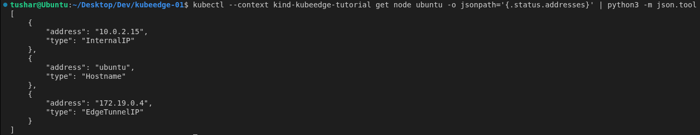
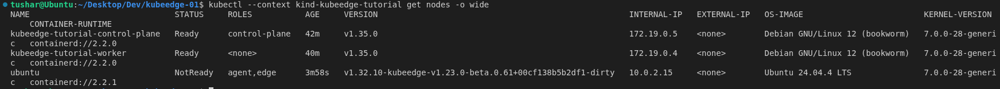
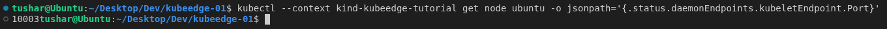
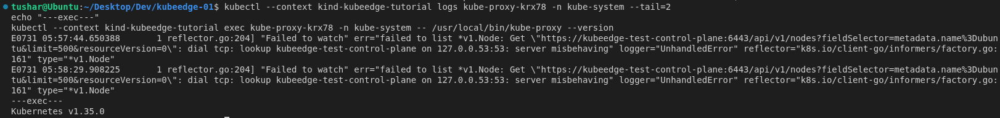
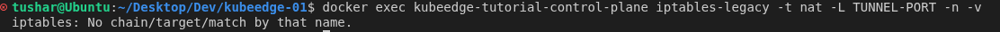

This post shares a hands-on validation of `EdgeTunnelIP`, a new KubeEdge feature that lets `kubectl exec`, `kubectl logs`, and `kubectl attach` reach edge nodes through CloudStream without any iptables rule on the API server's own node. It covers what the feature does, a real two-node deployment exercising both the case where it's needed and the case where it isn't, and what that showed about the feature's behavior.

<!--truncate-->

Running `kubectl exec`, `kubectl logs`, or `kubectl attach` against a pod on an edge node requires the Kubernetes API server to open a connection directly to that node. Edge nodes are frequently behind NAT or firewalls, so KubeEdge tunnels this traffic through CloudCore instead, using a component called **CloudStream**.

Getting the API server to actually dial CloudCore - instead of the edge node's real, possibly-unreachable address - has historically meant installing iptables DNAT rules on whichever node the API server happens to run on. That works, but it needs privileged access to that node, adds another component to run and maintain, and simply isn't an option on managed Kubernetes offerings where nobody gets to touch the control-plane node directly.

That raises a natural question: **can KubeEdge get the same redirection without iptables at all?**

Recently I worked on a feature called `EdgeTunnelIP` to answer exactly that, and spent time deploying it on a real two-node cluster to see how it actually behaves - not just whether it compiles.

The answer, for this round of testing, is **yes**.

---

## Why this matters

As more KubeEdge deployments move onto managed Kubernetes control planes - where operators have little or no access to the node the API server runs on - the iptables-based redirection path simply stops being an option. `EdgeTunnelIP` closes that gap using a mechanism Kubernetes already supports natively: a custom node address type, no changes to Kubernetes itself required.

For this validation, I wanted to see the feature do the one thing that actually matters in practice: quietly redirect exec/logs/attach traffic through CloudCore when the API server can't otherwise reach the edge node - and just as importantly, stay out of the way entirely when a local iptables rule already handles it.

More specifically, I wanted to see:

- what `EdgeTunnelIP` looks like on a real node once it's active;
- whether the node's real, familiar `InternalIP` stays untouched;
- whether `kubectl exec`/`logs` actually work through the tunnel, not just the address field looking right;
- what happens on the node the API server itself runs on, iptables-wise;
- whether the feature correctly switches itself off when it isn't needed.

## What EdgeTunnelIP does

`EdgeTunnelIP` is a KubeEdge-defined custom node address type. When an edge node connects to CloudCore, KubeEdge appends an `EdgeTunnelIP` entry to that node's `status.addresses`, set to CloudCore's own address. The API server is then configured with:

```
--kubelet-preferred-address-types=EdgeTunnelIP,InternalIP,ExternalIP,Hostname
```

Kubernetes walks this list in order and dials the *first* matching address type it finds on the node - no fallback once it finds one. With `EdgeTunnelIP` listed first, the API server dials CloudCore directly, which forwards the request over the existing CloudStream tunnel to the edge node.

The node's `InternalIP` is never touched - `kubectl get nodes -o wide` always shows the real edge address. Only the address the API server uses internally for exec/logs/attach changes.

It only needs to activate, though, when KubeEdge's `iptablesManager` runs in **internal** mode and CloudCore ends up on a *different* node than the API server - that's the one case where no local DNAT rule already covers the redirect. Everywhere else, it should stay off.

---

## Setting up the environment

To actually see both sides of that behavior, I needed a cluster with at least two nodes, so CloudCore's placement relative to the API server could genuinely change between runs.

```bash
cat <<EOF | kind create cluster --name kubeedge-test --config -
kind: Cluster
apiVersion: kind.x-k8s.io/v1alpha4
nodes:
- role: control-plane
- role: worker
EOF
```

One real edge node - a bare-metal host running `edgecore` - joined this cluster over WebSocket. CloudCore itself was deployed through the project's own Helm chart (`manifests/charts/cloudcore`), with `iptablesManager.mode` set to `internal`, since that's the mode `EdgeTunnelIP` exists for.

## Step 1: Telling the API server to prefer EdgeTunnelIP

Before anything else, the API server needs to know `EdgeTunnelIP` exists and should be tried first. On `kind`/`kubeadm` clusters this means editing the static pod manifest directly on the control-plane node:

```bash
docker exec kubeedge-test-control-plane sed -i \
  's/--kubelet-preferred-address-types=InternalIP,ExternalIP,Hostname/--kubelet-preferred-address-types=EdgeTunnelIP,InternalIP,ExternalIP,Hostname/' \
  /etc/kubernetes/manifests/kube-apiserver.yaml
```

The kubelet picks up the manifest change and restarts the API server automatically. This is a one-time, per-cluster step - a property of the API server itself, not something KubeEdge manages - and it's easy to forget. Skip it and `kubectl exec`/`logs` just fail with `connection refused`, with nothing about the failure pointing back at this flag.

## Step 2: Building and deploying CloudCore with the feature on

With the image built and loaded into the cluster, I installed CloudCore via Helm directly onto the **worker** node - deliberately placing it on a different node than the API server, to land in the scenario `EdgeTunnelIP` is meant for:

```bash
docker build -f build/cloud/Dockerfile -t kubeedge/cloudcore:phase1-video .
kind load docker-image kubeedge/cloudcore:phase1-video --name kubeedge-test

helm install cloudcore manifests/charts/cloudcore -n kubeedge --create-namespace \
  --set iptablesManager.mode=internal \
  --set cloudCore.image.repository=kubeedge/cloudcore \
  --set cloudCore.image.tag=phase1-video \
  --set cloudCore.image.pullPolicy=Never \
  --set cloudCore.nodeSelector.kubernetes\.io/hostname=kubeedge-test-worker
```

With the feature gate turned on in CloudCore's config:

```yaml
featureGates:
  EdgeTunnelIP: true
```

## Step 3: Connecting the edge node

Once CloudCore was up, I bootstrapped `edgecore` on the real edge host against CloudCore's address and let it connect. From here on, everything below is just watching what the cluster reports.

## Step 4: Checking what the node's addresses actually look like

With CloudCore and the API server on separate nodes, this is the moment that matters - does `EdgeTunnelIP` actually show up, and does it leave everything else alone?

```bash
kubectl get node ubuntu -o jsonpath='{.status.addresses}' | python3 -m json.tool
```



`EdgeTunnelIP` was there, pointing at CloudCore's address on the worker node, right next to an unchanged `InternalIP`.

The same thing shows up in the view most people actually check day to day:

```bash
kubectl get nodes -o wide
```



Nothing about this output looks unusual - which is exactly the point.

## Step 5: Confirming the traffic path, not just the address

An address field being correct doesn't prove traffic is actually flowing anywhere different. The kubelet endpoint port is the next tell:

```bash
kubectl get node ubuntu -o jsonpath='{.status.daemonEndpoints.kubeletEndpoint.Port}'
```



The port had switched to CloudCore's stream port instead of the local DNAT tunnel port - confirmation the API server is talking to CloudCore, not the edge node directly.

And then the part that actually matters to anyone using the cluster:

```bash
kubectl logs kube-proxy-krx78 -n kube-system --tail=2
kubectl exec kube-proxy-krx78 -n kube-system -- /usr/local/bin/kube-proxy --version
```



Both returned real output from the edge node - proof `EdgeTunnelIP` carries actual traffic through CloudStream, not just a cosmetic address field.

## Step 6: Checking the API server's own node for iptables rules

The whole point of this feature is that none of this should require touching iptables on the API server's node. So I checked directly:

```bash
docker exec kubeedge-test-control-plane iptables -t nat -L TUNNEL-PORT -n -v
```



The chain didn't exist there - genuinely absent, not just unused.

## Step 7: Moving CloudCore next to the API server

The other half of the story is whether `EdgeTunnelIP` knows when to disappear. I moved CloudCore's pod onto the control-plane node itself - the same node the API server runs on - where a local DNAT rule already handles the redirect, and re-checked the node's addresses.

`EdgeTunnelIP` was gone. `InternalIP` was still exactly where it had always been. The kubelet endpoint port had switched back to the local DNAT tunnel port instead of CloudCore's stream port, and `kubectl exec`/`logs` still worked - just routed through the iptables rule on that node instead of through CloudStream. Checking `iptables -t nat -L TUNNEL-PORT -n -v` on that same node this time showed the DNAT rule present and actively hit.

Nothing had to be toggled by hand for any of this - the feature figured out on its own that a tunnel address wasn't needed anymore.

---

## What this validation tells us

**1. EdgeTunnelIP shows up exactly when it's needed, and only then.** With CloudCore and the API server on separate nodes, the address appeared automatically on connect. With them on the same node, it correctly stayed absent - the feature isn't a blanket switch, it's actually reading the topology.

**2. InternalIP never changes.** Across every scenario tested, `kubectl get nodes -o wide` kept showing the edge node's real address. Nothing about how an operator inspects a node normally is affected.

**3. This carries real traffic, not just a field.** `kubectl exec` and `kubectl logs` returned genuine output from containers on the edge node in both scenarios - through CloudStream when separated, through the existing DNAT rule when colocated.

**4. The API server's own node stays completely free of iptables state** when `EdgeTunnelIP` is doing the work - the DNAT chain doesn't even exist there in that case.

## Final takeaway

Three words for where this stands: **topology-aware, tunnel-routed, iptables-free.**

It knows when it's needed. When it is, real exec/logs/attach traffic flows through CloudStream instead of a direct connection. And it asks nothing of the node the API server happens to be running on.

That's not a claim this is production-hardened everywhere yet - but it is a real, working answer to the original question.

---

## Current limitations and next steps

- The Helm chart doesn't yet expose the `EdgeTunnelIP` feature gate as a `values.yaml` field - turning it on today means patching the rendered ConfigMap by hand.
- The API server's `--kubelet-preferred-address-types` flag change is a manual, per-cluster step that nothing in this repo currently documents as a deployment prerequisite.
- This round covered a single two-node cluster. HA control planes and a wider range of managed Kubernetes distributions are still open ground.
- Longer-duration stability, well beyond the multi-minute windows tested here, hasn't been observed yet.

## Conclusion

This validation on a real two-node cluster shows that `EdgeTunnelIP` gets `kubectl exec`, `logs`, and `attach` to edge nodes flowing through CloudStream - with no iptables rule required on the API server's own node - while leaving `InternalIP` untouched and correctly staying out of the way when it isn't needed at all.

For KubeEdge deployments on managed control planes, where iptables access to the API server's node was never on the table to begin with, this is a small but concrete step toward making that setup work.
