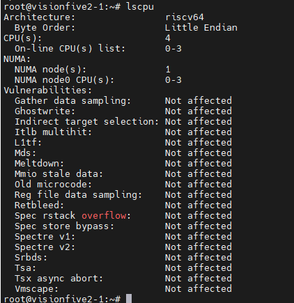
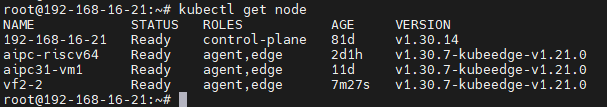
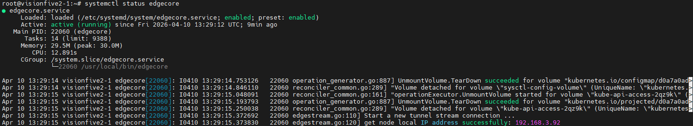
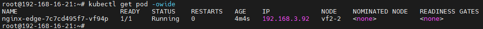
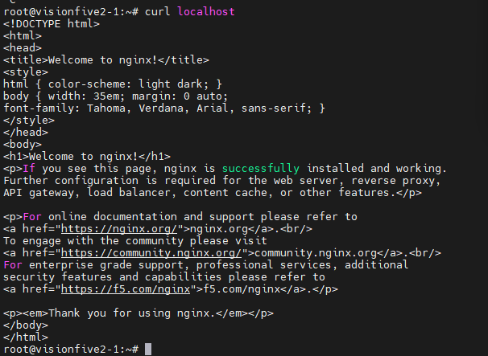

This post shares a hands-on validation of KubeEdge on a real RISC-V board, VisionFive2. It covers dependency preparation, native build of KubeEdge components, edge node join, and basic workload deployment, showing that the core deployment path is feasible on riscv64.


As the RISC-V ecosystem continues to grow, more edge scenarios are beginning to care about multi-architecture support. For KubeEdge, an important question naturally follows: **can its basic deployment path work on a real RISC-V device?**

Recently, I did a hands-on validation on a **VisionFive2** board to answer that question.

The goal of this work was not to prove production readiness in one step, but to verify a more practical baseline: on a real **riscv64** environment, can we complete the core path from **dependency preparation**, to **KubeEdge component build**, to **edge node join**, and finally to **basic workload running**?

The answer, at least for this round of testing, is **yes**.

---

## Why this validation matters

As edge computing expands to more hardware forms, architecture diversity is becoming increasingly common. In that context, verifying KubeEdge on RISC-V is meaningful in two ways.

First, it helps clarify whether KubeEdge has a usable starting point on emerging architectures. Second, it provides a practical reference for follow-up work, including workload compatibility testing, networking validation, and long-term stability evaluation on real devices.

For this validation, I used **VisionFive2** as the target platform and focused on a single question: **is the basic deployment chain of KubeEdge on RISC-V feasible?**

More specifically, I wanted to verify the following:

- whether edge-side dependencies can be installed and used on riscv64;
- whether **edgecore** and **keadm** can be built successfully on the device;
- whether the edge node can join **CloudCore** successfully;
- whether a basic containerized workload can finally run on the edge side.

---

## Test environment

### Hardware

- **Board**: VisionFive2
- **CPU Architecture**: RISC-V 64-bit
- **SoC**: JH7110

### Operating system

- **OS**: Ubuntu Server 24.04.4
- **Architecture**: riscv64
- **Image**:

```bash
https://cdimage.ubuntu.com/releases/24.04.4/release/ubuntu-24.04.4-preinstalled-server-riscv64+jh7110.img.xz
```



### Software versions

- **containerd**: v2.2.2
- **runc**: installed via apt
- **crictl**: v1.35.0
- **CNI plugins**: v1.9.1
- **nerdctl**: v2.2.2
- **buildkit**: v0.28.1
- **Go**: v1.22.4
- **KubeEdge**: v1.21.0

---

## What was validated

This round of work was intentionally scoped as a **basic capability validation**, not a full production-readiness assessment.

The validation covered:

- base OS and dependency preparation;
- container runtime setup;
- KubeEdge core component build;
- edge node join;
- basic application deployment.

The following items are **not fully covered yet**:

- multiple workload types and replicas;
- Service, DNS, and deeper CNI/networking verification;
- disconnect/reconnect and fault recovery scenarios;
- long-duration stability evaluation;
- compatibility across more RISC-V boards or distributions.

---

## Step 1: Preparing the container runtime environment

Before bringing up KubeEdge, the first task was to prepare the edge-side runtime stack on VisionFive2. This included installing and configuring **runc, containerd, crictl, CNI plugins, nerdctl, and buildkit**.

A few adjustments were also needed during this step, especially around **containerd cgroup configuration** and the **pause image** used by the runtime.

### Install runc and containerd

```bash
sudo apt update && sudo apt install -y runc

wget https://github.com/containerd/containerd/releases/download/v2.2.2/containerd-2.2.2-linux-riscv64.tar.gz
sudo tar Cxzvf /usr/local containerd-2.2.2-linux-riscv64.tar.gz

sudo curl -L https://raw.githubusercontent.com/containerd/containerd/v2.2.2/containerd.service -o /etc/systemd/system/containerd.service

sudo mkdir -p /etc/containerd
containerd config default | sudo tee /etc/containerd/config.toml

sed -i 's/SystemdCgroup = false/SystemdCgroup = true/' /etc/containerd/config.toml
sed -i "s#registry.k8s.io/pause:3.10.1#registry.k8s.io/pause:3.9#g" /etc/containerd/config.toml

sudo systemctl daemon-reload
sudo systemctl enable --now containerd
```

### Install crictl

```bash
wget https://github.com/kubernetes-sigs/cri-tools/releases/download/v1.35.0/crictl-v1.35.0-linux-riscv64.tar.gz
sudo tar xzvf crictl-v1.35.0-linux-riscv64.tar.gz -C /usr/local/bin

sudo tee /etc/crictl.yaml <<EOF
runtime-endpoint: unix:///run/containerd/containerd.sock
image-endpoint: unix:///run/containerd/containerd.sock
timeout: 10
debug: false
EOF
```

### Install CNI plugins

```bash
wget https://github.com/containernetworking/plugins/releases/download/v1.9.1/cni-plugins-linux-riscv64-v1.9.1.tgz
sudo mkdir -p /opt/cni/bin
sudo tar Cxzvf /opt/cni/bin cni-plugins-linux-riscv64-v1.9.1.tgz

sudo mkdir -p /etc/cni/net.d
sudo chmod 755 /etc/cni /etc/cni/net.d
sudo tee /etc/cni/net.d/87-loopback.conf <<EOF
{
    "cniVersion": "0.3.1",
    "name": "lo",
    "type": "loopback"
}
EOF
```

### Install nerdctl and buildkit

```bash
wget https://github.com/containerd/nerdctl/releases/download/v2.2.2/nerdctl-2.2.2-linux-riscv64.tar.gz
sudo tar Cxzvvf /usr/local/bin nerdctl-2.2.2-linux-riscv64.tar.gz

wget https://github.com/moby/buildkit/releases/download/v0.28.1/buildkit-v0.28.1.linux-riscv64.tar.gz
sudo tar Cxzvvf /usr/local buildkit-v0.28.1.linux-riscv64.tar.gz

sudo tee /etc/systemd/system/buildkitd.service <<EOF
[Unit]
Description=BuildKit Daemon (containerd worker)
Documentation=https://github.com/moby/buildkit
After=containerd.service
Requires=containerd.service

[Service]
Type=notify
ExecStart=/usr/local/bin/buildkitd --oci-worker=false --containerd-worker=true --containerd-worker-namespace=k8s.io --containerd-worker-addr=/run/containerd/containerd.sock
Restart=always
User=root
Group=root
LimitNOFILE=65535

[Install]
WantedBy=multi-user.target
EOF

sudo systemctl daemon-reload
sudo systemctl enable --now buildkitd
```

At this point, the basic runtime environment required by the edge node was in place.

---

## Step 2: Building a RISC-V-compatible pause image

One practical issue during setup was the **pause image**.

To make the runtime path more controllable on the current environment, I manually built a **RISC-V-compatible `pause:3.9` image** and loaded it into the local containerd namespace used by KubeEdge.

```bash
mkdir -p pause-build/bin
cd pause-build

curl -LO https://raw.githubusercontent.com/kubernetes/kubernetes/v1.28.0/build/pause/linux/pause.c
sudo apt install -y gcc
gcc -Os -Wall -Wextra -static -o bin/pause-riscv64 pause.c

tee Dockerfile <<EOF
FROM scratch
ARG ARCH=riscv64
ADD bin/pause-${ARCH} /pause
ENTRYPOINT ["/pause"]
EOF

sudo nerdctl -n k8s.io build -t registry.k8s.io/pause:3.9 .
```

This step helped ensure that later workload creation would not be blocked by image compatibility issues.

---

## Step 3: Building KubeEdge components on riscv64

After preparing the runtime layer, the next key question was whether **KubeEdge itself could be built successfully on the device**.

For this validation, I focused on the two most relevant binaries for the edge-side path: **edgecore** and **keadm**.

### Install Go

```bash
wget --no-check-certificate https://mirrors.aliyun.com/golang/go1.22.4.linux-riscv64.tar.gz
sudo tar -C /usr/local -xzf go1.22.4.linux-riscv64.tar.gz

echo "export PATH=\$PATH:/usr/local/go/bin" >> ~/.bashrc
source ~/.bashrc
go version
```

### Clone source and build edgecore / keadm

```bash
git clone https://github.com/kubeedge/kubeedge.git
cd kubeedge
git checkout v1.21.0

GIT_VERSION=$(git describe --tags --abbrev=0 || echo "v0.0.0-master")
GIT_COMMIT=$(git rev-parse --short HEAD)
GIT_TREE_STATE=$(if git status --porcelain | grep -q .; then echo "dirty"; else echo "clean"; fi)
BUILD_DATE=$(date -u +'%Y-%m-%dT%H:%M:%SZ')

LDFLAGS="-X github.com/kubeedge/kubeedge/pkg/version.gitVersion=${GIT_VERSION} \
-X github.com/kubeedge/kubeedge/pkg/version.gitCommit=${GIT_COMMIT} \
-X github.com/kubeedge/kubeedge/pkg/version.gitTreeState=${GIT_TREE_STATE} \
-X github.com/kubeedge/kubeedge/pkg/version.buildDate=${BUILD_DATE} \
-s -w"

GOARCH=riscv64 go build -ldflags "${LDFLAGS}" -o edgecore-riscv64 ./edge/cmd/edgecore
GOARCH=riscv64 go build -ldflags "${LDFLAGS}" -o keadm-riscv64 ./keadm/cmd/keadm/

sudo cp keadm-riscv64 /usr/local/bin/keadm
```

The build completed successfully, which is an important result on its own: **KubeEdge core components can at least be built natively on this RISC-V platform under the tested version path**.

---

## Step 4: Packaging the installation artifact

To make follow-up deployment and reproduction easier, I also packaged the built `edgecore` binary into an installation image.

```bash
mkdir -p install/usr/local/bin/
cp edgecore-riscv64 install/usr/local/bin/edgecore
cd install
tar zcvf kubeedge-v1.21.0-linux-riscv64.tar.gz usr/

tee Dockerfile <<EOF
FROM busybox:stable
ADD kubeedge-v1.21.0-linux-riscv64.tar.gz /
CMD ["sh"]
EOF

sudo nerdctl -n k8s.io build -t docker.io/kubeedge/installation-package:v1.21.0 .
```

This is not the final goal of the validation itself, but it is useful for later migration, distribution, and repeatability.

---

## Step 5: Joining the edge node to CloudCore

Once dependencies and binaries were ready, I used `keadm join` to connect the VisionFive2 node to the cloud side.

This is the key step that determines whether the **cloud-edge connection path** can actually work on RISC-V.

```bash
sudo keadm join \
--cgroupdriver=systemd \
--cloudcore-ipport=<CLOUDCORE_IP>:30000 \
--hub-protocol=websocket \
--certport=30002 \
--kubeedge-version=v1.21.0 \
--remote-runtime-endpoint=unix:///run/containerd/containerd.sock \
--edgenode-name=vf2-2 \
--set modules.edgeStream.server=<CLOUDCORE_IP>:30004,modules.edgeStream.enable=true,modules.metaManager.enable=true,modules.metaManager.metaServer.enable=true,modules.eventBus.enable=false,modules.serviceBus.enable=true,modules.edgeHub.websocket.server=<CLOUDCORE_IP>:30000 \
--token=<TOKEN>
```




After execution, the edge node joined successfully and the node status was normal.

This means the main join path between the RISC-V edge node and CloudCore was successfully verified.

---

## Step 6: Running a basic workload on the edge node

Joining the node is only part of the story. To complete the full loop, the environment still needs to prove that it can actually run a real workload.

For this, I deployed a simple **Nginx** application to the edge node.

```bash
tee edgetest.yaml <<EOF
apiVersion: apps/v1
kind: Deployment
metadata:
  name: nginx-edge
spec:
  replicas: 1
  selector:
    matchLabels:
      app: nginx-edge
  template:
    metadata:
      labels:
        app: nginx-edge
    spec:
      nodeName: vf2-2
      hostNetwork: true
      automountServiceAccountToken: false
      containers:
      - name: nginx-edge
        image: nginx
        imagePullPolicy: IfNotPresent
        ports:
        - containerPort: 80
EOF

kubectl apply -f edgetest.yaml
```




The deployment was created successfully and the container ran on the edge side as expected.

At this point, the core validation loop had been closed:

- dependencies were prepared;
- KubeEdge components were built;
- the node joined CloudCore;
- a basic workload ran successfully on the edge device.

---

## What this validation tells us

Based on the observed results, the following conclusions can be drawn for the current stage.

### 1. Edge-side dependencies can be installed on VisionFive2

The basic runtime stack — including **containerd, runc, crictl, CNI plugins, nerdctl, and buildkit** — can be installed and configured successfully on **Ubuntu 24.04.4 riscv64** running on VisionFive2.

### 2. KubeEdge core components can be built on riscv64

Both **edgecore** and **keadm** were successfully compiled on the tested RISC-V environment, showing that KubeEdge has a workable source-level build path on this platform.

### 3. The edge node can join CloudCore successfully

Using `keadm join`, the VisionFive2 node was able to join the cloud side and report normal status, which confirms that the **basic cloud-edge access path is feasible on RISC-V**.

### 4. Basic workloads can run on the edge side

The successful deployment of Nginx shows that this environment is not only able to build and connect, but also able to support **basic containerized workloads**.

---

## Final takeaway

From this round of validation, I would summarize the current state in three words:

- **buildable**;
- **joinable**;
- **runnable**.

In other words, **KubeEdge already demonstrates basic usability on VisionFive2 under the tested RISC-V environment**.

That does not mean the platform is fully validated for all edge scenarios yet. But it does mean that the most important first step has been crossed: **the core deployment path works**.

For anyone interested in bringing KubeEdge to RISC-V devices, this should be a useful starting point.

---

## Current limitations and next steps

It is also important to keep the conclusion within the right boundary.

This validation proves **basic feasibility**, not **full production readiness**.

Several areas still need follow-up work:

- broader workload compatibility testing;
- systematic verification of networking features such as Service, DNS, and deeper CNI behavior;
- disconnection, reconnection, and recovery testing;
- long-duration stability observation on real hardware;
- validation across more RISC-V boards and software combinations.

These will be the more meaningful next steps if we want to move from “it works” to “it is reliable enough for real-world edge scenarios.”

---

## Conclusion

This validation on **VisionFive2** shows that **KubeEdge v1.21.0** can complete the basic end-to-end deployment path on **Ubuntu 24.04.4 riscv64**:

- the runtime environment can be prepared;
- core components can be built;
- the edge node can join the cloud side;
- a basic workload can run successfully.

For the RISC-V ecosystem, this is a small but concrete step forward.

And for KubeEdge on emerging architectures, it provides a practical reference point for deeper verification work ahead.
