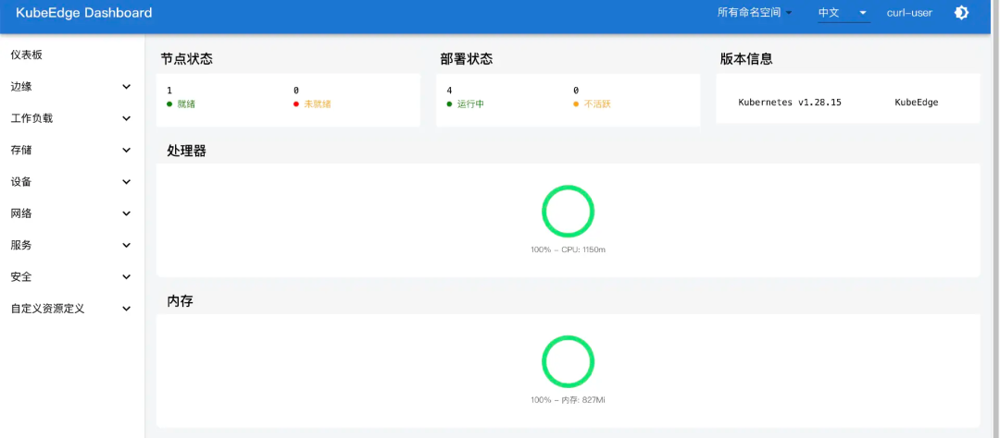
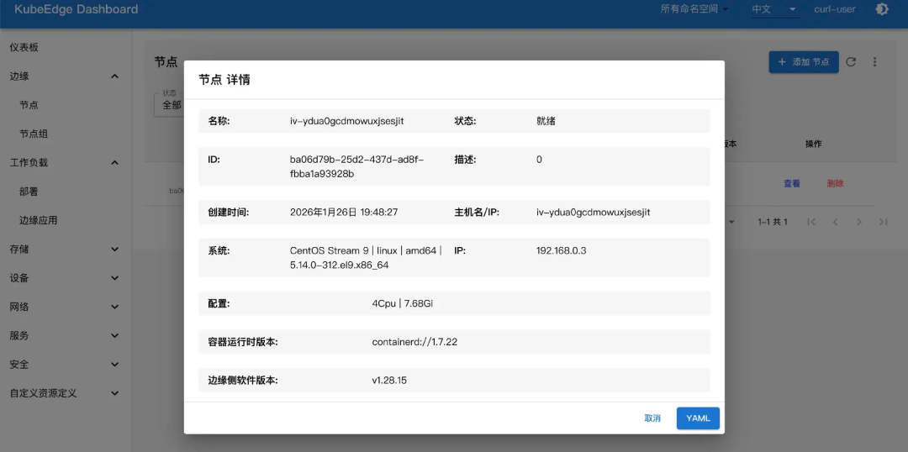

---
authors:
- KubeEdge SIG Release
categories:
- General
- Announcements
date: 2026-03-11
draft: false
lastmod: 2026-03-11
summary: KubeEdge v1.23 is live!
tags:
- KubeEdge
- kubeedge
- edge computing
- kubernetes edge computing
- K8s edge orchestration
- edge computing platform
- cloud native
- iot
- iiot
- dashboard
- release v1.23
- v1.23
title: KubeEdge v1.23 is live!
---

On March 11, 2026, KubeEdge released v1.23.0

## 1.23 What's New
- [Enhanced Capabilities of EdgeCore and Keadm Under Windows Operating System](#enhanced-capabilities-of-edgecore-and-keadm-under-windows-operating-system)
- [Add Equipment Anomaly Detection Capability](#add-equipment-anomaly-detection-capability)
- [Optimize Edge-Side Query Node Process to Reduce Edge-Cloud Channel Bandwidth Usage](#optimize-edge-side-query-node-process-to-reduce-edge-cloud-channel-bandwidth-usage)
- [Replace Beego with Gorm and Refactor Edge Database](#replace-beego-with-gorm-and-refactor-edge-database)
- [Upgrade Kubernetes Dependency to v1.32](#upgrade-kubernetes-dependency-to-v132)
- [New Dashboard Version: Support Chinese Internationalization, Performance Optimization and Page Improvement](#new-dashboard-version-support-chinese-internationalization-performance-optimization-and-page-improvement)


## Release Highlights

### Enhanced Capabilities of EdgeCore and Keadm Under Windows Operating System

In version 1.23.0, we have enhanced the capabilities of EdgeCore and keadm on Windows OS as follows:

* **Local DMI service is provided** : Since Windows does not support Unix Domain Sockets, we use Windows Named Pipes to implement local network communication;  
* **Enhanced keadm upgrade/download** : In v1.23.0, keadm will detect the version information of the local `edgecore.exe` . If a higher version is available, it will automatically download the EdgeCore package again to avoid   the upgrade being skipped because `edgecore.exe` already exists locally.  
* **Enhanced observability** : In the new version, EdgeCore logs will be redirected to configurable log files, optimizing operations and troubleshooting in Windows environments.

**Refer to the link for more details.([#6563](https://github.com/kubeedge/kubeedge/pull/6563), [#6580](https://github.com/kubeedge/kubeedge/pull/6580), [#6565](https://github.com/kubeedge/kubeedge/pull/6565))**

### Add Equipment Anomaly Detection Capability

v1.23.0 introduced a device anomaly detection framework, allowing you to   specify anomaly detection configurations in the pushMethod field of the Device CRD:

```yaml
apiVersion: devices.kubeedge.io/v1beta1

kind: Device

spec:

   properties:

     pushMethod:

        anomolyDetection: 

          ... // 指定异常检测字段，如设备工作状态等
...
```

We've also implemented device anomaly detection and processing logic in the Mapper, allowing you to customize the handling of abnormal device data. Additionally, we've provided a device anomaly detection demo in the Example repository, making it easy for you to quickly understand and try out this new capability. See details: *https://github.com/kubeedge/examples/pull/163*

**Refer to the link for more details.([#6478](https://github.com/kubeedge/kubeedge/pull/6478), [#6543](https://github.com/kubeedge/kubeedge/pull/6543))**


### Optimize Edge-Side Query Node Process to Reduce Edge-Cloud Channel Bandwidth Usage

In previous versions, EdgeCore needed to remotely query node information via the edge-cloud channel, which resulted in significant bandwidth consumption, especially in large-scale scenarios. In the new version, EdgeCore queries nodes directly from the edge database. Simultaneously, CloudCore automatically synchronizes node information to the edge database when it detects updates, significantly improving system performance and reliability in large-scale edge scenarios.

**Refer to the link for more details.([#6543](https://github.com/kubeedge/kubeedge/pull/6543))**


### Replace Beego with Gorm and Refactor Edge Database

The original edge database used the Beego framework, which only utilized the ORM portion. In the new version, we replace the Beego framework with the lighter Gorm. Simultaneously, the edge database has been restructured, introducing a unified database operation entry point in MetaManager, making database interactions clearer and easier to maintain.

**Refer to the link for more details.([#6296](https://github.com/kubeedge/kubeedge/issues/6296), [#6585](https://github.com/kubeedge/kubeedge/pull/6585))**

### Upgrade Kubernetes Dependency to v1.32

The new version upgrades the Kubernetes version it depends on to v1.32.10, allowing you to use the new version's features in the cloud and at the edge.


**Refer to the link for more details.([#6549](https://github.com/kubeedge/kubeedge/pull/6549))**

### New Dashboard Version: Support Chinese Internationalization, Performance Optimization and Page Improvement

Dashboard v0.2.0 has been officially released, including the following updates:

* Introducing the Backend-for-Frontend (BFF) architecture establishes a data processing middleware layer, optimizes data processing logic, and improves frontend performance;  
* An internationalized language framework has been introduced, and Chinese language pack support has been added.  
* We have comprehensively optimized the Dashboard's UI experience, unified the page style, and focused on optimizing form components such as PodTable and TableView to improve the user interaction experience.





**Refer to the link for more details.([#v0.2.0](https://github.com/kubeedge/dashboard/tree/v0.2.0))**


 ## Version upgrade notes

Starting with version 1.23.0, the Status field of the Device CRD   will be separated and used as a separate  DeviceStatus CRD  . This change is compatible with older CRDs, but please note that in later versions, device status will need to be obtained through the new  DeviceStatus CRD  .

**Refer to the link for more details.([#6534](https://github.com/kubeedge/kubeedge/pull/6534))**

