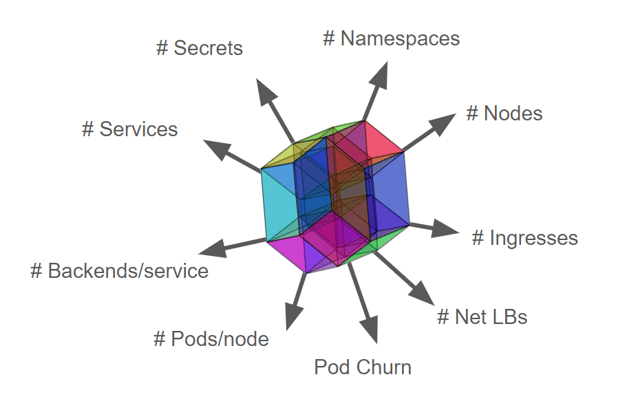
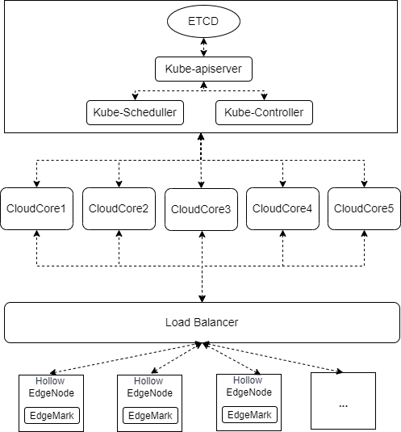
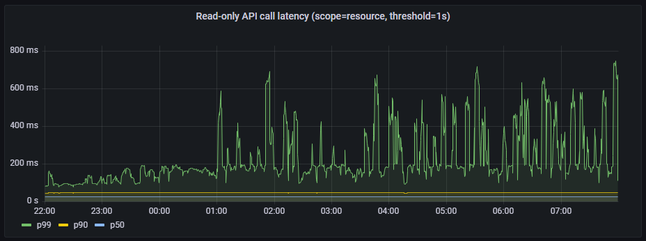
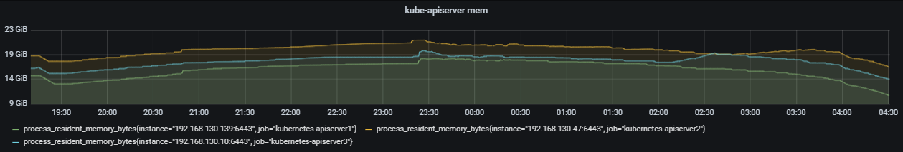

---
authors:
- Wack Xu
categories:
- General
- Announcements
date: 2022-07-13
draft: false
lastmod: 2022-07-13
summary: Test Report on KubeEdge's Support for 100,000 Edge Nodes
tags:
- KubeEdge
- kubeedge
- edge computing
- kubernetes edge computing
- K8S edge orchestration
- performance
- large scale
- scalability test
- 100,000 nodes
title: Test Report on KubeEdge's Support for 100,000 Edge Nodes
---

# Test Report on KubeEdge's Support for 100,000 Edge Nodes

## Abstract

The population of KubeEdge brings in community interests in the scalability and scale of KubeEdge. Now, Kubernetes clusters powered by KubeEdge, as fully tested, can stably support 100,000 concurrent edge nodes and manage more than one million pods. This report introduces the metrics used in the test, the test procedure, and the method to connect to an ocean of edge nodes.

<!--truncate-->

## Background

Fast growing technologies, such as 5G networks, industrial Internet, and AI, are giving edge computing an important role in driving digital transformation. Cities, transportation, healthcare, manufacturing, and many other fields are becoming smart thanks to edge computing. According to Gartner, by 2023, the number of intelligent edge devices may be more than 20 times that of traditional IT devices. By 2028, the embedding of sensors, storage, computing, and advanced AI functions in edge devices will grow steadily. IoT devices are of various types and in large quantities. The increasing connected IoT devices are challenging management and O&M.

At the same time, users in the KubeEdge community are expecting large-scale edge deployment. There are already some successful use cases for KubeEdge. In unmanned toll stations across China, there are nearly 100,000 edge nodes and more than 500,000 edge applications in this project, and the numbers keep growing. Another case is a vehicle-cloud collaboration platform, the industry-first cloud-edge-device system. It enables fast software upgrade and iteration for software-defined vehicles. On this platform, each vehicle is connected as an edge node, and the number of edge nodes will reach millions.

## Introduction to KubeEdge

**KubeEdge** is the **industry's first cloud native edge computing framework** designed for edge-cloud collaboration. Complementing Kubernetes for container orchestration and scheduling, KubeEdge allows applications, resources, data, and devices to collaborate between edges and the cloud. **Devices, edges, and the cloud are now fully connected in edge computing**.

In the KubeEdge architecture, the cloud is a unified control plane, which includes native Kubernetes management components and KubeEdge-developed CloudCore components. It listens to cloud resource changes and provides reliable, efficient cloud-edge messaging. At the edge side lie the EdgeCore components, including [Edged](https://kubeedge.io/en/docs/architecture/edge/edged), [MetaManager](https://kubeedge.io/en/docs/architecture/edge/metamanager), and [EdgeHub](https://kubeedge.io/en/docs/architecture/edge/edgehub). They receive messages from the cloud and manage the lifecycle of containers. The device mapper and event bus are responsible for device access.


Based on the Kubernetes control plane, KubeEdge allows nodes to be deployed more remotely and thereby extends edge-cloud collaboration. Kubernetes supports 5,000 nodes and 150,000 pods, which are far from enough for edge computing in Internet of Everything (IoE). The access of a large number of edge devices demands a scalable, centralized edge computing platform. To help users cost less and manage more in an easier way, KubeEdge, fully compatible with Kubernetes, optimizes the cloud-edge messaging and provides access support for mass edge nodes.

## SLIs/SLOs

Scalability and performance are important features of Kubernetes clusters. Before performing the large-scale performance test, we need to define the measurement metrics. The Kubernetes community defines the following SLIs (Service Level Indicators) and SLOs (Service Level Objectives) to measure the cluster service quality.

1. API Call Latency

| **Status**   | **SLI**                                                      | **SLO**                                                      |
| ------------ | ------------------------------------------------------------ | ------------------------------------------------------------ |
| **Official** | Latency of mutating API calls for single objects for every (resource, verb) pair, measured as 99th percentile over last 5 minutes | In default Kubernetes installation, for every (resource, verb) pair, excluding virtual and aggregated resources and Custom Resource Definitions, 99th percentile per cluster-day <= 1s |
| **Official** | Latency of non-streaming read-only API calls for every (resource, scope) pair, measured as 99th percentile over last 5 minutes | In default Kubernetes installation, for every (resource, scope) pair, excluding virtual and aggregated resources and Custom Resource Definitions, 99th percentile per cluster-day: (a) <= 1s if `scope=resource` (b) <= 30s[5](https://github.com/kubernetes/community/blob/master/sig-scalability/slos/api_call_latency.md#footnote5) otherwise (if `scope=namespace` or `scope=cluster`) |

2. Pod Startup Latency

| **Status**   | **SLI**                                                      | SLO                                                          |
| ------------ | ------------------------------------------------------------ | ------------------------------------------------------------ |
| **Official** | Startup latency of schedulable stateless pods, excluding time to pull images and run init containers, measured from pod creation timestamp to when all its containers are reported as started and observed via watch, measured as 99th percentile over last 5 minutes | In default Kubernetes installation, 99th percentile per cluster-day <= 5s |
| **WIP**      | Startup latency of schedulable stateful pods, excluding time to pull images, run init containers, provision volumes (in delayed binding mode) and unmount/detach volumes (from previous pod if needed), measured from pod creation timestamp to when all its containers are reported as started and observed via watch, measured as 99th percentile over last 5 minutes | TBD                                                          |

The community also defines indicators such as in-cluster network programming latency (latency for Service updates or changes in ready pods to be reflected to iptables/IPVS rules), in-cluster network latency, DNS programming latency (latency for Service updates or changes in ready pods to be reflected to the DNS server), and DNS latency. These indicators have not yet been quantified. This test was conducted to satisfy all SLIs/SLOs in the official state.

## Kubernetes Scalability Dimensions and Thresholds

Kubernetes scalability does not just mean the number of nodes (Scalability != #Nodes). Other dimensions include the number of namespaces, pods, Services, secrets, and ConfigMaps. Configurations that Kubernetes supports create the **Scalability Envelope** (which keeps evolving):



Obviously, it is impossible for a Kubernetes cluster to expand resource objects without limitation while satisfying SLIs/SLOs. Therefore, the industry defines the upper limits of Kubernetes resource objects.

```
1. Pods/node 30
2. Backends <= 50k & Services <= 10k & Backends/service <= 250
3. Pod churn 20/s
4. Secret & configmap/node 30
5. Namespaces <= 10k & Pods <= 150k & Pods/namespace <= 3k
6. ​    …..
```

Dimensions are sometimes not independent. As you move farther along one dimension, your cross-section wrt other dimensions gets smaller. For example, if 5000 nodes are expanded to 10,000 nodes, the specifications of other dimensions will be affected. A heavy workload is required if all scenarios are tested. In this test, we focus on the typical scenarios. **We manage to host 100k edge nodes and 1000k pods in a single cluster while satisfying the SLIs/SLOs.**

## Test Tools

### ClusterLoader2

ClusterLoader2 is an open source Kubernetes cluster performance test tool. It can test the Kubernetes SLIs/SLOs to check whether the cluster meets the service quality standards. It also visualizes data for locating cluster problems and optimizing cluster performance. After the test, users get a performance report with detailed test results.

Clusterloader2 performance metrics:

- **APIResponsivenessPrometheusSimple**
- **APIResponsivenessPrometheus**
- **CPUProfile**
- **EtcdMetrics**
- **MemoryProfile**
- **MetricsForE2E**
- **PodStartupLatency**
- **ResourceUsageSummary**
- **SchedulingMetrics**
- **SchedulingThroughput**
- **WaitForControlledPodsRunning**
-  **WaitForRunningPods**

### Edgemark

Edgemark is a performance test tool similar to Kubemark. It simulates deploying KubeEdge edge nodes in the KubeEdge cluster scalability test to build ultra-large Kubernetes clusters, powered by KubeEdge, with limited resources. The objective is to expose the cluster control plane downsides that occur only in large-scale deployments. The following figure illustrates the Edgemark deployment:


- **K8s master**: the master node of the Kubernetes cluster
- **Edgemark master**: the master node of the simulated Kubernetes cluster
- **CloudCore**: the KubeEdge cloud management component, which is responsible for edge node access
- **hollow pod**: a pod started in the actual cluster. It registers with the Edgemark master as a virtual edge node by starting Edgemark in it. The Edgemark master can schedule pods to this virtual edge node.
- **hollow edgeNode**: a virtual node in the simulated cluster, registered from a hollow pod

## Cluster Deployment Scheme for the Test



The Kubernetes control plane is deployed with one master node. The etcd, kube-apiserver, kube-scheduler, and kube-controller are deployed as single-instance. The KubeEdge control plane is deployed with five CloudCore instances and connects to the kube-apiserver through the IP address of the master node. Hollow EdgeNodes are exposed by a load balancer and randomly connect to a CloudCore instance based on the round-robin policy of the load balancer.

## Test Environment Information

Control Plane OS Version

```
CentOS 7.9 64bit 3.10.0-1160.15.2.el7.x86_64
```

Kubernetes Version

```
Major:"1", Minor:"23", GitVersion:"v1.23.4", GitCommit:"e6c093d87ea4cbb530a7b2ae91e54c0842d8308a", GitTreeState:"clean", BuildDate:"2022-02-16T12:38:05Z", GoVersion:"go1.17.7", Compiler:"gc", Platform:"linux/amd64"
```

 KubeEdge Version
```
KubeEdge v1.11.0-alpha.0
```


Master Node Configurations

-  **CPU**

```
Architecture:          x86_64
CPU op-mode(s):        32-bit, 64-bit
Byte Order:            Little Endian
CPU(s):                128
On-line CPU(s) list:   0-127
Thread(s) per core:    2
Core(s) per socket:    32
Socket(s):             2
NUMA node(s):          2
Vendor ID:             GenuineIntel
CPU family:            6
Model:                 106
Model name:            Intel(R) Xeon(R) Platinum 8378A CPU @ 3.00GHz
Stepping:              6
CPU MHz:               2999.998
```

-  **MEMORY**

```
Total online memory:   256G
```

- **ETCD DISK**

```
Type:	SAS_SSD
Size:	300GB
```

CloudCore Node Configurations

- **CPU**

```
Architecture:          x86_64
CPU op-mode(s):        32-bit, 64-bit
Byte Order:            Little Endian
CPU(s):                12
On-line CPU(s) list:   0-11
Thread(s) per core:    2
Core(s) per socket:    6
Socket(s):             1
NUMA node(s):          1
Vendor ID:             GenuineIntel
CPU family:            6
Model:                 106
Model name:            Intel(R) Xeon(R) Platinum 8378A CPU @ 3.00GHz
Stepping:              6
CPU MHz:               2999.998
```

-  **MEMORY**

```
Total online memory:   48G
```

## Component Parameter Configurations

**1.**    **kube-apiserver** 

```
--max-requests-inflight=2000
--max-mutating-requests-inflight=1000
```

**2.**    **kube-controller-manager** 

```
--kube-api-qps=100
--kube-api-burst=100
```

**3.**    **kube-scheduler**

```
--kube-api-qps=200
--kube-api-burst=400
```

**4.**    **CloudCore**

```
apiVersion: cloudcore.config.kubeedge.io/v1alpha1
kind: CloudCore
kubeAPIConfig:
  kubeConfig: ""
  master: ""
  qps: 60000
  burst: 80000
modules:
  cloudHub:
    advertiseAddress:
      - xx.xx.xx.xx
    nodeLimit: 30000
    tlsCAFile: /etc/kubeedge/ca/rootCA.crt
    tlsCertFile: /etc/kubeedge/certs/server.crt
    tlsPrivateKeyFile: /etc/kubeedge/certs/server.key
    unixsocket:
      address: unix:///var/lib/kubeedge/kubeedge.sock
      enable: false
    websocket:
      address: 0.0.0.0
      enable: true
      port: 10000
  cloudStream:
    enable: false
  deviceController:
    enable: false
  dynamicController:
    enable: false
  edgeController:
    buffer:
      configMapEvent: 102400
      deletePod: 10240
      endpointsEvent: 1
      podEvent: 102400
      queryConfigMap: 10240
      queryEndpoints: 1
      queryNode: 10240
      queryPersistentVolume: 1
      queryPersistentVolumeClaim: 1
      querySecret: 10240
      queryService: 1
      queryVolumeAttachment: 1
      ruleEndpointsEvent: 1
      rulesEvent: 1
      secretEvent: 1
      serviceEvent: 10240
      updateNode: 15240
      updateNodeStatus: 30000
      updatePodStatus: 102400
    enable: true
    load:
      deletePodWorkers: 5000
      queryConfigMapWorkers: 1000
      queryEndpointsWorkers: 1
      queryNodeWorkers: 5000
      queryPersistentVolumeClaimWorkers: 1
      queryPersistentVolumeWorkers: 1
      querySecretWorkers: 1000
      queryServiceWorkers: 1
      queryVolumeAttachmentWorkers: 1
      updateNodeStatusWorkers: 10000
      updateNodeWorkers: 5000
      updatePodStatusWorkers: 20000
      ServiceAccountTokenWorkers: 10000
    nodeUpdateFrequency: 60
  router:
    enable: false
  syncController:
    enable: true
```

## Density Test

### Test Execution

Before using ClusterLoader2 to perform the performance test, we defined the test policy using the configuration file. In this test, we used the official [Kubernetes density](https://links.jianshu.com/go?to=https%3A%2F%2Fgithub.com%2Fkubernetes%2Fperf-tests%2Fblob%2Fmaster%2Fclusterloader2%2Ftesting%2Fdensity%2Fconfig.yaml) case. The configuration file we used can be obtained here:

https://github.com/kubernetes/perf-tests/blob/master/clusterloader2/testing/density/config.yaml

The following table describes the detailed Kubernetes resource configurations:

| **Maximum type**             | **Maximum value** |
| ---------------------------- | ----------------- |
| Number of Nodes              | 100,000           |
| Number of Pods               | 1,000,000         |
| Number of Pods per node      | 10                |
| Number of Namespaces         | 400               |
| Number of Pods per Namespace | 2,500             |

For details about the test method and procedure, see the following links:

https://github.com/kubeedge/kubeedge/tree/master/build/edgemark

https://github.com/kubernetes/perf-tests/blob/master/clusterloader2/docs/GETTING_STARTED.md

### Test Results

**APIResponsivenessPrometheusSimple**：

1. mutating API latency（threshold=1s）：

  

2. Read-only API call latency(scope=resource, threshold=1s)

 

3. Read-only API call latency(scope=namespace, threshold=5s)

 

4. Read-only API call latency(scope=cluster, threshold=30s)

 

**PodStartupLatency**：

| **metric**         | **p50(ms)** | **p90(ms)** | **p99(ms)** | **SLO(ms)** |
| ------------------ | ----------- | ----------- | ----------- | ----------- |
| pod_startup        | 1688        | 2751        | 4087        | 5000        |
| create_to_schedule | 0           | 0           | 1000        | N/A         |
| schedule_to_run    | 1000        | 1000        | 1000        | N/A         |
| run_to_watch       | 1087        | 1674        | 2265        | N/A         |
| schedule_to_watch  | 1657        | 2724        | 3070        | N/A         |


Note: Theoretically, the latency should always be greater than 0. Because kube-apiserver does not support RFC339NANO, the timestamp precision can only be seconds. Therefore, when the latency is low, some values collected by ClusterLoader2 are 0 due to precision loss.

## Conclusion and Analysis

From the preceding test results, the API call latency and pod startup latency meet the SLIs/SLOs defined by the Kubernetes community. Therefore, **the KubeEdge-powered Kubernetes clusters can stably support 100,000 concurrent edge nodes and more than one million pods**. In production, the network between edge nodes and the cloud is connected according to O&M requirements due to reasons such as network security and partition management. Therefore, the number of edge nodes that can be managed by a single cluster can increase proportionally based on the proportion of offline edge nodes to online ones. In addition, data fragmentation is used on the Kubernetes control plane to store different resources to the corresponding etcd space, which allows for a larger service deployment scale.

### KubeEdge's Support for Large-Scale Edge Node Access

#### 1. Efficient Cloud-Edge Messaging

List-watch is a unified mechanism for asynchronous messaging of Kubernetes components. The list operation calls the list API of a resource to obtain full resource data through non-persistent HTTP connections. The watch operation calls the watch API of a resource to monitor resource change events and obtain incremental change data through persistent HTTP connections and block-based transmission encoding. In Kubernetes, in addition to the list-watch of a node, pods allocated to the node, and full service metadata, kubelet must also watch (by default) the running pods mounted with secrets and ConfigMaps as data volumes. The number of list-watch operations could explode with increasing nodes and pods, which heavily burdens kube-apiserver.


KubeEdge uses the two-way multiplexing edge-cloud message channel and supports the WebSocket (default) and QUIC protocols. EdgeCore at the edge initiates a connection request to CloudCore on the cloud. CloudCore list-watches Kubernetes resource changes, and delivers metadata to the edge through this two-way channel. EdgeCore uploads the metadata, such as edge node status and application status, to CloudCore through this channel. CloudCore reports the received metadata to kube-apiserver.


CloudCore aggregates the upstream and downstream data. kube-apiserver processes only several list-watch requests from CloudCore. It can be effectively unburdened and the cluster performance gets improved.


Memory usage when the native Kubernetes kube-apiserver is used under the same node and pod scales:



Memory usage when kube-apiserver is used in a KubeEdge-powered Kubernetes cluster:


#### 2. Reliable Incremental Cloud-Edge Data Transmission

In the case of complex edge network topology or poor networking quality, cloud-edge communication may be compromised by high network latency, intermittent/frequent disconnection, and other issues. When the network recovers and edge nodes want to reconnect to the cloud, a large number of full list requests will be generated, pressuring kube-apiserver. Large-scale deployments may amplify this challenge to system stability. To solve it, KubeEdge records the version of the metadata successfully sent to the edge. When the cloud-edge network is reconnected, the cloud sends incremental metadata starting from the recorded metadata version.

#### 3. Lightweight Edge + Edge-Cloud Messaging Optimization

EdgeCore removes native kubelet features that are not used in edge deployments, such as in-tree volume and cloud-provider, trims the status information reported by nodes, and optimizes resource usage of edge agent software. EdgeCore can run with a minimum of 70 MB memory on edge devices whose memory is as minimum as 100 MB. The WebSocket channel, edge-cloud message combination, and data trim greatly reduces the communication pressure on the edge and cloud and the access pressure on the control plane. They ensure that the system can work properly even in the case of high latency and jitter.


When 100,000 edge nodes are connected, the number of ELB connections is 100,000.


When 100,000 edge nodes and more than 1,000,000 pods are deployed, the inbound rate of the ELB network is about 3 MB/s, and the average uplink bandwidth to each edge node is about 0.25 kbit/s.


## Next Steps

Targeted tests will be performed on edge devices, edge-cloud messaging, and edge service mesh. In addition, for some edge scenarios, such as large-scale node network disconnection and reconnection, high latency of edge networks, and intermittent disconnection, new SLIs/SLOs need to be introduced to measure the cluster service quality and perform large-scale tests.
