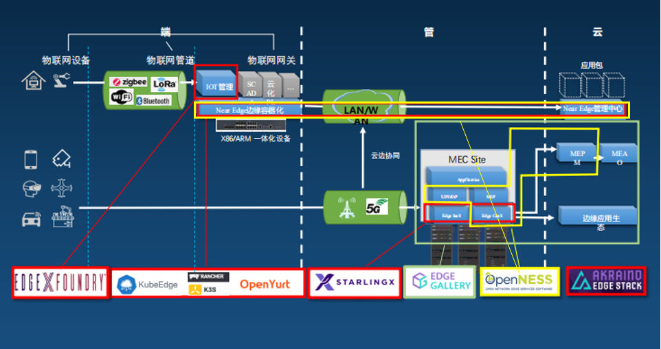

---
authors:
- Luo Gangyi
categories:
- Case
date: 2020-10-15
draft: false
lastmod: 2020-10-15
summary: Architecture Design and Application of KubeEdge in the Big Data Center of China Academy of Industrial Internet
tags:
- KubeEdge
- kubeedge
- edge computing
- kubernetes edge computing
- K8S edge orchestration
- edge computing platform
title: Architecture Design and Application of KubeEdge in the Big Data Center of China Academy of Industrial Internet
---
Project background: In 2018, the Ministry of Industry and Information Technology launched the National Innovation and Development Project, which proposed to establish a national industrial big data center. China Mobile was responsible for developing related functions such as edge coordination and data collection.

## Challenges

### Requirements

- Collect production and operation data from the factory and upload the data to the cloud.
- Control data from the cloud, such as the data to collect and how to process data.

### Challenges

- The edge devices can connect to the cloud, while the cloud cannot actively connect to the edge devices, because the edge devices do not have a public IP address
- The architecture must be flexible enough to adapt to various industrial devices and protocols.
- The edge devices must support autonomous capabilities when the network is unstable.
- Edge computing capabilities must be supported so that various applications can run on edge nodes.
- Resource utilization and power consumption are low.

## Technology selection

Our technical selection is also based on our practical needs.

Firstly, before starting this project, we had been using EdgeX for data collection and management. EdgeX performed well, but it was lack of cloud-edge coordination capabilities. To address this issue, we  set up a VPN to connect EdgeX nodes to the central cloud, but this VPN is not scalable.

Then, we used K3s/K8s. However, they were lack of cloud-edge coordination capabilities. K8s was resource-intensive, making it inappropriate for our factory. K3s used fewer resources, but it did not support device management.

We also tried OpenNESS, which is too flexible, making development stressful. Additionally, it lacked device management capabilities.

The fourth one was OpenYurt, which was similar to KubeEdge, but it was not premature compared with  KubeEdge.

Finally, we chose KubeEdge, which outperformed in cloud-edge coordination, resource consumption, and device management.

## Architecture design

### Overall architecture

The architecture is used in our national industrial internet big data center. The core of this architecture is KubeEdge, which manages devices and applications. We deploy a K8s cluster in the cloud and configure the Cloud Core of KubeEdge. All the data, including management data is stored in the K8s cluster in the cloud. Edge devices run on the industrial control machine or industrial gateway. The Edge Core process of KubeEdge runs containerized applications for device management and data collection on the edge side.

We also leverage Mapper, which is a community-defined standard specifically designed for device management and data collection. Currently, the Mapper community provides Modbus and Bluetooth APIs. For example, if I want to manage a camera or a custom device, I need to write the Mapper according to the community's guidelines. That is, we use Java and Spring Cloud to encapsulate a management sevice to prevent potential security risks caused by API exposure.

Finally, we also develop an industrial APP marketplace to encourage independent developers and other vendors to develop Mapper applications in compliance with our standards. We hope to build an ecosystem so that developers can benefit from this marketplace. 

### Data Collection

We have improved KubeEdge from the following:

1. Support for more industrial devices and protocols

Previously, we found that KubeEdge only supported Bluetooth and Modbus, which had been encoded in its CRD, and we could not modify it. Considering that there were many protocols in industrial automation, and some of them are private, we need custom extensions. In a scenario that everyone uses the Modbus protocol, but different devices may have additional configurations, we can use the newly added CustomizedValue parameter to customize some parameters. Another option is that we use our own CustomizedProtocol, which can be completely customized.

2. Support for easier device collection configurations

Industry and IT are different. In IT, we usually define templates first and then define instances, but in the industry, they usually define instances first and then copy and modify the content. For example, if I have 10 temperature sensors that are identical and connected to the same industrial network, their properties are the same, but the only difference is the offset on the Modbus. Therefore, all I need to do is change the offset in the Instance. Therefore, we moved the PropertyVisitor class from the Device model to the DeviceInstance class. We also added more flexible configuration options, such as the collection cycle. Additionally, We added configuration such as CollectCycle to the PropertyVisitor class and extracted the serial port and TCP configuration to the common parameters.

3. Optimized distribution of twin properties

4. Support for bypass data configurations

### Bypass data processing

- Support for Mapper to push time-series data to edge MQTT broker (EdgeCore does not process it). The specific topic to which the data is pushed can also be configured.

- Integration with EMQX Kuiper, which can read meta data from DeviceProfile.

- Cleanup rules sent to Kuiper from KubeEdge.

- Third-party applications retrieving data from the edge MQTT.

### Status monitoring

Status monitoring is critical for a commercial product. KubeEdge provides a channel called Cloud Stream, which can work with MetricServer and Prometheus. However, we need to configure the iptables to intercept traffic, which results in some problems.

To resolve the problems, we create a timer container on the edge node. The timer retrieves data from the NodeExporter every five seconds, and then pushes the data to the cloud-hosted PushGateway, an official component of Prometheus. In this way, we achieve status monitoring.

### Challenges of other projects

- Multi-tenant sharing

K8s itself supports multi-tenancy, but we suffer from Namespace issues while we are using KubeEdge. Currently, KubeEdge cannot place different devices in different Namespaces, and the edge node also cannot be associated with a Namespace. In our cases, a node must be solely owned by a tenant. So we have to encapsulate at the business layer, such as labeling the Device and using labels for filtering.

- IP address restrictions

In our design, we will provide each tenant with a K8s cluster for connecting to an edge device. In this case, the cloud cluster requires a public IP address. However, IP addresses are insufficient, and how can we handle this problem?

IPv6 is key to this issue. And the KubeEdge community promises it supports IPv6, but we have not yet tested it.

Port reuse: In fact, KubeEdge uses a few ports. Apart from the default port 10003, there are only 4 to 5 ports in use. One public IP address can be reused by multiple kubeEdge instances.

- High-availability solution: This is supported by K8s: Service+Deployment and status check.

## Case study:

### Case study 1: OPC-UA data collection and processing

In our App marketplace, users can purchase OPC-UA mappers and deploy them to edge gateways, and then they can collect data from edge industrial devices by simply configuring a page. The processes are as follows:

- The OPC-UA mapper collects temperature data.

- The alert application on the edge node can directly retrieve data from the edge.

- The alert is triggered when the value exceeds the threshold, and the device is stopped.

- KubeEdge can be used to adjust the threshold values.

### Case study 2: industrial video security

This application features edge autonomy and barely interacts with the cloud. It can run independently on the edge and mainly perform AI inference. To integrate it with the cloud, we place the model training on the cloud and then push the trained model through KubeEdge to the edge. The main features include the following:

- KubeEdge manages the configuration of video security applications on edge nodes.

- The video security applications run autonomously on edge nodes.

- The application reads data from cameras and conducts AI inference.

- The application detects compliance of safety helmets and work uniforms.

- The application detects entry into dangerous areas.

## Summary

1. KubeEdge assists us in industrial data collection.

- Currently, through CustomizedProtocol and CustomizedValue, KubeEdge can support various industrial protocols.

- By using ConfigMap, we can control edge data applications (Mapper) on the cloud.

- Bypass data (Spec/Data) provides easier support for the processing of time-series data.

2. A commercialized KubeEdge should support the following:

- Multi-tenant solution
- Multiple monitoring solution
- High-availability solution
- Public IP reuse solution