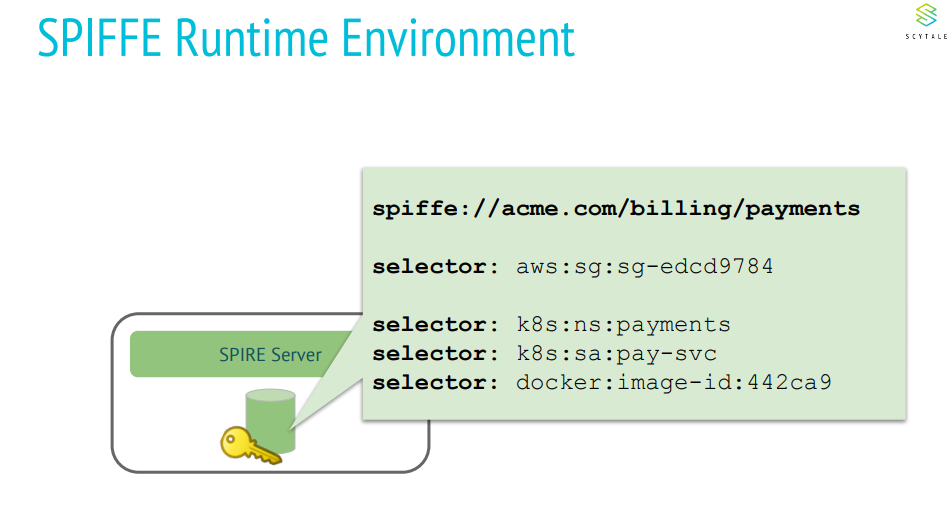
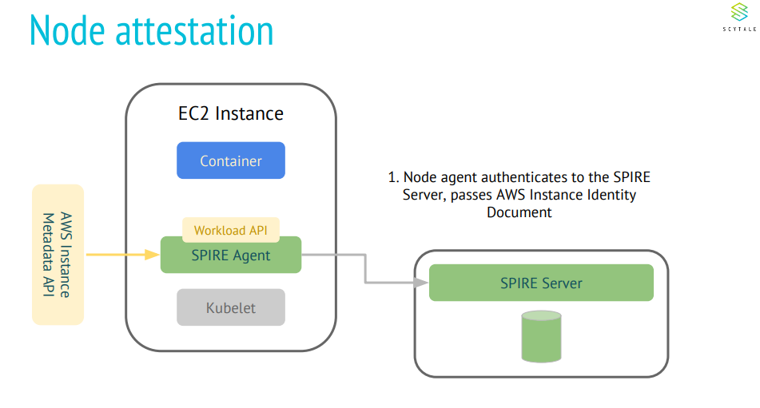
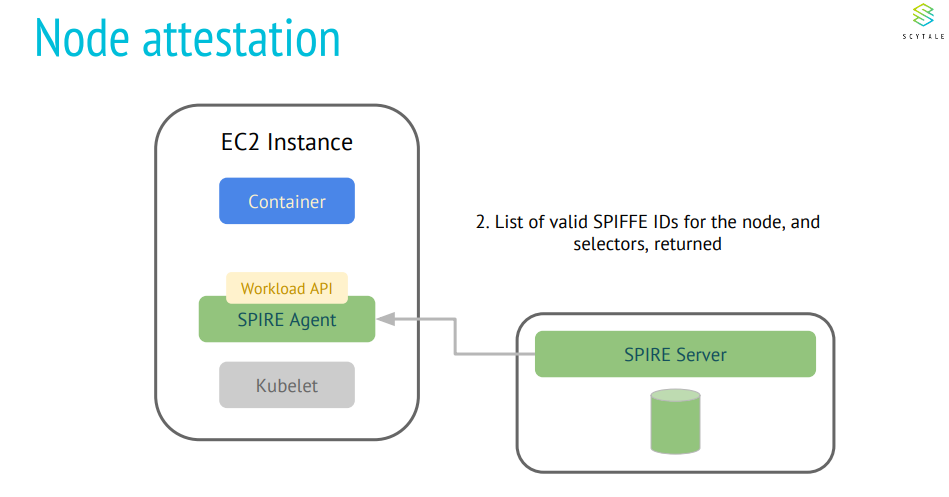
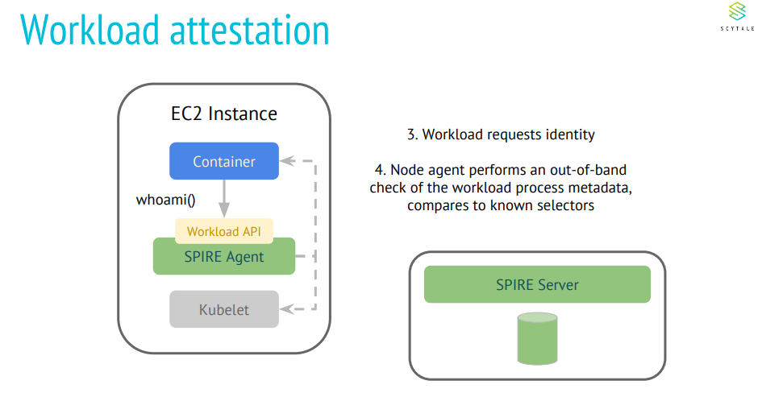
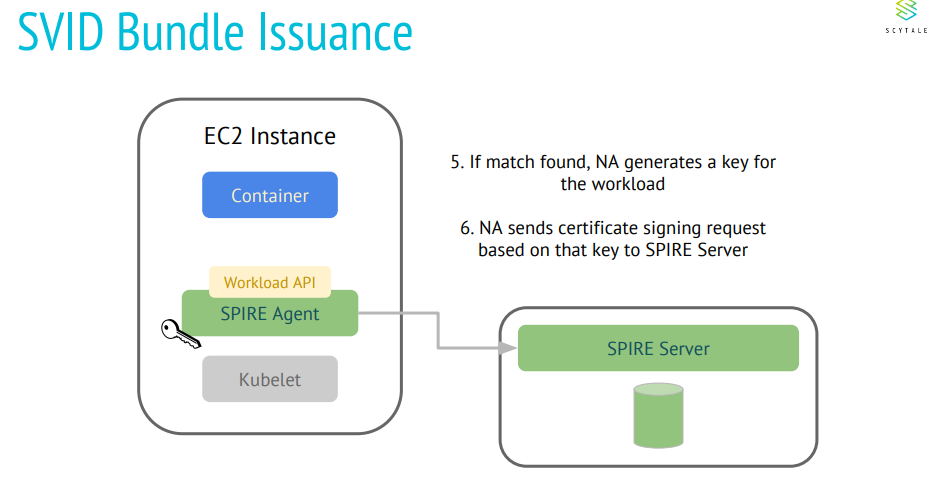
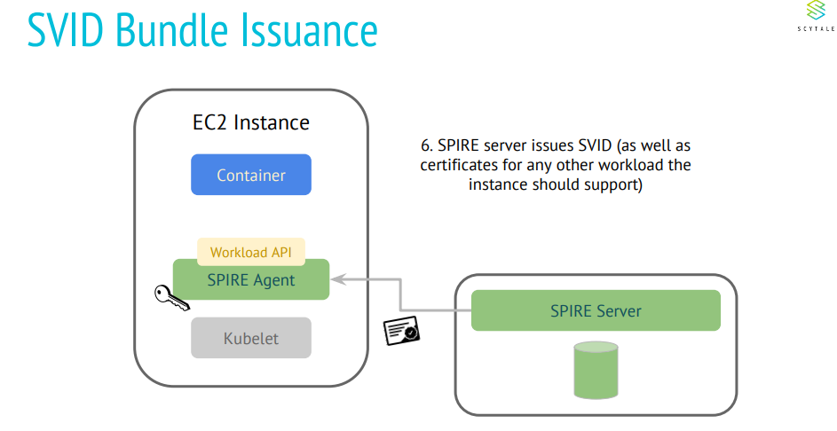
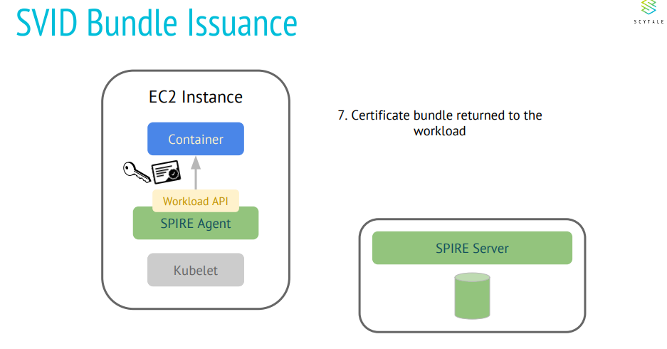

---
authors:
- Trilok Geer
categories:
- Security
date: 2019-04-16
draft: false
lastmod: 2019-04-16
summary: Secure kubeedge workloads using SPIFFE/SPIRE
tags:
- KubeEdge
- kubeedge
- edge computing
- kubernetes edge computing
- K8S edge orchestration
- edge computing platform
- security
title: Secure kubeedge using SPIFFE/SPIRE
---
## Why SPIFFE for edge computing?

Edge computing framework capabilities should be able to cloud-native design patterns and practices such as container orchestration, microservices, serverless computation which has led to increasing heterogenous deployment environments. Conventional practices for securing heterogenous deployments add complexity overhead to enforcing policies, prevention and detection of threats. Due to the increase in complexity, there is more scope of error in manageability and also, constraints the scalability of the applications across multiple production environments. In such cases, a common identity framework for workloads becomes necessary to avoid the pit-falls of conventional security policies (such as managing network policies that are based on rules for traffic between particular ip addresses) which affect implementation of distributed patterns.

This enables to build a security model which is application-oriented rather than infrastructure-oriented.

## What is SPIFFE and SPIRE?

The SPIFFE standard provides a specification for a framework capable of bootstrapping and issuing identity to services across heterogeneous environments and organizational boundaries.

SPIFFE specification standardizes the process of assigning identities to workloads , verifying and validation of workload identities and workload API to retrieve the identities. 

[https://github.com/spiffe/spiffe](https://github.com/spiffe/spiffe)

SPIFFE identities are encompassed in a SVID (SPIFFE Verifiable Identity Document). SVID specification provides the requirement for properties that must be supported when implementing SVID. Following link provides more information on SVID based on X509 certificate.

[https://github.com/spiffe/spiffe/blob/master/standards/X509-SVID.md](https://github.com/spiffe/spiffe/blob/master/standards/X509-SVID.md)

SPIRE is a toolchain implementation for SPIFFE specification that enables establishing trust between workloads (using mTLS or JWT) across different deployment environments,issue SPIFFE IDs and  workload API to retrieve workload SVIDs.

## How does SPIRE work?

Following information is extracted from Scytale presentations which gives informative and simplistic view on how SPIRE works.

## What are the few desired security requirements for Kubeedge?

Security is a paramount requirement for edge computing architecture as security breaches can make a complete organization to come to a halt (IIot) , data breach can lead to privacy issues and also control of the complete edge computing infrastructure. Few of the security requirements for deployment for kubeedge framework and edge application, but not limited to, are 

* An identifiable edge node and workloads executing on the edge node.

* A method to verify the authenticity of the node and workloads executing on the node.

* Automated rotation of security credentials.

* Limit the affect of SPOF (in case of security-related events).

* Auditable security information about node and workloads in the environment.

* Limit access of user workloads to framework components and cloud.\

* Secure device provisioning.

* Device identity management and access control.

## How SPIRE helps Kubeedge?

* Node attestation: Only verifiable edge nodes can join the edge clusters. Every node is issued an identity on verification. In case of failed node attestations, no identity documents can be issued for services running on the node.

* Workload attestation: Only verifiable workload can run on edge nodes. In case of failed workload attestations, there are no identities issues for the workloads. All communications are blocked from unverified workloads.

* Certificate rotation: Short-lived certificates are generated and rotation policies can be configured for every service communication. There is no need for custom agents and reliance on specific orchestrators for certificate rotation configuration and management.

* Automated non-root CA certificate heirarchical deployments: Edge spire servers can be configured to not share any root CA chain for downstream nodes and workloads.

## Example Demo

In the present example PoC, there is no solution implemented for secure device provisioning and identity management. It will be added in the forthcoming versions. An example demo using SPIRE for secure deployment of edge node and sample applications can be found at 

[*https://github.com/kubeedge/examples/tree/master/security-demo*](https://github.com/kubeedge/examples/tree/master/security-demo)
