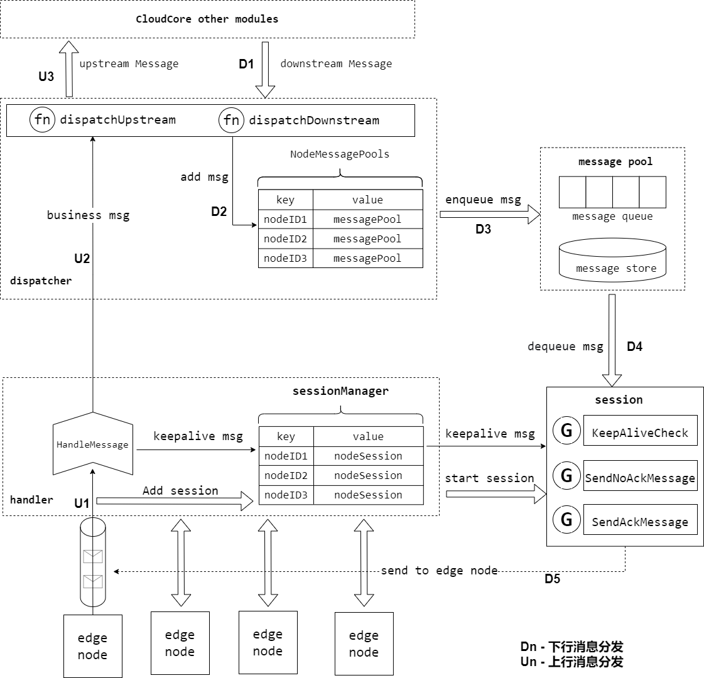

---
authors:
- Wack Xu
categories:
- General
- Announcements
date: 2023-02-08
draft: false
lastmod: 2023-02-08
summary: KubeEdge云边通信框架源码解析
tags:
- KubeEdge
- kubeedge
- edge computing
- kubernetes edge computing
- Source code analysis
- cloud-edge communication framework
- beehive
- viaduct
- cloudhub
- edgehub
- synccontroller
- 边缘计算
- 云边通信框架
- 源码解析
title: KubeEdge云边通信框架源码解析
---

# KubeEdge云边通信框架源码解析

## beehive

Beehive是KubeEdge中核心的消息通讯框架，用于不同模块的注册和模块之间的通信，KubeEdge中CloudCore和EdgeCore组件都依赖于beehive框架。因此，我们需要首先了解Beehive的工作机制，才能更进一步理解KubeEdge的设计理念和工作原理。

Beehive是基于golang channel实现的消息通信框架，核心能力包含两部分：module注册管理和module间通信管理，分别对应beehive中定义的接口ModuleContext和MessageContext，其架构图如下所示：


### message通信格式

在分析beehive的具体功能之前，我们先看下通信的消息格式，message是beehive中不同module之间通信的信息载体，message包含三部分内容，如下所示：

- Header:
  - ID: 消息ID，UUID字符串
  - ParentID: 如果是对同步消息的响应，则说明parentID存在
  - TimeStamp: 生成消息的时间
  - Sync: 消息是否为同步类型消息的标志，为true则说明是同步消息
- Route:
  - Source: 消息的来源
  - Group:  消息所属的group
  - Operation: 资源的操作
  - Resource: 操作的资源
- Content: 消息的内容

### context数据结构

ModuleContext和MessageContext定义的接口均由Context来实现，其数据结构如下所示：

```
// Context is object for Context channel
type Context struct {
   //ConfigFactory goarchaius.ConfigurationFactory
   channels     map[string]chan model.Message
   chsLock      sync.RWMutex
   typeChannels map[string]map[string]chan model.Message
   typeChsLock  sync.RWMutex
   anonChannels map[string]chan model.Message
   anonChsLock  sync.RWMutex
}
```

https://github.com/kubeedge/kubeedge/blob/master/staging/src/github.com/kubeedge/beehive/pkg/core/channel/context_channel.go

- channels - channels是模块的名称和对应的消息channel映射，用于将消息发送到相应的模块。
- chsLock - channels map的锁
- typeChannels  - typeChannels是一个两级map，第一级key是group名字，第二级key是module名字，value是module对应的消息channel。
- typeChsLock - typeChannels map的锁 
- anonChannels - anonChannels是消息parentID到channel的映射，将用于发送同步消息的响应。 
- anonChsLock - anonChannels map的锁

### beehive module管理

在beehive中，module定义是一个接口，只要实现了此接口，便可以成为module，在KubeEdge中常见的模块，如cloudhub、edgehub、edgeController等，都已经实现了这个接口。

```
// Module interface
type Module interface {
   Name() string
   Group() string
   Start()
   Enable() bool
}
```

https://github.com/kubeedge/kubeedge/blob/master/staging/src/github.com/kubeedge/beehive/pkg/core/module.go

Beehive支持的module操作如下：

```
// ModuleContext is interface for context module management
type ModuleContext interface {
	AddModule(info *common.ModuleInfo)
	AddModuleGroup(module, group string)
	Cleanup(module string)
}
```

https://github.com/kubeedge/kubeedge/blob/master/staging/src/github.com/kubeedge/beehive/pkg/core/context/context.go

| 接口           | 功能                  | 实现                                                         |
| -------------- | --------------------- | ------------------------------------------------------------ |
| AddModule      | 添加module            | 首先创建一个message类型的channel，然后保存到Context中的channels map里 |
| AddModuleGroup | 添加module到所属group | 首先会从Context中的channels map里查询对应的channel，然后将对应的group以及module和channel保存到typeChannels里面 |
| Cleanup        | 清理module            | 将module信息从channels和typeChannels清除                     |

### beehive消息通信管理

beehive中注册的模块之间，可以互相通信，beehive支持多种通信方式，如下所示：

```
// MessageContext is interface for message syncing
type MessageContext interface {
	// async mode
	Send(module string, message model.Message)
	Receive(module string) (model.Message, error)
	// sync mode
	SendSync(module string, message model.Message, timeout time.Duration) (model.Message, error)
	SendResp(message model.Message)
	// group broadcast
	SendToGroup(group string, message model.Message)
	SendToGroupSync(group string, message model.Message, timeout time.Duration) error
}
```

https://github.com/kubeedge/kubeedge/blob/master/staging/src/github.com/kubeedge/beehive/pkg/core/context/context.go

| 接口            | 功能                                  | 实现                                                         |
| --------------- | ------------------------------------- | ------------------------------------------------------------ |
| Send            | 发送异步消息到指定module              | 从Context中的channels map里查询对应module的channel，然后将消息放入到channel里面 |
| Receive         | 接收发送到指定module的消息            | 从Context中的channels map里查询对应module的channel，然后从channel里面取出消息，如果没有消息到达，则会阻塞，直至有消息到达。 |
| SendSync        | 发送同步消息到指定module              | SendSync从channels map中获取模块的channel，将消息放入channel，然后创建一个新的channel，并将其添加到anonChannels映射中，其中key是messageID，然后在这个channel上等待接收到消息（响应），直到超时，如果在超时之前收到响应消息，则返回响应消息，否则返回空的消息和超时错误。 |
| SendResp        | 发送对同步消息的相应                  | 根据message中parentID在anonChannels查找对应的channel，然后将消息放入channel中，如果不存在，则记录错误 |
| SendToGroup     | 发送异步消息到指定group下的所有module | SendToGroup从typeChannels map中获取指定group下的所有module，然后遍历module，依次发送消息到module |
| SendToGroupSync | 发送同步消息到指定group下的所有module | SendToGroup从typeChannels map中获取指定group下的所有module，创建了一个size和module数量一样的匿名通道，然后遍历module，调用send发送消息，然后等待匿名通道收到消息的数量等于size |

### beehive模块注册启动

在cloudocre或者edgecore启动的时候，会将所有的module注册到beehive内核，beehive中维护了module名字到module的映射。

```
// registerModules register all the modules started in cloudcore
func registerModules(c *v1alpha1.CloudCoreConfig) {
   cloudhub.Register(c.Modules.CloudHub)
   edgecontroller.Register(c.Modules.EdgeController)
   devicecontroller.Register(c.Modules.DeviceController)
   nodeupgradejobcontroller.Register(c.Modules.NodeUpgradeJobController)
   synccontroller.Register(c.Modules.SyncController)
   cloudstream.Register(c.Modules.CloudStream, c.CommonConfig)
   router.Register(c.Modules.Router)
   dynamiccontroller.Register(c.Modules.DynamicController)
}
```

https://github.com/kubeedge/kubeedge/blob/master/cloud/cmd/cloudcore/app/server.go#L155-L165

在beehive启动的时候，会获取所有注册的module，然后遍历所有的module，依次执行如下操作：

1. 根据module的类型，初始化moduleInfo信息
2. 执行beehiveContext.AddModule
3. 执行beehiveContext.AddModuleGroup
4. 调用每个module的start方法启动module

```
// StartModules starts modules that are registered
func StartModules() {
	// only register channel mode, if want to use socket mode, we should also pass in common.MsgCtxTypeUS parameter
	beehiveContext.InitContext([]string{common.MsgCtxTypeChannel})

	modules := GetModules()

	for name, module := range modules {
		var m common.ModuleInfo
		switch module.contextType {
		case common.MsgCtxTypeChannel:
			m = common.ModuleInfo{
				ModuleName: name,
				ModuleType: module.contextType,
			}
			
		......
		
		default:
			klog.Exitf("unsupported context type: %s", module.contextType)
		}

		beehiveContext.AddModule(&m)
		beehiveContext.AddModuleGroup(name, module.module.Group())

		go moduleKeeper(name, module, m)
		klog.Infof("starting module %s", name)
	}
}
```

https://github.com/kubeedge/kubeedge/blob/master/staging/src/github.com/kubeedge/beehive/pkg/core/core.go

## viaduct

viaduct 是KubeEdge云边通信的中间件，基于统一的抽象接口，提供了不同协议的服务端和客户端实现，用于边缘节点和云端管理面的连接管理和数据传输管理。viaduct屏蔽了不同网络协议之间的差异，使用统一的接口对上层提供服务，支持用户可以通过配置云边通信的网络协议灵活选择接入协议。 目前内置了多种网络协议的实现，如websocket和quic。后续根据不同的边缘接入场景和业务场景，通过viaduct 可以快速对接新的网络协议，满足用户的需求。

viaduct 中主要分为两部分：服务端和客户端接口以及不同协议的实现。服务端被云端组件CloudCore所使用，用来启动不同协议的server，用来边缘节点的接入和数据传输，客户端被边缘组件edgeCore所使用，是用来发起接入的client，用于连接云端CloudCore组件。其主要架构如下所示：


接下来，我们将以WebSocket协议为例，来介绍服务端和客户端接口以及实现。

### Connection接口定义

Connection是viaduct中核心的接口，viaduct支持双向通信协议，云端和边缘节点可以双向消息传输，在边缘节点接入的时候，server端和client端均需要初始化Connection，并通过此Connection进行全双工通信。Connection的接口定义如下：

```
// the operation set of connection
type Connection interface {
   // process message from the connection
   ServeConn()

   // SetReadDeadline sets the deadline for future Read calls
   // and any currently-blocked Read call.
   // A zero value for t means Read will not time out.
   SetReadDeadline(t time.Time) error

   // SetWriteDeadline sets the deadline for future Write calls
   // and any currently-blocked Write call.
   // Even if write times out, it may return n > 0, indicating that
   // some of the data was successfully written.
   // A zero value for t means Write will not time out.
   SetWriteDeadline(t time.Time) error

   // Read read raw data from the connection
   // you can also set raw data consumer when new client/server instance
   Read(raw []byte) (int, error)

   // Write write raw data to the connection
   // it will open a stream for raw data
   Write(raw []byte) (int, error)

   // WriteMessageAsync writes data to the connection and don't care about the response.
   WriteMessageAsync(msg *model.Message) error

   // WriteMessageSync writes data to the connection and care about the response.
   WriteMessageSync(msg *model.Message) (*model.Message, error)

   // ReadMessage reads message from the connection.
   // it will be blocked when no message received
   // if you want to use this api for message reading,
   // make sure AutoRoute be false
   ReadMessage(msg *model.Message) error

   // RemoteAddr returns the remote network address.
   RemoteAddr() net.Addr

   // LocalAddr returns the local network address.
   LocalAddr() net.Addr

   // ConnectState return the current connection state
   ConnectionState() ConnectionState

   // Close closes the connection.
   // Any blocked Read or Write operations will be unblocked and return errors.
   Close() error
}
```

https://github.com/kubeedge/kubeedge/blob/master/staging/src/github.com/kubeedge/viaduct/pkg/conn/conn.go

其核心接口如下：

| 接口              | 功能                                                         |
| ----------------- | ------------------------------------------------------------ |
| ServeConn         | 云端server使用，持续的从connection中读取数据并转换成message，然后调用回调函数执行分发操作 |
| Read              | 从connection中读取原始byte数据                               |
| Write             | 向connection中写入原始byte数据                               |
| WriteMessageAsync | 向connection中写入message数据，不需要对端响应                |
| WriteMessageSync  | 向connection中写入message数据，同时等待对端的响应消息        |
| ReadMessage       | 从connection中读取数据并转化为message格式                    |

### server接口定义及websocket实现

server的接口定义比较简单，如下所示：

```
// protocol server
type ProtocolServer interface {
   ListenAndServeTLS() error
   Close() error
}
```

webSocket协议的实现也比较简单

```
func (srv *WSServer) ListenAndServeTLS() error {
   return srv.server.ListenAndServeTLS("", "")
}

func (srv *WSServer) Close() error {
   if srv.server != nil {
      return srv.server.Close()
   }
   return nil
}
```

https://github.com/kubeedge/kubeedge/blob/master/staging/src/github.com/kubeedge/viaduct/pkg/server/ws.go

WSServer的核心逻辑在于ServeHTTP方法里面，用于处理边缘节点的接入，流程如下所示：


### client接口定义及websocket实现

client接口定义也是比较简单，如下所示，Connect方法用于连接云端的server，并返回Connection对象，然后边缘侧使用此connection进行消息的读取和写入

```
// each protocol(websocket/quic) provide Connect
type ProtocolClient interface {
   Connect() (conn.Connection, error)
}
```

webSocket Client 通过dial发起对云端的连接，连接成功之后，如果对应的Callback不为空，则发起回调函数，然后初始化Connection对象并返回

```
// Connect try to connect remote server
func (c *WSClient) Connect() (conn.Connection, error) {
   header := c.exOpts.Header
   header.Add("ConnectionUse", string(c.options.ConnUse))
   wsConn, resp, err := c.dialer.Dial(c.options.Addr, header)
   if err == nil {
      klog.Infof("dial %s successfully", c.options.Addr)

      // do user's processing on connection or response
      if c.exOpts.Callback != nil {
         c.exOpts.Callback(wsConn, resp)
      }
      return conn.NewConnection(&conn.ConnectionOptions{
         ConnType: api.ProtocolTypeWS,
         ConnUse:  c.options.ConnUse,
         Base:     wsConn,
         Consumer: c.options.Consumer,
         Handler:  c.options.Handler,
         CtrlLane: lane.NewLane(api.ProtocolTypeWS, wsConn),
         State: &conn.ConnectionState{
            State:   api.StatConnected,
            Headers: c.exOpts.Header.Clone(),
         },
         AutoRoute: c.options.AutoRoute,
      }), nil
   }

   // something wrong!!
   var respMsg string
   if resp != nil {
      body, errRead := io.ReadAll(io.LimitReader(resp.Body, comm.MaxReadLength))
      if errRead == nil {
         respMsg = fmt.Sprintf("response code: %d, response body: %s", resp.StatusCode, string(body))
      } else {
         respMsg = fmt.Sprintf("response code: %d", resp.StatusCode)
      }
      resp.Body.Close()
   }
   klog.Errorf("dial websocket error(%+v), response message: %s", err, respMsg)

   return nil, err
}
```

https://github.com/kubeedge/kubeedge/blob/master/staging/src/github.com/kubeedge/viaduct/pkg/client/ws.go

## cloudhub

CloudHub是云端组件CloudCore的一个模块，负责边缘节点的接入和云边数据传输，是Controllers和边缘EdgeCore之间的中介。它负责分发下行消息(其内封装了k8s资源事件，如pod update等)到边缘节点，也负责接收边缘节点发送的状态消息并转发至对应的controllers。CloudHub在KubeEdge中的位置如下所示：


Cloudhub内部有几个重要的代码模块，如下所示：


- **HTTP server：**为边缘节点提供证书服务入口，如获取CA证书、证书签发与证书轮转
- **WebSocket server：**可配置是否开启，为边缘节点提供WebSocket协议接入服务
- **QUIC server：**可配置是否开启，为边缘节点提供QUIC协议接入服务
- **CSI socket server：**在云端用来和csi driver通信
- **Token manager：**边缘节点接入token凭据管理，token默认12h轮转
- **Certificate manager：**边缘节点证书签发和轮转的实现模块
- **message handler：**边缘节点接入管理和边缘消息处理分发
- **node session manager：**边缘节点会话生命周期管理
- **message dispatcher：**上行和下行消息分发管理

### CloudHub启动流程

Cloudhub在Cloudcore启动时注册，通过beehive消息通信框架调用Start()函数启动Cloudhub模块。

```
cloudhub.Register(c.Modules.CloudHub)
```

CloudHub启动的时候，首先会启动dispatcher.DispatchDownstream协程，用来异步分发下行消息，其次进行证书的初始化，如果没有配置证书，则会自动生成CA和服务证书，用于后续WebSocket、QUIC、HTTP服务的安全通讯。然后启动token manager模块，生成边缘节点接入使用的token凭据以及开启自动轮转服务。StartHTTPServer()启动服务器监听，主要用于EdgeCore申请证书，它将等待edgecore发来请求，获取证书。然后，启动cloudhub服务，具体的操作是使用viaduct中间件启动一个服务器，等待EdgeCore发来连接的请求，协议可以是基于tcp的WebSocket或基于udp的QUIC。如果用户需要使用CSI相关功能，则会启动CSI socket server。

```
func (ch *cloudHub) Start() {
   if !cache.WaitForCacheSync(beehiveContext.Done(), ch.informersSyncedFuncs...) {
      klog.Errorf("unable to sync caches for objectSyncController")
      os.Exit(1)
   }

   // start dispatch message from the cloud to edge node
   go ch.dispatcher.DispatchDownstream()

   // check whether the certificates exist in the local directory,
   // and then check whether certificates exist in the secret, generate if they don't exist
   if err := httpserver.PrepareAllCerts(); err != nil {
      klog.Exit(err)
   }
   // TODO: Will improve in the future
   DoneTLSTunnelCerts <- true
   close(DoneTLSTunnelCerts)

   // generate Token
   if err := httpserver.GenerateToken(); err != nil {
      klog.Exit(err)
   }

   // HttpServer mainly used to issue certificates for the edge
   go httpserver.StartHTTPServer()

   servers.StartCloudHub(ch.messageHandler)

   if hubconfig.Config.UnixSocket.Enable {
      // The uds server is only used to communicate with csi driver from kubeedge on cloud.
      // It is not used to communicate between cloud and edge.
      go udsserver.StartServer(hubconfig.Config.UnixSocket.Address)
   }
}
```

https://github.com/kubeedge/kubeedge/blob/master/cloud/pkg/cloudhub/cloudhub.go

接下来，我们看一下cloudhub的核心功能，边缘节点接入管理和消息分发管理，下图是CloudHub的内部实现架构图：




### 下行消息发送模式

发送到边缘节点的下行消息，有两种发送模式，这两种发送模式，直接关系到下行消息的分发和节点session的消息处理，如下所示：

```
ACK模式：在这种模式下，边缘节点收到下行消息并将消息正确保存到本地数据存储之后，需要给云端发送ACK响应消息已通知云端消息在边缘侧被正确处理，如果云端没有收到ACK消息，则认为消息没有在边缘节点正确处理，则会重试，直到收到ACK响应消息。

NO—ACK模式：在这种模式下，缘节点收到下行消息后，不需要给云端发送ACK响应消息，云端认为边缘侧已经收到此消息并正确处理，在这种模式下，消息有可能会丢失。这种模式，通常用于给边缘节点同步消息发送响应，如果边缘侧没有收到响应，则会触发重试操作。
```

### 边缘节点接入

边缘节点接入的主要逻辑在messageHandler里面，handler接口如下所示：

```
type Handler interface {
   // HandleConnection is invoked when a new connection arrives
   HandleConnection(connection conn.Connection)

   // HandleMessage is invoked when a new message arrives.
   HandleMessage(container *mux.MessageContainer, writer mux.ResponseWriter)

   // OnEdgeNodeConnect is invoked when a new connection is established
   OnEdgeNodeConnect(info *model.HubInfo, connection conn.Connection) error

   // OnEdgeNodeDisconnect is invoked when a connection is lost
   OnEdgeNodeDisconnect(info *model.HubInfo, connection conn.Connection)

   // OnReadTransportErr is invoked when the connection read message err
   OnReadTransportErr(nodeID, projectID string)
}
```

https://github.com/kubeedge/kubeedge/blob/master/cloud/pkg/cloudhub/handler/message_handler.go

HandleConnection用来处理边缘节点接入，以WebSocket协议接入为例，WebSocket server通过viaduct启动之后，当有边缘节点接上来时，viaduct中serverHTTP将http协议upgrade成为websockt协议，然后初始化Connection对象，HandleConnection根据传入的connection对象进行一系列初始化操作：

1. 执行初始化前的校验工作，如是否超过配置的node数量限制。

```
nodeID := connection.ConnectionState().Headers.Get("node_id")
projectID := connection.ConnectionState().Headers.Get("project_id")

if mh.SessionManager.ReachLimit() {
   klog.Errorf("Fail to serve node %s, reach node limit", nodeID)
   return
}
```

2. 初始化nodeMessagePool，并加入到MessageDispatcher的哈希表中，用于存储分发的下行消息。

```
// init node message pool and add to the dispatcher
nodeMessagePool := common.InitNodeMessagePool(nodeID)
mh.MessageDispatcher.AddNodeMessagePool(nodeID, nodeMessagePool)
```

nodeMessagePool是用来存储下行消息的队列，每个边缘节点在接入时，都会初始化一个对应的nodeMessagePool，和之前的下行消息发送模式对应，nodeMessagePool包含两个队列，分别用来存储ACK和NO-ACK模式的下行消息。

```
// NodeMessagePool is a collection of all downstream messages sent to an
// edge node. There are two types of messages, one that requires an ack
// and one that does not. For each type of message, we use the `queue` to
// mark the order of sending, and use the `store` to store specific messages
type NodeMessagePool struct {
   // AckMessageStore store message that will send to edge node
   // and require acknowledgement from edge node.
   AckMessageStore cache.Store
   // AckMessageQueue store message key that will send to edge node
   // and require acknowledgement from edge node.
   AckMessageQueue workqueue.RateLimitingInterface
   // NoAckMessageStore store message that will send to edge node
   // and do not require acknowledgement from edge node.
   NoAckMessageStore cache.Store
   // NoAckMessageQueue store message key that will send to edge node
   // and do not require acknowledgement from edge node.
   NoAckMessageQueue workqueue.RateLimitingInterface
}
```

https://github.com/kubeedge/kubeedge/blob/master/cloud/pkg/cloudhub/common/message_pool.go

3. 初始化nodeSession对象，加入到SessionManager哈希表中，并启动nodeSession

```
// create a node session for each edge node
nodeSession := session.NewNodeSession(nodeID, projectID, connection,
   keepaliveInterval, nodeMessagePool, mh.reliableClient)
// add node session to the session manager
mh.SessionManager.AddSession(nodeSession)

// start session for each edge node and it will keep running until
// it encounters some Transport Error from underlying connection.
nodeSession.Start()
```

每个边缘节点对应一个nodeSession，nodeSession是对每个边缘节点连接会话的抽象，SessionManager存储并管理连接到当前cloudHub的所有边缘节点的session，nodeSession启动时，会启动该节点所需要的所有处理协程，包括：KeepAliveCheck心跳检测，SendAckMessage发送ACK模式的下行消息，SendNoAckMessage发送NO-ACK模式的下行消息。

```
// Start the main goroutine responsible for serving node session
func (ns *NodeSession) Start() {
   klog.Infof("Start session for edge node %s", ns.nodeID)

   go ns.KeepAliveCheck()
   go ns.SendAckMessage()
   go ns.SendNoAckMessage()

   <-ns.ctx.Done()
}
```

### 上下行消息分发

在CloudHub中，上行消息的处理比较简单，主要逻辑在messageHandler的HandleMessage方法中，底层的viaduct库进行数据的解析转换成MessageContainer对象，里面包含了message信息，HandleMessage收到message后，进行简单的校验，然后调用MessageDispatcher DispatchUpstream方法，转发到不同的模块，如edgeController、deviceController等。

```
// HandleMessage handle all the request from node
func (mh *messageHandler) HandleMessage(container *mux.MessageContainer, writer mux.ResponseWriter) {
   nodeID := container.Header.Get("node_id")
   projectID := container.Header.Get("project_id")

   // validate message
   if container.Message == nil {
      klog.Errorf("The message is nil for node: %s", nodeID)
      return
   }

   klog.V(4).Infof("[messageHandler]get msg from node(%s): %+v", nodeID, container.Message)

   // dispatch upstream message
   mh.MessageDispatcher.DispatchUpstream(container.Message, &model.HubInfo{ProjectID: projectID, NodeID: nodeID})
}
```

下行消息的分发流程如上图D1-D5所示，以发送ACK消息为例，主要包括以下流程：

1. KubeEdge使用K8s objectSync CRD存储已成功发送到Edge的资源的最新resourceVersion。当CloudHub重新启动或正常启动时，它将检查待发送的资源resourceVersion和已发送成功的resourceVersion，以避免发送旧消息。
2. EdgeController和devicecontroller等将消息发送到Cloudhub，MessageDispatcher将根据消息中的节点名称，将消息发送到相应的NodeMessagePool，同时会根据消息的resource等信息来选择发送模式。在加入队列的过程中，会查询资源对应的objectSync CR，获取发送成功的最新资源resourceVersion，并和待加入队列的消息比较，避免重复发送。
3. 节点对应的nodeSession SendAckMessage协程将顺序地将数据从NodeMessagePool取出发送到相应的边缘节点，同时并将消息ID存储在ACK channel中。当收到来自边缘节点的ACK消息时，ACK channel将收到通知，并将当前消息的resourceVersion保存到objectSync CR中，并发送下一条消息。
4. 当Edgecore收到消息时，它将首先将消息保存到本地数据存储中，然后将ACK消息返回给云端。如果cloudhub在此间隔内未收到ACK消息，它将继续重新发送该消息5次。如果所有5次重试均失败，cloudhub将丢弃该事件。
5. CloudCore中另一个模块SyncController将处理这些失败的事件。即使边缘节点接收到该消息，返回的ACK消息也可能在传输过程中丢失。在这种情况下，SyncController将再次发送消息给cloudhub，再次触发下行消息分发，直至成功。

```
func (ns *NodeSession) sendMessageWithRetry(copyMsg, msg *beehivemodel.Message) error {
   ackChan := make(chan struct{})
   ns.ackMessageCache.Store(copyMsg.GetID(), ackChan)

   // initialize retry count and timer for sending message
   retryCount := 0
   ticker := time.NewTimer(sendRetryInterval)

   err := ns.connection.WriteMessageAsync(copyMsg)
   if err != nil {
      return err
   }

   for {
      select {
      case <-ackChan:
         ns.saveSuccessPoint(msg)
         return nil

      case <-ticker.C:
         if retryCount == 4 {
            return ErrWaitTimeout
         }

         err := ns.connection.WriteMessageAsync(copyMsg)
         if err != nil {
            return err
         }

         retryCount++
         ticker.Reset(sendRetryInterval)
      }
   }
}
```

https://github.com/kubeedge/kubeedge/tree/master/cloud/pkg/cloudhub/session

## synccontroller

在边缘计算场景下，边缘的网络通常是不稳定的，这将导致云边的网络连接频繁断开，在云边协同通信时存在丢失数据的风险。synccontroller是CloudCore中的一个模块，用来保障消息的可靠性发送。在KubeEdge中，使用objectSync对象来持久化云边协同消息状态。在云和边缘状态同步的过程中，云端会实时记录每个边缘节点同步成功的最新消息版本号（ResourceVersion），并以CR的形式持久化保存到 K8s 中。该机制可以保证在边缘场景下云端故障或者边缘离线重启后消息发送的顺序和连续性，避免重发旧消息引起云边状态不一致问题。与此同时，synccontroller会周期性检查同步云边数据，保持一致性。它主要负责周期性检查个边缘节点的同步状态，对比 K8s 中资源的信息，将不一致的状态同步到边缘，确保云边状态的最终一致性。

synccontroller在Cloudcore启动时注册，通过beehive消息通信框架调用Start()函数启动synccontroller模块。

```
synccontroller.Register(c.Modules.SyncController)
```

synccontroller启动时，会开启周期性的检测，间隔5s执行一次。

```
func (sctl *SyncController) Start() {
   if !cache.WaitForCacheSync(beehiveContext.Done(), sctl.informersSyncedFuncs...) {
      klog.Errorf("unable to sync caches for sync controller")
      return
   }

   sctl.deleteObjectSyncs() //check outdate sync before start to reconcile
   go wait.Until(sctl.reconcile, 5*time.Second, beehiveContext.Done())
}
```

https://github.com/kubeedge/kubeedge/tree/master/cloud/pkg/synccontroller

ObjectSync用于保存命名空间范围的对象。 它们的名称由相关的节点名称和对象UUID组成，SyncController将定期比较保存的ObjectSync对象中的已发送resourceVersion与K8s中的对象，然后触发诸如重试和删除之类的事件。当cloudhub将事件添加到NodeMessagePool时，它将与NodeMessagePool中的相应对象进行比较。 如果NodeMessagePool中的对象较新，它将直接丢弃这些事件，否则CloudHub将消息发送到边缘侧。


## edgehub

EdgeHub 是一个 Web Socket或者QUIC协议的 客户端，负责与云端CloudCore交互，包括同步云端资源更新、报告边缘主机和设备状态变化到云端等功能。

EdgeHub 在Edgecore启动时通过beehive框架注册， 并对edgehub进行了初始化

```
// Register register edgehub
func Register(eh *v1alpha2.EdgeHub, nodeName string) {
   config.InitConfigure(eh, nodeName)
   core.Register(newEdgeHub(eh.Enable))
}
```

EdgeHub启动代码如下所示：

```
func (eh *EdgeHub) Start() {
   eh.certManager = certificate.NewCertManager(config.Config.EdgeHub, config.Config.NodeName)
   eh.certManager.Start()
   for _, v := range GetCertSyncChannel() {
      v <- true
      close(v)
   }

   go eh.ifRotationDone()

   for {
      select {
      case <-beehiveContext.Done():
         klog.Warning("EdgeHub stop")
         return
      default:
      }
      err := eh.initial()
      if err != nil {
         klog.Exitf("failed to init controller: %v", err)
         return
      }

      waitTime := time.Duration(config.Config.Heartbeat) * time.Second * 2

      err = eh.chClient.Init()
      if err != nil {
         klog.Errorf("connection failed: %v, will reconnect after %s", err, waitTime.String())
         time.Sleep(waitTime)
         continue
      }
      // execute hook func after connect
      eh.pubConnectInfo(true)
      go eh.routeToEdge()
      go eh.routeToCloud()
      go eh.keepalive()

      // wait the stop signal
      // stop authinfo manager/websocket connection
      <-eh.reconnectChan
      eh.chClient.UnInit()

      // execute hook fun after disconnect
      eh.pubConnectInfo(false)

      // sleep one period of heartbeat, then try to connect cloud hub again
      klog.Warningf("connection is broken, will reconnect after %s", waitTime.String())
      time.Sleep(waitTime)

      // clean channel
   clean:
      for {
         select {
         case <-eh.reconnectChan:
         default:
            break clean
         }
      }
   }
}
```

https://github.com/kubeedge/kubeedge/blob/master/edge/pkg/edgehub/edgehub.go

EdgeHub 的启动过程如下所示，主要包含以下步骤：

1. 证书初始化，从 cloudcore 申请证书（若正确配置本地证书，则直接使用本地证书），启动证书轮转模块，然后进入循环
2. 调用 eh.initial() 创建 eh.chClient，接着调用 eh.chClient.Init()，初始化过程通过viadcut库建立了 websocket/quic 的connection，
3. 调用 eh.pubConnectInfo(true)，向 edgecore 各模块广播已经连接成功的消息
4. 接下来启动了三个协程：
   - routeToEdge
   - routeToCloud
   - keepalive

**routeToEdge：**接收云端发送下来的消息，如果是同步消息响应，则调用beehive sendResp发送响应，否则，根据消息的group，发送到对应的group

```
func (eh *EdgeHub) routeToEdge() {
   for {
      select {
      case <-beehiveContext.Done():
         klog.Warning("EdgeHub RouteToEdge stop")
         return
      default:
      }
      message, err := eh.chClient.Receive()
      if err != nil {
         klog.Errorf("websocket read error: %v", err)
         eh.reconnectChan <- struct{}{}
         return
      }

      klog.V(4).Infof("[edgehub/routeToEdge] receive msg from cloud, msg:% +v", message)
      err = eh.dispatch(message)
      if err != nil {
         klog.Errorf("failed to dispatch message, discard: %v", err)
      }
   }
}
```

**routeToCloud：**接收边缘侧其他module发送过来的消息，然后将消息通过websocket/quic client发送到云端

```
func (eh *EdgeHub) routeToCloud() {
   for {
      select {
      case <-beehiveContext.Done():
         klog.Warning("EdgeHub RouteToCloud stop")
         return
      default:
      }
      message, err := beehiveContext.Receive(modules.EdgeHubModuleName)
      if err != nil {
         klog.Errorf("failed to receive message from edge: %v", err)
         time.Sleep(time.Second)
         continue
      }

      err = eh.tryThrottle(message.GetID())
      if err != nil {
         klog.Errorf("msgID: %s, client rate limiter returned an error: %v ", message.GetID(), err)
         continue
      }

      // post message to cloud hub
      err = eh.sendToCloud(message)
      if err != nil {
         klog.Errorf("failed to send message to cloud: %v", err)
         eh.reconnectChan <- struct{}{}
         return
      }
   }
}
```

**keepalive：**根据心跳周期定期向云端发送心跳消息

```
func (eh *EdgeHub) keepalive() {
   for {
      select {
      case <-beehiveContext.Done():
         klog.Warning("EdgeHub KeepAlive stop")
         return
      default:
      }
      msg := model.NewMessage("").
         BuildRouter(modules.EdgeHubModuleName, "resource", "node", messagepkg.OperationKeepalive).
         FillBody("ping")

      // post message to cloud hub
      err := eh.sendToCloud(*msg)
      if err != nil {
         klog.Errorf("websocket write error: %v", err)
         eh.reconnectChan <- struct{}{}
         return
      }

      time.Sleep(time.Duration(config.Config.Heartbeat) * time.Second)
   }
}
```

5. 当云边消息传送过程中出现错误时，边缘部分会重新 init 相应的 websocket/quic client，与云端重新建立连接。