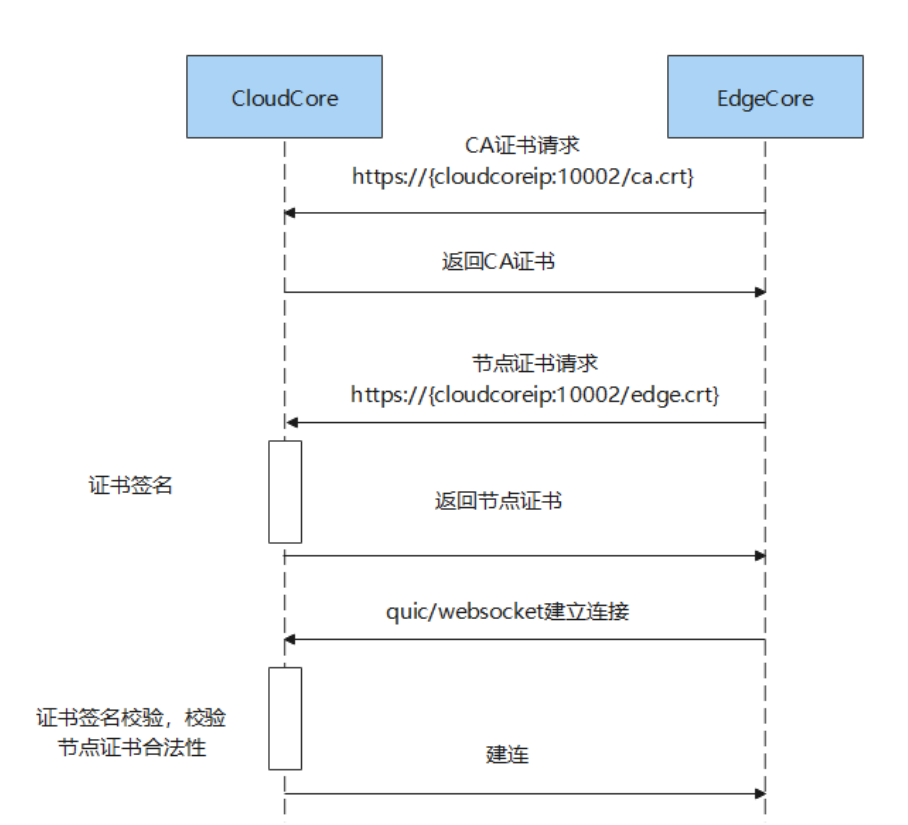
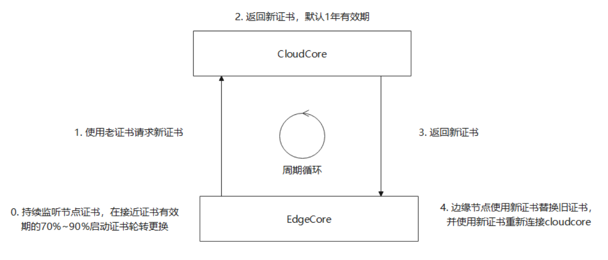

---
authors:
- gy95
categories:
- General
- Announcements
date: 2023-02-12
draft: false
lastmod: 2023-02-12
summary: KubeEdge安装工具keadm及云边证书管理机制源码解析
tags:
- KubeEdge
- kubeedge
- edge computing
- kubernetes edge computing
- Source code analysis
- keadm
- certificate management
- 边缘计算
- 源码解析
title: KubeEdge安装工具keadm及云边证书管理机制源码解析
---

# KubeEdge安装工具keadm及云边证书管理机制源码解析

## keadm

keadm是KubeEdge社区官方提供的安装工具，用于初始化KubeEdge云上组件，边缘节点注册，删除节点等KubeEdge运维相关的操作。

keadm支持如下操作，我们可以通过执行`keadm --help`命令查看keadm支持的操作的详细信息
```shell
# keadm --help

    +----------------------------------------------------------+
    | KEADM                                                    |
    | Easily bootstrap a KubeEdge cluster                      |
    |                                                          |
    | Please give us feedback at:                              |
    | https://github.com/kubeedge/kubeedge/issues              |
    +----------------------------------------------------------+

    Create a cluster with cloud node
    (which controls the edge node cluster), and edge nodes
    (where native containerized application, in the form of
    pods and deployments run), connects to devices.

Usage:
  keadm [command]

Examples:

    +----------------------------------------------------------+
    | On the cloud machine:                                    |
    +----------------------------------------------------------+
    | master node (on the cloud)# sudo keadm init              |
    +----------------------------------------------------------+

    +----------------------------------------------------------+
    | On the edge machine:                                     |
    +----------------------------------------------------------+
    | worker node (at the edge)# sudo keadm join <flags>       |
    +----------------------------------------------------------+

    You can then repeat the second step on, as many other machines as you like.


Available Commands:
  completion  generate the autocompletion script for the specified shell
  config      Use this command to configure keadm
  debug       debug function to help diagnose the cluster
  deprecated  keadm deprecated command
  gettoken    To get the token for edge nodes to join the cluster
  help        Help about any command
  init        Bootstraps cloud component. Checks and install (if required) the pre-requisites.
  join        Bootstraps edge component. Checks and install (if required) the pre-requisites. Execute it on any edge node machine you wish to join
  manifest    Render the manifests by using a list of set flags like helm.
  reset       Teardowns KubeEdge (cloud(helm installed) & edge) component
  upgrade     Upgrade edge component. Upgrade the edge node to the desired version.
  version     Print the version of keadm

Flags:
  -h, --help   help for keadm

Additional help topics:
  keadm beta       keadm beta command

Use "keadm [command] --help" for more information about a command.
```

keadm功能很丰富，其中最重要的两个命令是`keadm init`和`keadm join`，前者用于初始化KubeEdge的云上组件，后者用于将边缘节点加入到KubeEdge集群中。下面我将针对这两个命令进行源码剖析。

### keadm init
`keadm init`用于初始化KubeEdge的云上组件，会用Helm以容器化的方式安装KubeEdge的云上组件如cloudcore、admission等组件。云上组件所需要的所有资源定义都以Helm Chart的格式保存在https://github.com/kubeedge/kubeedge/tree/master/manifests路径下，keadm会将charts文件嵌入到keadm二进制文件中。

keadm init的源码位于：
https://github.com/kubeedge/kubeedge/blob/master/keadm/cmd/keadm/app/cmd/cloud/init.go

keadm init命令定义如下：
```go
// keadm init命令定义
// NewCloudInit represents the keadm init command for cloud component
func NewCloudInit() *cobra.Command {}
```

具体实现
```go
// InstallTools downloads KubeEdge for the specified version
// and makes the required configuration changes and initiates cloudcore.
func (cu *KubeCloudHelmInstTool) InstallTools() error {
	// 设置操作系统及版本信息
	cu.SetOSInterface(util.GetOSInterface())
	cu.SetKubeEdgeVersion(cu.ToolVersion)

	baseHelmRoot := DefaultBaseHelmDir
	if cu.ExternalHelmRoot != "" {
		baseHelmRoot = cu.ExternalHelmRoot
	}

	switch cu.Action {
	case types.HelmInstallAction:
		// 执行helm安装
		if err := cu.RunHelmInstall(baseHelmRoot); err != nil {
			return err
		}
	case types.HelmManifestAction:
		// 打印manifest信息，而不是安装组件
		if err := cu.RunHelmManifest(baseHelmRoot); err != nil {
			return err
		}
	default:
		fmt.Println("Not support this action")
	}

	return nil
}
```

```go
// RunHelmInstall renders the Charts with the given values, then installs the Charts to the cluster.
func (cu *KubeCloudHelmInstTool) RunHelmInstall(baseHelmRoot string) error {
	if !cu.Force && cu.ExternalHelmRoot == "" {
		// 判断cloudcore是否已经允许，避免重复安装
		cloudCoreRunning, err := cu.IsKubeEdgeProcessRunning(util.KubeCloudBinaryName)
		if err != nil {
			return err
		}
		if cloudCoreRunning {
			return fmt.Errorf("CloudCore is already running on this node, please run reset to clean up first")
		}
	}

	// 判断k8s集群是否正常运作
	err := cu.IsK8SComponentInstalled(cu.KubeConfig, cu.Master)
	if err != nil {
		return err
	}

	fmt.Println("Kubernetes version verification passed, KubeEdge installation will start...")

	// 预处理相关的操作
	if err := cu.beforeRenderer(baseHelmRoot); err != nil {
		return err
	}

	// 初始化renderer实例
	renderer, err := cu.buildRenderer(baseHelmRoot)
	if err != nil {
		return fmt.Errorf("cannot build renderer: %s", err.Error())
	}

	// 调用helm的库函数，执行helm install操作
	release, err := cu.runHelmInstall(renderer)
	if err != nil {
		return err
	}

	if release == nil {
		return fmt.Errorf("release is empty point")
	}

	// 打印此次安装的详细信息
	fmt.Printf("%s started\n", strings.ToTitle(renderer.componentName))

	fmt.Printf("=========CHART DETAILS=======\n")
	fmt.Printf("NAME: %s\n", release.Name)
	if !release.Info.LastDeployed.IsZero() {
		fmt.Printf("LAST DEPLOYED: %s\n", release.Info.LastDeployed.Format(time.ANSIC))
	}
	fmt.Printf("NAMESPACE: %s\n", release.Namespace)
	fmt.Printf("STATUS: %s\n", release.Info.Status.String())
	fmt.Printf("REVISION: %d\n", release.Version)

	return nil
}
```


### keadm join

`keadm join`用于将边缘节点接入到KubeEdge的云上组件，会从`kubeedge/installation-package`镜像中拷贝`edgecore`二进制文件到边缘节点，然后允许edgecore。

`keadm join`相关的代码路径如下：
https://github.com/kubeedge/kubeedge/blob/master/keadm/cmd/keadm/app/cmd/edge/join.go

`keadm join`命令定义如下：
```go
func NewEdgeJoin() *cobra.Command {
	joinOptions := newOption()
	step := common.NewStep()
	cmd := &cobra.Command{
		Use:          "join",
		Short:        "Bootstraps edge component. Checks and install (if required) the pre-requisites. Execute it on any edge node machine you wish to join",
		Long:         edgeJoinDescription,
		Example:      edgeJoinExample,
		SilenceUsage: true,
		PreRunE: func(cmd *cobra.Command, args []string) error {
			// join相关的预处理操作
			step.Printf("Check KubeEdge edgecore process status")
			// 判断edgecore组件是否已经运行，如果运行则终止安装操作，以避免重复安装。
			running, err := util.IsKubeEdgeProcessRunning(util.KubeEdgeBinaryName)
			if err != nil {
				return fmt.Errorf("check KubeEdge edgecore process status failed: %v", err)
			}
			if running {
				return fmt.Errorf("EdgeCore is already running on this node, please run reset to clean up first")
			}

			step.Printf("Check if the management directory is clean")
			// 检查/etc/kubeedge目录是否有残留文件
			if _, err := os.Stat(util.KubeEdgePath); err != nil {
				if os.IsNotExist(err) {
					return nil
				}
				return fmt.Errorf("Stat management directory %s failed: %v", util.KubeEdgePath, err)
			}
			entries, err := os.ReadDir(util.KubeEdgePath)
			if err != nil {
				return fmt.Errorf("read management directory %s failed: %v", util.KubeEdgePath, err)
			}
			if len(entries) > 0 {
				return fmt.Errorf("the management directory %s is not clean, please remove it first", util.KubeEdgePath)
			}
			return nil
		},
		RunE: func(cmd *cobra.Command, args []string) error {
			// 获取要安装的版本信息
			ver, err := util.GetCurrentVersion(joinOptions.KubeEdgeVersion)
			if err != nil {
				return fmt.Errorf("edge node join failed: %v", err)
			}
			joinOptions.KubeEdgeVersion = ver

			// 执行安装操作，此步骤是核心处理逻辑
			if err := join(joinOptions, step); err != nil {
				return fmt.Errorf("edge node join failed: %v", err)
			}

			return nil
		},
	}

	AddJoinOtherFlags(cmd, joinOptions)
	return cmd
}
```

```go
func join(opt *common.JoinOptions, step *common.Step) error {
	step.Printf("Create the necessary directories")
	// 初始化必要的目录：如/etc/kubeedge /var/lib/kubeedge等路径
	if err := createDirs(); err != nil {
		return err
	}

	// request函数会根据所使用的容器运行时：docker和remote（CRI）
	// 从kubeedge/installation-packaget镜像中拷贝edgecore二进制文件到本地路径
	if err := request(opt, step); err != nil {
		return err
	}

	step.Printf("Generate systemd service file")
	// 生成edgecore systemd service文件
	if err := common.GenerateServiceFile(util.KubeEdgeBinaryName, filepath.Join(util.KubeEdgeUsrBinPath, util.KubeEdgeBinaryName)); err != nil {
		return fmt.Errorf("create systemd service file failed: %v", err)
	}

	// 把 token 写入到bootstrap文件：/etc/kubeedge/bootstrap-edgecore.conf
	if err := createBootstrapFile(opt); err != nil {
		return fmt.Errorf("create bootstrap file failed: %v", err)
	}
	
	// 无论安装成功与否，均会删除bootstrap文件，以避免token值长时间保存在本地，提高安全性
	defer os.Remove(filepath.Join(util.KubeEdgePath, "bootstrap-edgecore.conf"))

	step.Printf("Generate EdgeCore default configuration")
	// 根据命令行参数，生成edgecore.yaml配置文件
	if err := createEdgeConfigFiles(opt); err != nil {
		return fmt.Errorf("create edge config file failed: %v", err)
	}

	step.Printf("Run EdgeCore daemon")
	// 启动edgecore进程
	err := runEdgeCore()
	if err != nil {
		return fmt.Errorf("start edgecore failed: %v", err)
	}

	// 等待edgecore运行成功，如果edgecore启动正常，会从云上获取ca/certs证书。
	// 因此根据证书是否生成来判断此次安装是否成功
	err = wait.Poll(10*time.Second, 300*time.Second, func() (bool, error) {
		if util.FileExists(edgeCoreConfig.Modules.EdgeHub.TLSCAFile) &&
			util.FileExists(edgeCoreConfig.Modules.EdgeHub.TLSCertFile) &&
			util.FileExists(edgeCoreConfig.Modules.EdgeHub.TLSPrivateKeyFile) {
			return true, nil
		}
		return false, nil
	})

	return err
}
```


## 云边证书管理机制
KubeEdge云边通道使用证书保证连接的安全性，在边缘节点初次注册到云上时，边缘节点会向云端申请证书，并保存到本地用于websocket/quic协议建立连接时双向认证。在证书接近有效期时，会启动证书轮转更换，边缘节点会使用新证书替换旧证书，并使用新证书重新建立连接。

### 边缘节点证书生成机制


cloudcore会启动HTTP Server，默认监听10002端口，包含如下api
```shell
/ca.crt
/edge.crt
/nodeupgrade
```
https://github.com/kubeedge/kubeedge/blob/master/cloud/pkg/cloudhub/servers/httpserver/server.go

/ca.crt api实现如下：
```go
// getCA returns the caCertDER
func getCA(request *restful.Request, response *restful.Response) {
	// 直接返回CloudHub提供的ca证书信息
	caCertDER := hubconfig.Config.Ca
	if _, err := response.Write(caCertDER); err != nil {
		klog.Errorf("failed to write caCertDER, err: %v", err)
	}
}
```

/edge.crt api实现如下：
```go
// edgeCoreClientCert will verify the certificate of EdgeCore or token then create EdgeCoreCert and return it
func edgeCoreClientCert(request *restful.Request, response *restful.Response) {
	if cert := request.Request.TLS.PeerCertificates; len(cert) > 0 {
		if err := verifyCert(cert[0]); err != nil {
			klog.Errorf("failed to sign the certificate for edgenode: %s, failed to verify the certificate", request.Request.Header.Get(constants.NodeName))
			response.WriteHeader(http.StatusUnauthorized)
			if _, err := response.Write([]byte(err.Error())); err != nil {
				klog.Errorf("failed to write response, err: %v", err)
			}
		} else {
			signEdgeCert(response, request.Request)
		}
		return
	}
	if verifyAuthorization(response, request.Request) {
		signEdgeCert(response, request.Request)
	} else {
		klog.Errorf("failed to sign the certificate for edgenode: %s, invalid token", request.Request.Header.Get(constants.NodeName))
	}
}
```

边缘节点向云上申请证书
https://github.com/kubeedge/kubeedge/blob/master/edge/pkg/edgehub/certificate/certmanager.go
```go
// applyCerts realizes the certificate application by token
func (cm *CertManager) applyCerts() error {
	// 获取ca证书，访问https://{cloudcore_ip:10002/ca.crt}获取ca证书
	cacert, err := GetCACert(cm.caURL)
	if err != nil {
		return fmt.Errorf("failed to get CA certificate, err: %v", err)
	}

	// validate the CA certificate by hashcode
	tokenParts := strings.Split(cm.token, ".")
	if len(tokenParts) != 4 {
		return fmt.Errorf("token credentials are in the wrong format")
	}
	ok, hash, newHash := ValidateCACerts(cacert, tokenParts[0])
	if !ok {
		return fmt.Errorf("failed to validate CA certificate. tokenCAhash: %s, CAhash: %s", hash, newHash)
	}

	// save the ca.crt to file
	// 将获取到的CA证书保存在本地
	ca, err := x509.ParseCertificate(cacert)
	if err != nil {
		return fmt.Errorf("failed to parse the CA certificate, error: %v", err)
	}

	if err = certutil.WriteCert(cm.caFile, ca); err != nil {
		return fmt.Errorf("failed to save the CA certificate to file: %s, error: %v", cm.caFile, err)
	}

	// get the edge.crt
	// 获取节点证书，访问https://{cloudcore_ip:10002/edge.crt}获取节点证书
	caPem := pem.EncodeToMemory(&pem.Block{Bytes: cacert, Type: cert.CertificateBlockType})
	pk, edgeCert, err := cm.GetEdgeCert(cm.certURL, caPem, tls.Certificate{}, strings.Join(tokenParts[1:], "."))
	if err != nil {
		return fmt.Errorf("failed to get edge certificate from the cloudcore, error: %v", err)
	}

	// save the edge.crt to the file
	// 将获取到的edge.crt证书保存在本地
	crt, _ := x509.ParseCertificate(edgeCert)
	if err = certutil.WriteKeyAndCert(cm.keyFile, cm.certFile, pk, crt); err != nil {
		return fmt.Errorf("failed to save the edge key and certificate to file: %s, error: %v", cm.certFile, err)
	}

	return nil
}
```

### 边缘节点证书轮换机制

https://github.com/kubeedge/kubeedge/blob/master/edge/pkg/edgehub/certificate/certmanager.go
```go
// rotateCert realizes the specific process of edge certificate rotation.
func (cm *CertManager) rotateCert() (bool, error) {
	klog.Infof("Rotating certificates")
	// 获取本地的证书
	tlsCert, err := cm.getCurrent()
	if err != nil {
		klog.Errorf("failed to get current certificate:%v", err)
		return false, nil
	}
	// 获取本地的CA证书
	caPem, err := cm.getCA()
	if err != nil {
		klog.Errorf("failed to get CA certificate locally:%v", err)
		return false, nil
	}
	// 获取节点证书，访问https://{cloudcore_ip:10002/edge.crt}获取节点证书 
	pk, edgecert, err := cm.GetEdgeCert(cm.certURL, caPem, *tlsCert, "")
	if err != nil {
		klog.Errorf("failed to get edge certificate from CloudCore:%v", err)
		return false, nil
	}
	// 保存证书到本地
	cert, err := x509.ParseCertificate(edgecert)
	if err != nil {
		klog.Errorf("failed to parse edge certificate:%v", err)
		return false, nil
	}
	if err = certutil.WriteKeyAndCert(cm.keyFile, cm.certFile, pk, cert); err != nil {
		klog.Errorf("failed to save edge key and certificate:%v", err)
		return false, nil
	}

	klog.Info("succeeded to rotate certificate")

	// 证书轮转以完成，通知edgehub使用新证书重新发起连接
	cm.Done <- struct{}{}

	return true, nil
}
```