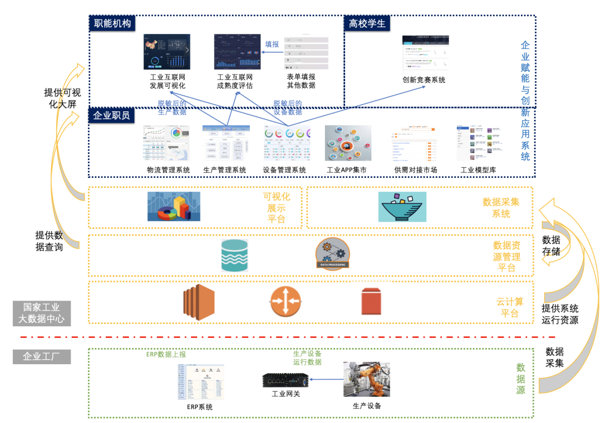
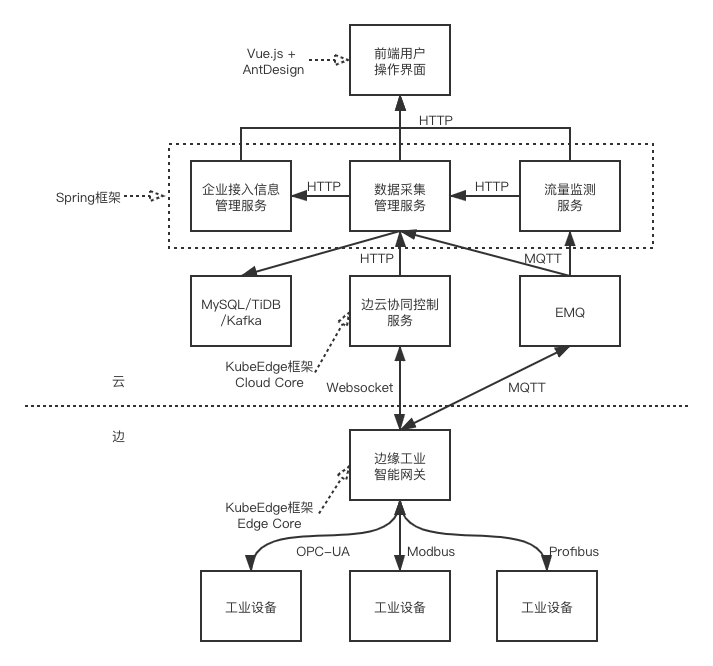
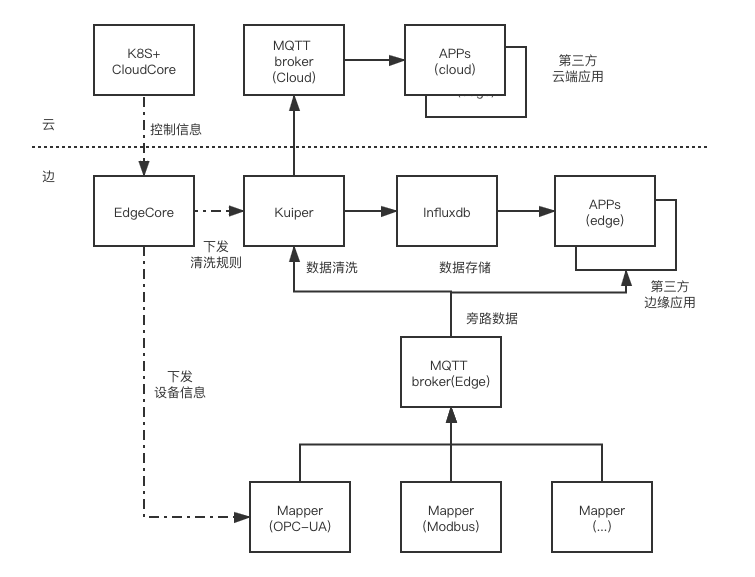

---
authors:
- Gangyi Luo
categories:
- Case
date: 2020-10-15
draft: false
lastmod: 2020-10-15
summary: KubeEdge 在国家工业互联网大数据中心的架构设计与应用
tags:
- KubeEdge
- kubeedge
- edge computing
- kubernetes edge computing
- K8S edge orchestration
- edge computing platform
title: KubeEdge 在国家工业互联网大数据中心的架构设计与应用
---
项目背景：在 18 年时候，工信部开展了一个叫国家创新发展工程，这个工程中提出了要建立一个国家工业大数据中心，中国移动在其中承担了边缘协同与数据采集相关功能的研发。

## 问题与挑战

### 需求

- 从工厂采集生产、运行数据，汇总云端

- 云端进行统一控制：采什么数据、数据怎么处理

### 挑战

- 只能边主动连云，云不可以主动连边（边缘没有公网 IP）

- 足够通用，灵活适应各类工业设备与协议

- 具备边缘自治能力，在网络不稳定时，边缘能够自治

- 具备边缘计算能力，能够在边缘节点运行各类应用

- 占用资源少，功耗低

## 技术选型

技术选型其实也是从我们的实际需求出发的，首先是 EdgeX，其实在做这个项目之前，我们一直是用 EdgeX 做数据采集和管理的，EdgeX 在数据采集和管理上做的还是比较完善的，功能也比较强，但是它也缺少一些能力，比如云边协同能力，我认为它是一个纯的边缘自治架构，不具备和云的一个同步能力，当然我们也有一些方案，比如从 EdgeX 的节点上拨一个 VPN 拨到我们的中心云上，但是 VPN 这种方案的扩展性还是比较差一点的。

第二就是 K3s/K8s，K3s/K8s 第一个问题也是不具备云边协同能力，第二点是尤其是 K8s 占用的资源太大了，不太适合放在我们的工厂，K3s 占用的资源已经少了很多，但一方面缺少云边协同的能力，另一方面也缺少设备管理能力；

第三个是 OpenNESS，它是非常通用的框架，但对我们来说太通用了，不论做什么，都需要写适配器，去底层对接 Kubernetes 都可以，有点太灵活，开发工作量相对比较大，缺乏设备管理的能力；

第四个是 OpenYurt，这个从功能描述上和 KubeEdge 比较像，但出现的比较晚，而当时我们的项目已经进行了一半了，目前看起来它整体的成熟度还是比 KubeEdge 差一些；

最后是 KubeEdge。它具有云边协同能力、资源开销比较小，它还具有设备管理能力，我认为它还是比较有特色的，尤其是云边协同能力和设备管理能力，可能市面上很少找到同时具备这两种能力的。

## 架构设计

### 整体框架

这个是我们实际在国家工业互联网大数据中心中用到的架构，其实最核心的就是我们的 KubeEdge，它其实就起到了一个设备管理、应用管理的作用；我的云端肯定首先会有一个 K8s 集群，我们会部署 KubeEdge 所谓的 Cloud Core，所有的数据包括管理数据都是保存在云端的 K8s 中，边缘侧是运行在我们所谓的工控机或工业网关上，它运行的 Kube Edge 的 Edge Core 进程，它是负责在边缘侧运行我们的容器化应用，包括做设备管理、数据采集的一些应用；

Edge Core 再往下就是 Mapper,它是社区定义的一个标准，专门用来做设备管理和数据采集的，Mapper 社区目前是提供了 Modbus 和蓝牙，比如我想管理一个摄像头，一个自己的设备，那我需要按照社区的规范去写 Mapper，再往上看是我们封装那一层，通过 Java 和 Spring Cloud 封装了一层管理服务，为什么要做这一层封装呢？如果我们直接把 KubeEdge 或 K8s 的 API 暴露给用户，会有一些安全上的隐患，因为这个接口还是比较开放的，可能涉及到一些数据隔离性和 K8s 集群本身的一些功能，如果我们一旦把这个 API 暴露，用户可能会做一些破坏性的操作，所以我们对外还封装了一层业务逻辑。

最后我们还做了一个工业 APP 集市，做这个的原因主要是我们社区其实是定了一个标准，我个人开发者或者厂商其实我可以按照这个标准去做 Mapper 应用，做完之后它可以发布到我们的应用市场，我们可以收费或者免费分享给其他用户，其实这样我们也是希望建立这样一个生态来鼓励大家基于 KubeEdge 去做 Mapper,希望做 Mapper 的开发者也能得到收益，这是我们的一个考虑。

### 数据采集

我们在项目过程中对 KubeEdge 的一些改进：

1. 支持更广泛的工业设备与协议

   其实我们在刚做项目的时候发现 KubeEdge 支持的协议是有限的，只支持蓝牙、Modbus，而且它的 CRD 中把这个东西已经固定了，我们没有办法进行修改，所以我们要增加自己的协议就很不灵活，我们需要对代码层做一些改动，考虑到工业上协议非常多，而且有些是私有的东西，所以我们为了更好的支持这些协议，就允许做一些自定义扩展， 一个是扩展现有的协议 ，比如说大家同样都是用 Modbus 协议，不同的设备可能有一些额外的配置，这个时候就可以用到我们新加的 CustomizedValue 字段，可以自定义的去配一些字段； 第二种是完全就不用社区的协议 ，这个时候可以完全用我们的 CustomizedProtocol，完全自定义自己的协议。

2. 支持更便捷的设备采集配置

   其实工业上和我们有些 IT 思路还是不太一样，我们做 IT 的一般是先定义模板，再定义实例，但是工业上有所不同，一般是先定义实例，将实例复制修改里面的内容，但其实他们这么做也是考虑到现实情况的，举个例子，我有 10 个温度传感器，它是一模一样的，接到了同一个工业总线上，但是它所谓的属性都是一样的，唯一的区别是它在 Modbus 上的偏移量不一样，所以说我只要把 Instance 中的偏移量改了就可以了，所以基于这种考虑我们把原来 Device model 中的 PropertyVisitor 移动到 DeviceInstance 中，然后也加入了一些更灵活的配置项，比如整个采集周期是不可以配置的，工业中不同测点它是可以配置不同的采集周期，比如温度中周期可能是一小时一次，那像能耗数据可能就不需要这么高的频率了，所以这就需要一个更灵活的采集周期的一个配置，我们还做了增加 CollectCycle 等配置项到 PropertyVisitor 中以及抽取串口、TCP 配置到公共部分。

3. 优化孪生属性的下发

4. 支持旁路数据配置

### 旁路数据处理

- 支持 Mapper 推送时序数据至边缘 MQTT broker（EdgeCore 不处理）,具体推送到哪个 Topic 中也是可以定义的

- 与 EMQX Kuiper 进行集成，Kuiper 支持从 DeviceProfile 中读取元数据

- 清洗规则由 KubeEdge 下发给 Kuiper

- 第三方应用直接从边缘 MQTT 中获取数据

### 状态监控

其实要做一个商用的产品，状态监控是非常重要的，其实我觉得 KubeEdge 目前在监控这块还是有些缺失，社区提供了一个叫 Cloud Stream 的通道，这个通道可以配合 MetricServer，也可以配合 Prometheus，但是需要配置 iptables 来将流量拦截下来；还有一个是我如果一配就将整个流量拦截下来了，所以这块是有些问题的。

所以我们也做了另外一个方案： 在边缘节点起了一个定时任务容器，这个定时任务做的事情也很简单，比如每 5 秒从我边缘的 NodeExporter 拉一次数据，把本地的数据拉完之后推到 PushGateway 上，PushGateway 是普罗米修斯官方的一个组件，这个 PushGateway 是放在云上的，那通过这种方式我们可以实现整个监控。

### 其他项目中遇到的一些问题

- 多租户共享

其实 K8s 本身是有多租户的设计的，但 KubeEdge 在做的时候我们的 Device 没有考虑 Namespace 的问题，所以我们如果现在在 Device 中用 Namespace 是有 bug 的,所以现在 KUbeEdge 原身是没有办法把不同的设备放在不同的 Namespace 下，这个我们只能从业务层的业务逻辑做封装，比如给 Device 打一些标签，通过标签去做筛选；边缘 node 工作节点也是没有办法归属 Namespace 的，但是在我们的场景下，某个节点是属于某个租户的，是由这个租户独享的，这个时候我们可以通过和上层业务逻辑进行封装。

- IP 地址限制

其实按照我们现在的设计，我们每个租户会给他们一个 K8s 集群，会去连它的一个边缘设备，这种的方式其实云端的集群要求有一个公网 IP,IP 资源其实还是比较紧张的，怎么在地址有限的情况下比如说我们做一个项目给你 200 个公网 IP,但我可能有 1000 个用户，那怎么去解决？

Pv6 是最彻底的解决方案： 目前社区给的答案是支持，但我们现在还没试过。

端口复用： 其实 kubeEdge 需要使用的端口比较少，默认是 10003，最多也就 4-5 个端口，其实一个公网 IP 是可以给多个 kubeEdge 实例去复用的。

- 高可用方案 ：这个其实社区是有的，其实是复用了 kubernetes 自有的功能，Service+Deployment 与状态检查

## 应用案例

### 案例一：OPC-UA 数据采集与处理

通过我们的放到了我们的应用超市，用户订购了以后 OPC-UA mapper 下发到边缘的网关上，再通过我们的一个页面配置就可以实现从边缘的工业设备上去采集数据，比如说：

- OPC-UA mapper 采集温度数据

- 边缘节点告警应用直接从边缘获取数据

- 超过阈值触发告警，暂停设备

- KubeEdge 对阈值进行调整

### 案例二：工业视频安防

这个是一个偏边缘自治的一个应用，其实和云目前的交互比较少，它下发到边缘侧可以独立运行，主要在边缘侧做 AI 推理，那如果要它和云结合起来，我们会把模型的训练放到云上，把训练完成的模型再通过 KubeEdge 推送到边缘，主要有：

- KubeEdge 管理边缘节点上的视频安防应用配置

- 边缘视频安防应用在边缘节点自治运行

- 摄像头中取流，AI 推理

- 安全帽、工作服佩戴检测

- 危险区域禁入检测

## 总结

1. 基于 KubeEdge 工业数据采集

- 当前通过 CustomizedProtocol 与 CustomizedValue，已能支持各类工业协议

- 通过 ConfigMap 可以实现云端对边缘数据应用（Mapper）的控制

- 旁路数据（Spec/Data）为时序数据的处理提供了更便捷的支持

2. KubeEdge 的产品化

- 多租户方案

- 多种监控方案

- 高可用方案

- 公网 IP 复用方案
