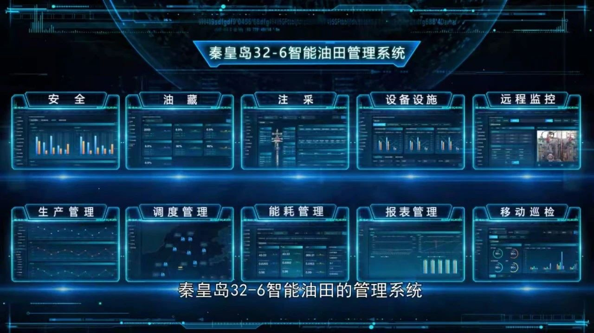
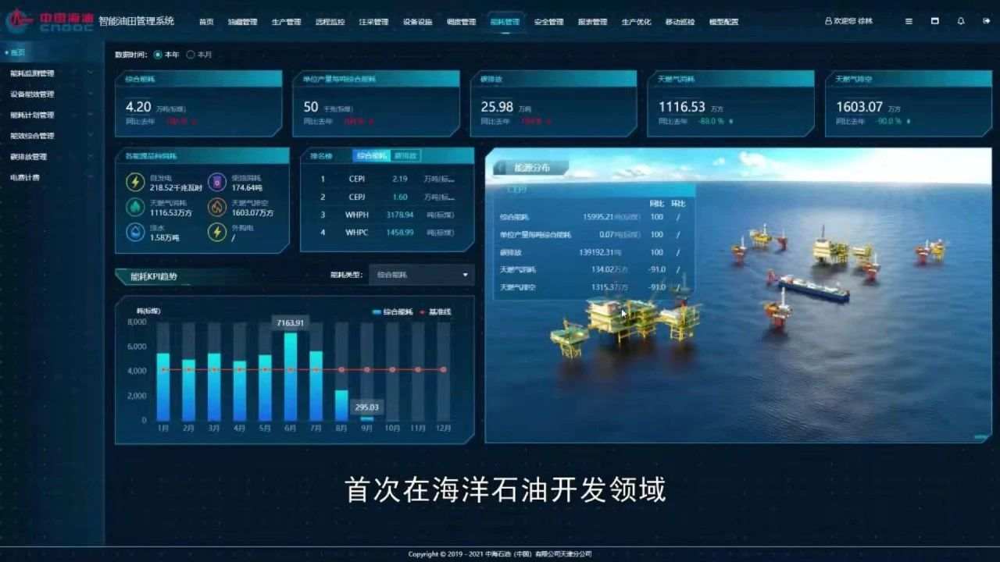
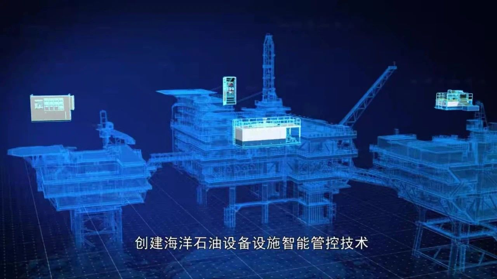
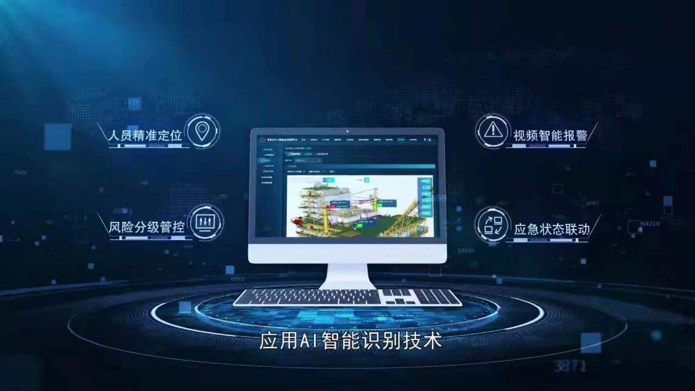

---
authors:
- KubeEdge
categories:
- Case
date: 2022-01-04
draft: false
lastmod: 2022-01-04
summary: 中海油的 KubeEdge 实践
tags:
- KubeEdge
- kubeedge
- edge computing
- kubernetes edge computing
- K8S edge orchestration
- edge computing platform
title: 中海油智能油田：云原生创新实践的探路先锋
---
2022 年已经开启，但我们似乎依然生活在 2020 年漫长的影子里。那一年，新冠疫情在全球蔓延，国际油价断崖式下跌，石油行业深刻感受到“凛冬来临”的萧瑟。

大幅削减资本开支，为过冬做足准备，是各大石油巨头的共同选择。但在最艰难的时刻，很多公司的数字化投入不降反升。

根据 IHS Markit 的统计，自 2013 年以来，国际石油公司的数字化投资在科技投入中的占比逐年升高，最近两年更有加速的迹象——油气行业上游通过数字化转型，油气产量可提高 7%~8%，租赁和运营成本减少 2%~3%，运营的不确定性大幅降低。

显而易见，数字化升级是石油行业应对外部冲击和低油价挑战的必由之路。

作为国内能源领域的翘楚，中国海油在数字技术应用方面敢为人先，积极探索无人平台、水下井口等油气勘探开发新模式，为公司降本、提质、增效提供重要支撑。

量变引发质变，数字化新标杆浮出水面。2021 年 10 月 15 日，我国首个大型海上智能油田项目——秦皇岛 32-6 智能油田全面建成投用。项目应用云计算、大数据、人工智能、5G 等技术为传统油田赋能，实现流程再造，在渤海湾打造了一个现代化、数字化、智能化的新型油田。

据《IT 创事记》了解，中海油在渤海智能油田建设项目中部署华为云智能边缘计算平台 IEF，通过云边协同技术，简化用于平台安全、设备、注采、生产等业务管理相关应用服务与模型算法的发布和监控以及容器资源的管理和调度，在提高平台现场业务应用响应及时性的同时，改善系统运维效率，实现服务、数据、网络、应用协同的全生命周期管理。

## 挑战

数字化技术的武器库中，云原生无疑是披荆斩棘的“尖刀”，奠基于云原生的中海油智能油田堪比开路先锋。IDC 咨询的报告显示，2023 年企业云原生应用占比将超过 80%，大规模的云原生落地离不开率先垂范的探路者。

在云原生计算基金会、中国信通院和华为云共同发起的云原生交流平台“创原会”成立一周年之际，2021 创原会年度峰会近日于深圳举办。中海油等 20 家单位凭借对推动云原生发展做出的杰出贡献，赢得“云原生十大技术创新/先锋实践”的殊荣。

在光鲜的荣誉背后，中海油智能油田面对难题的扎实思考与积极行动更具示范效应。

渤海油田是中国海油产量最高、规模最大、前景最好的原油生产基地，拥有油气田 40 余个，生产平台 100 余座。目前，油田产量达 3000 万吨规模，预计 2025 年将达到 4000 万吨。

秦皇岛 32-6 属于渤海油田下辖的一家主力油田，投产已接近 20 年。据中海油渤海油田智能建设专项工作组副组长杨海滨透露，与其他行业相比，整个能源行业数字化转型起步较晚，传统油田如何借助数字化转型的契机实现高质量发展，是中海油必须应对的挑战。

伴随油田开采规模的不断扩大，在各个层面都会暴露出诸多痛点：

- 一方面，作业周期长、成本高、效率低，且存在安全隐患。中国既是陆地大国也是海洋大国，海岸线总长度 3.2 万公里。对比陆地勘采，实施海上油田相关作业，通常需要提前一周准备出海事宜，运作周期长，衍生成本高，频繁海上作业也增加了人员风险。

- 另一方面，异构兼容问题突出，运维面临挑战。海上平台建设时间存在差异，各部分软硬件基础设施参差不齐。加之海上油田数量多，分布零散，缺少统一的数据采集与应用管理界面，运维难度陡增。

## 智能油田的云原生探索

直面挑战是解决问题的基本前提，智能油田的云原生探索离不开强强携手、攻坚克难。

针对数字化转型的痛点，中海油在渤海油田启动秦皇岛 32-6 “智能油田”先行试点项目建设。该项目基于华为云云原生智能边缘计算平台 IEF，对分布在浩瀚海洋上各平台设备统一接入和管理，实现数据智能化采集、应用服务智能化下发以及统一运维管理等能力。

值得关注的是，华为云智能边缘平台 IEF 可提供业界领先的云边协同一体化服务，满足行业用户对边缘计算资源的远程管控、数据处理、分析决策、智能化诉求，具备全生命周期管理、极轻极简、边缘离线自治、超大规模协同、生态丰富等特点。

渤海油田陆地数据中心和各个海上钻井设备平台，是华为云云原生边云协同施展能力的舞台——云端模型下发到边缘端运行，边端数据采集到云端分析，以实时的智能化平台进行动态监控分析，对海上设备与应用故障、网络不稳定等情况，可实现应用的智能飘移和智能修复。

不难看出，云边协同对海上各个平台和中心云进行统一的连接和管理，在陆地上就可以获取足够量的数据参数并完成绝大多数的作业任务，与原有的运作模式相比优势凸显。

- 首先是降本增效。相关作业无需出海， 借助智能边缘平台可实现秒级、分钟级的任务下发；与此同时，陆地云中心统一管控，也大幅减少海上作业时间，降低成本的同时最大限度提升效率。

- 其次是保障安全生产。针对海上网络差、出海风险高等难题，边缘侧节点间达成去中心化调度，支持离线场景下边缘应用秒级恢复，在促进安全生产的基础上增强了业务的高可用性。

- 再次是兼容异构计算。华为云智能边缘平台支持 x86、ARM32、ARM64 架构设备和 CentOS、Ubuntu 等主流操作系统，虽然各油田建设时间和基础设施存在差异，但智能边缘平台异构接入的能力可降低适配工作量，完成业务快速接入。

- 此外，智能边缘平台还能实现数据统一采集，并将功能可视化，提供全流程的生命周期管理，大幅降低运维与学习成本。

借助先进的云原生平台， 秦皇岛 32-6 智能油田建设将应用场景和数字技术深度融合，以陆地生产操控中心为枢纽构建海陆协同新范式，为油田油藏注采、安全环保、设备设施、工艺流程等开发生产核心业务提效赋能，形成基于“数据、网络、平台、应用”的海上智能油田全栈解决方案，探索了“智能、安全、绿色、高效”的新型海上油气开采运营模式，使秦皇岛 32-6 这个 20 年的老油田具备全面感知、整体协同、科学决策和自主优化等显著的智能特征，为中国海油智能油田全面建设贡献示范价值。该项目投资 1.3 亿元，可以实现生产效率提升 30%，每年直接收益预计 3000 万元。

## 油田数字化转型的未来图景

智能油田建设只是能源行业数字化转型的缩影，“大象起舞”的丰富场景与未来空间值得期待。

早在 2020 年 3 月，中国海油就正式下发《集团公司数字化转型顶层设计纲要》，提出“一个平台、两套体系、三朵云、四项能力、五大提升”的数字化转型总体蓝图，并明确了发展愿景：基于集中统一的数据资产化管理，打造感知洞察、智能控制、协同共享、互联创新数字化能力，构建纵向贯通、横向联通、内外融通数字化生态，建成“智慧海油”。

在石油行业数字化升级的恢宏构想中，云扮演着举足轻重的角色。除了在核心端搭建云的基础平台，还要把云应用到更贴近生产现场的地方。比如，将云部署到卫星以及作业平台上，边缘层上云可以确保生产数据不出厂，就能实时支撑现场的业务应用。

在可预期的未来，全海域的智能油田推广和建设会逐步展开，华为云将与中海油在云、AI，大数据等领域展开更多深入合作；从更长的时间来看，把广阔海域上各个平台与陆地连在一起，构筑一张分布式云原生的大网，也许并不遥远。