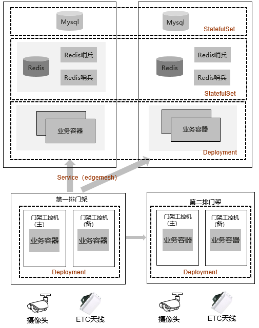
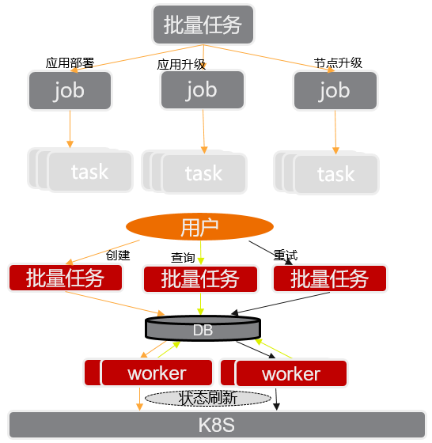

---
authors:
- KubeEdge
categories:
- Case
date: 2021-06-21
draft: false
lastmod: 2021-06-21
summary: 使用 Kubernetes 和 KubeEdge 管理高速公路 10 万个边缘节点
tags:
- KubeEdge
- kubeedge
- edge computing
- kubernetes edge computing
- K8S edge orchestration
- edge computing platform
title: 如何使用 Kubernetes 和 KubeEdge 管理中国高速公路上的 10 万边缘节点？
---
## 项目背景

本项目是在高速公路 ETC 联网和推动取消省界收费站的大前提下，门架系统的落地，也就是要把门架部署在覆盖全国范围的高速公路上，收集车辆通行的牌示信息，以及相应的交易信息。

整体的情况是在边缘侧，即高速公路上会部署大量的门架和相应的控制器，相应的边缘终端，这些终端大概 10 万台，其上部署了相关的应用以收集相关信息。超过 50 万个应用部署到边缘节点，收集到信息后，通过收费专网向省中心以及路网中心上传对应的数据。

本次项目的工作挑战主要有两个方面：

- 将近 10 万台异构设备的管理，包括 arm，x86 等异构设备。

- 50 余万个应用的生命周期管理

为保证项目的成功落地，我们对整体架构做了选型，最终选择了 K8s 和 KubeEdge 来进行整体的应用和边缘节点管理。

## 为什么选择 Kubernetes

在项目里，虽然说是部署在边缘侧的应用，但它的复杂程度已经和云上是类似的了，在边缘侧部署的应用已经是由很多个微服务组成的。所以 Kubernetes 对于支撑这种微服务化的、云原生化的应用部署和大规模管理的能力，同样也适用于这个项目在边缘侧的使用。

具体来说，有一些典型的部署需求：

- 双机热备

- 多机多活互备

- 有关联的应用同节点部署以提升应用间交互效率

- 同一应用的不同实例跨节点部署以提升可用性

- 依据边缘节点的不同属性将应用部署于不同分组中

- 定义独立于节点的应用部署以及实现满足条件的新边缘节点上线后自动安装应用

这些需求，用 K8s 的这些 Deployment、Pod、ReplicaSet、DaemonSet 等核心对象来表示，是非常适合的。所以我们就选择了 Kubernetes。

当然，还有一些重要的边缘侧特有的需求是原生的 Kubernetes 不具备的，但 Kubernetes 的架构是非常好的，易于扩展，灵活性很高，可以基于原生 Kubernetes 架构基础，根据边缘管理的特殊需求进行扩展。

## 为什么选择 KubeEdge

- 一是业务自身的特点来决定的。这个业务的量非常大，涉及的边缘节点分布在全国各地，所以它的边缘侧是多硬件架构、多厂家的，我们需要异构的支持； 边缘工控机低至 4 核 ARM SOC、1G 可用内存，我们需要低资源占用的方案来管理边缘侧的节点；管理运维复杂，从路网中心到最终路段，分为 6 级管理层次，管理成本高，我们需要高集成度边缘的方案，让边缘足够简单，把出问题的概率降到最低，降低运维成本。

- 二是从边缘环境的特点来看的。从网络的角度来看，网络分为部省、省站两层，多次转发，我们需要边缘接入具有高灵活性，可支持专线、代理、公网、有线和无线接入等多种方式；各地基础设施的建设不同，有些省份的网络带宽低至 3M，我们需要边缘和云之间的管理带宽占用降到最低；有些高速公路上的网络条件是非常差的，经常出现断网的情况。我们需要边缘方案有离线自治的能力。

## 整体方案

接下来我会把整体方案打开成几层来分别介绍。

### 应用部署

首先是应用部署，就像我刚才说的，在边缘侧要部署的业务非常复杂，它是由多个微服务所构成的云原生化的架构。所以我们这些微服务以及中间件都容器化之后可以非常好的适应各种不同的异构操作系统，方便统一管理。

如下图所示，微服务架构分成前端和后端，前端主要把业务通过 Deployment 的方式部署到门架上，与后端之间是通过 EdgeMesh 实现的。通过这种服务发现的方式，实现微服务前后端业务的通信。而后端业务容器本身是无状态的，可以通过 Deployment 来部署。

后面的 Redis 包括 MySql 就可以通过 Statefulset 的方式来进行部署。通过这样的部署模型，我们可以很完美的进行封装和自动化管理高可用的边缘侧的整套业务系统。

但如果仅仅是用原生的 K8s 部署方式，并不能完全满足我们的需求，因为在项目里要部署的量非常大，左图的环境只是应用于一个收费站，而一个路段要管理几百上千个收费站，逐个部署成本过高。所以我们基于 K8s 之上又构建了一个任务工作流的引擎系统，把每一个部署微服务的步骤定义为一个 job。用批量的方式大量、快速部署成百上千个同样的微服务系统和环境。

### 大规模节点接入

除了上面提到的挑战，在应对大规模节点接入的情况下也遇见过一些问题：

- 每个省有自己的管理权限，我们按 K8s 集群的配置配了多个 K8s 集群来进行管理，一个省对应一个 K8s 集群，然后在 K8s 之上通过统一的管理层处理复杂跨集群数据统计等操作，从中心侧管理每个省的边缘侧，这就是多集群的管理手段。

- 我们曾遇见一种现象，路网中心或省中心做网络升级等动作之后，网络有时候会出现问题，所有省的边缘节点，失去与 K8s 的连接，等网络恢复之后，又会发生所有节点同时连接中心侧的 K8s 集群，引起大量的并发连接,对中心侧的系统造成冲击，导致应用异常。为了应对这种情况，我们通过动态退避算法缓解节点同时接入所形成的流量冲击。

- 需要精简 NodeStatus 和 PodStatus 上报的信息。就前文所提到的，各地基础设施的建设不同，有些省份的网络带宽低至 3M，所以我们需要减小状态信息的大小，降低上报流量的冲击，降低对网络的影响。

- 镜像仓库 Mirror 分级加速，有效降低了对网络的冲击，提高大批量部署的部署效率。

### 边缘业务高可用

接下来的是边缘业务高可用，按照原生 K8s 的升级状态，它会先删除旧版本 Pod，再创建新 Pod 并在这个过程中去拉取新版本镜像。这种操作在公有云网络条件较好的情况下，是没太大问题的。但在边缘侧，这样就会造成业务长时间的中断，收费数据缺失。所以针对这一个流程，我们也是做了相应的升级和优化。

我们先把升级下载镜像的通知下发做预下载，下载成功之后再删除已有的旧 Pod，启动新应用，优化了应用升级对服务中断的时间的影响，将业务升级时整体业务中断的时间从分钟级缩减到了 10s 内。

同时，考虑到边缘设备有主备部署的情况，而边缘侧又不像云上有 ELB 服务。我们又在边缘节点中容器化部署了 Keepalived，通过 VIP，为门架的摄像头等设备提供对应的 K8s 集群内的容器服务。

## 总结

- 当前基于 KubeEdge 的边缘管理系统管理着全国 29 个省、市 、自治区的将近 100,000 个边缘节点，超过 500,000 边缘应用的部署。支撑了高速公路门架业务的不断调整、更新，满足了每日 3 亿条以上的信息采集。

- 为日后车路协同、自动驾驶等创新业务的发展提供了良好的平台支撑。

- K8s 提供的通用部署和调度模型很适合部署大规模边缘应用。

- 单纯原生 K8s 不能满足边缘侧业务的所有需求，KubeEdge 集成 K8s 云原生管理能力，同时对边缘业务部署和管理提供了很好的支持。