---
authors:
- Wack Xu
categories:
- General
- Announcements
date: 2022-06-01
draft: false
lastmod: 2022-06-01
summary: 单集群突破10万边缘节点，KubeEdge大规模测试报告发布
tags:
- KubeEdge
- kubeedge
- edge computing
- kubernetes edge computing
- K8S edge orchestration
- performance
- large scale
- scalability test
- 边缘计算
- 大规模测试报告
- 10万节点
title: 单集群突破10万边缘节点，KubeEdge大规模测试报告发布
---

# KubeEdge支持100000边缘节点测试

## 摘要

随着KubeEdge在越来越多的企业以及组织大规模落地，KubeEdge可扩展性和大规模逐步成为社区用户新的关注点。因此，我们开展了KubeEdge的大规模测试工作，现在我们宣布Kubernetes + KubeEdge集群能够稳定支持100,000边缘节点同时在线，并且管理超过1,000,000的pod。在本篇文章中，我们将介绍测试使用的相关指标，如何开展的大规模测试以及我们如何实现大规模边缘节点接入。

## 背景介绍

随着5G网络、工业互联网、AI等领域的高速发展，边缘计算成为引领数字化发展的潮流。智慧城市、智慧交通、智慧医疗、智能制造等未来场景更多被人熟知，边缘计算也受到了空前的关注。Gartner里面明确提出，到2023年，网络边缘的智能设备数量可能是传统IT的20倍以上。到2028年，传感器、存储、计算和高级人工智能功能在边缘设备中的嵌入将稳步增长。由于物联网设备本身存在类型繁杂和数量众多的特点，物联网设备接入的数量级增加的同时，给我们的统一管理和运维带来了巨大的挑战。

与此同时，KubeEdge社区的用户也提出了大规模边缘节点和应用管理的诉求。基于KubeEdge的高速取消省界项目中，在全国的省界收费站拥有将近10万边缘节点，超过50万边缘应用接入，并且随着项目的演进，边缘节点和应用规模将进一步扩大。使用KubeEdge打造的车云协同管理平台，是汽车行业的首款“云、边、端”一体化架构，助力软件定义汽车实现软件快速升级迭代。在此平台中，每一辆汽车，均作为一个边缘节点接入，边缘节点的规模将达到数百万级别。

## KubeEdge简介

**KubeEdge**是面向边缘计算场景、专为边云协同设计的**业界首个云原生边缘计算框架**，在 Kubernetes 原生的容器编排调度能力之上实现了边云之间的应用协同、资源协同、数据协同和设备协同等能力，**完整打通了边缘计算中云、边、设备协同的场景。**

KubeEdge架构主要包含云边端三部分，云上是统一的控制面，包含原生的Kubernetes管理组件，以及KubeEdge自研的CloudCore组件，负责监听云端资源的变化，提供可靠和高效的云边消息同步。边侧主要是EdgeCore组件，包含[Edged](https://kubeedge.io/en/docs/architecture/edge/edged)、[MetaManager](https://kubeedge.io/en/docs/architecture/edge/metamanager)、[EdgeHub](https://kubeedge.io/en/docs/architecture/edge/edgehub)等模块，通过接收云端的消息，负责容器的生命周期管理。端侧主要是device mapper和eventBus，负责端侧设备的接入。

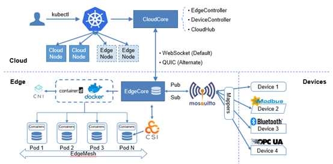

KubeEdge以Kubernetes管控面作为底座，通过将节点拉远的方式，扩展了边云之间的应用协同、资源协同、数据协同和设备协同等能力。 目前，Kubernetes社区官方支持的规模是5,000 个节点和150,000 个Pod，在边缘计算的场景，随着万物互联时代的到来，这种规模是远远不够的。大规模边缘设备的接入，对边缘计算平台的可扩展性和集中管理的需求将会增加，如何使用尽可能少的云端资源和集群，管理尽可能多的边缘设备，简化基础设施的管理和运维。KubeEdge在全面兼容Kubernetes原生能力的基础上，对云边消息通道和传输机制进行了优化，突破了原生Kubernetes的管理规模，支撑更大规模的边缘节点接入和管理。

## SLIs/SLOs

可扩展性和性能是Kubernetes集群的重要特性，作为K8s集群的用户，期望在以上两方面有服务质量的保证。在进行Kubernetes + KubeEdge大规模性能测试前，我们需要定义如何衡量集群大规模场景下服务指标。Kubernetes社区定义了以下几种SLIs(Service Level Indicator)/SLOs(service-level objective)指标项，我们将使用这些指标来衡量集群服务质量。

1. API Call Latency

| **Status**   | **SLI**                                       | **SLO**                                                      |
| ------------ | --------------------------------------------- | ------------------------------------------------------------ |
| **Official** | 最近5min的单个Object  Mutating API P99 时延   | 除聚合API和CRD外，P99 <= 1s                                  |
| **Official** | 最近5min的non-streaming read-only P99 API时延 | 除聚合API和CRD外  Scope=resource, P99 <= 1s  Scope=namespace, P99 <= 5s  Scope=cluster, P99 <= 30s |

2. Pod Startup Latency

| **Status**   | **SLI**                                                      |
| ------------ | ------------------------------------------------------------ |
| **Official** | 无状态Pod启动时间（不包含拉取镜像和Init  Container），从pod  createTimestamp到所有container都上报启动，并被watch观察到的P99时间 |
| **WIP**      | 有状态Pod启动时间（不包含拉取镜像和Init  Container），从pod  createTimestamp到所有container都上报启动，并被watch观察到的P99时间 |

社区还定义了In-Cluster Network Programming Latency（Service更新或者其Ready Pod变化最终反映到Iptables/IPVS规则的时延），In-cluster network latency，DNS Programming Latency（ Service更新或者其Ready Pod 反映到dns server的时延）， DNS Latency等指标，这些指标当前还尚未量化。满足所有SLO 为大规模集群测试的目标，因此本报告主要针对Official状态SLIs/SLOs进行测试。


## Kubernetes 可伸缩性维度和阈值

Kubernetes的可伸缩特性不单指节点规模，即Scalability != #nodes，实际上Kubernetes可伸缩性包含很多维度的测量标准，包含namespaces的数量，Pod的数量，service的数量，secrets/configmap的数量等。下图是Kubernetes社区定义的描述集群可扩展性的重要维度（尚在持续更新中）：

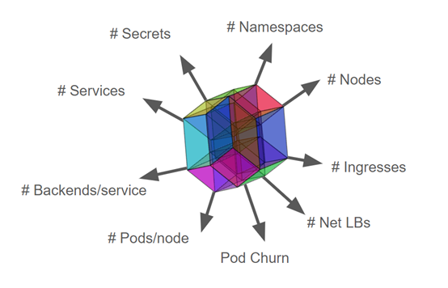

Kubernetes集群无限制扩展资源对象而且又满足SLIs/SLOs各项指标显然是不可能实现的，为此业界定义了Kubernetes多个维度资源上限。

```
1. Pods/node 30
2. Backends <= 50k & Services <= 10k & Backends/service <= 250
3. Pod churn 20/s
4. Secret & configmap/node 30
5. Namespaces <= 10k & Pods <= 150k & Pods/namespace <= 3k
6. ​    …..
```

各个维度不是完全独立的，某个维度被拉伸相应的其他维度就要被压缩，可以根据使用场景进行调整。例如5k node 拉伸到10k node 其他维度的规格势必会受到影响。如果各种场景都进行测试分析工作量是非常巨大的，在本次测试中，我们会重点选取典型场景配置进行测试分析。**在满足SLIs/SLOs的基础上，实现单集群支持100k边缘节点，1000k pod规模管理。**


## 测试工具

### ClusterLoader2

ClusterLoader2是一款开源Kubernetes集群负载测试工具，该工具能够针对Kubernetes 定义的SLIs/SLOs 指标进行测试，检验集群是否符合各项服务质量标准。此外Clusterloader2为集群问题定位和集群性能优化提供可视化数据。ClusterLoader2 最终会输出一份Kubernetes集群性能报告，展示一系列性能指标测试结果。

Clusterloader2性能指标：

- **APIResponsivenessPrometheusSimple**
- **APIResponsivenessPrometheus**
- **CPUProfile**
- **EtcdMetrics**
- **MemoryProfile**
- **MetricsForE2E**
- **PodStartupLatency**
- **ResourceUsageSummary**
- **SchedulingMetrics**
- **SchedulingThroughput**
- **WaitForControlledPodsRunning**
-  **WaitForRunningPods**

### Edgemark

Edgemark是类似于Kubemark的性能测试工具， 主要用于KubeEdge集群可扩展性测试中，用来模拟KubeEdge边缘节点，在有限资源的情况下构建超大规模Kubernetes+KubeEdge集群，目标是暴露只有在大规模集群情况下才会出现的集群管理面问题。Edgemark部署方式如下图：

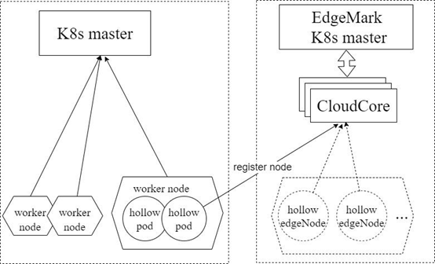

- k8s master --- Kubernetes物理集群主节点
- edgemark master --- Kubernetes模拟集群主节点
- CloudCore --- KubeEdge云端管理组件，负责边缘节点的接入
- hollow pod --- 在物理集群上启动的pod，通过在pod内启动edgemark向edgemark master注册成为一台虚拟边缘节点，edgemark master可以向该虚拟边缘节点上调度pod
- hollow edgeNode --- 模拟集群中可见的节点，为虚拟节点，由hollow pod注册获得

## 测试集群部署方案

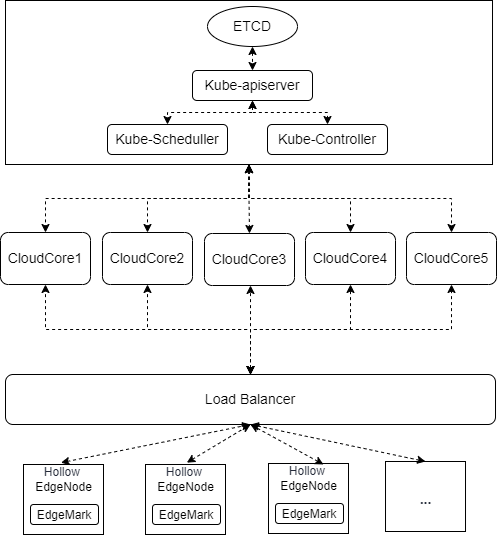

Kubernetes底座管理面采用单master进行部署，ETCD、Kube-apiserver、Kube-Scheduler、Kube-Controller均为单实例部署，KubeEdge管理面CloudCore采用5实例部署，通过master节点IP连接Kube-apiserver，南向通过Load Balancer对外暴漏服务，边缘节点通过Load Balancer轮询策略随机连接到某一个CloudCore实例。

## 测试环境信息

 管理面OS版本

```
CentOS 7.9 64bit 3.10.0-1160.15.2.el7.x86_64
```

 Kubernetes 版本

```
Major:"1", Minor:"23", GitVersion:"v1.23.4", GitCommit:"e6c093d87ea4cbb530a7b2ae91e54c0842d8308a", GitTreeState:"clean", BuildDate:"2022-02-16T12:38:05Z", GoVersion:"go1.17.7", Compiler:"gc", Platform:"linux/amd64"
```

 KubeEdge 版本
```
KubeEdge v1.11.0-alpha.0
```


Master节点配置

-  **CPU**

```
Architecture:          x86_64
CPU op-mode(s):        32-bit, 64-bit
Byte Order:            Little Endian
CPU(s):                128
On-line CPU(s) list:   0-127
Thread(s) per core:    2
Core(s) per socket:    32
Socket(s):             2
NUMA node(s):          2
Vendor ID:             GenuineIntel
CPU family:            6
Model:                 106
Model name:            Intel(R) Xeon(R) Platinum 8378A CPU @ 3.00GHz
Stepping:              6
CPU MHz:               2999.998
```

-  **MEMORY**

```
Total online memory:   256G
```

- **ETCD DISK**

```
Type:	SAS_SSD
Size:	300GB
```

CloudCore节点配置

- **CPU**

```
Architecture:          x86_64
CPU op-mode(s):        32-bit, 64-bit
Byte Order:            Little Endian
CPU(s):                12
On-line CPU(s) list:   0-11
Thread(s) per core:    2
Core(s) per socket:    6
Socket(s):             1
NUMA node(s):          1
Vendor ID:             GenuineIntel
CPU family:            6
Model:                 106
Model name:            Intel(R) Xeon(R) Platinum 8378A CPU @ 3.00GHz
Stepping:              6
CPU MHz:               2999.998
```

-  **MEMORY**

```
Total online memory:   48G
```

## 组件参数配置

**1.**    **kube-apiserver** **参数**

```
--max-requests-inflight=2000
--max-mutating-requests-inflight=1000
```

**2.**    **kube-controller-manager** **参数**

```
--kube-api-qps=100
--kube-api-burst=100
```

**3.**    **kube-scheduler** **参数**

```
--kube-api-qps=200
--kube-api-burst=400
```

**4.**    **CloudCore****参数配置**

```
apiVersion: cloudcore.config.kubeedge.io/v1alpha1
kind: CloudCore
kubeAPIConfig:
  kubeConfig: ""
  master: ""
  qps: 60000
  burst: 80000
modules:
  cloudHub:
    advertiseAddress:
      - xx.xx.xx.xx
    nodeLimit: 30000
    tlsCAFile: /etc/kubeedge/ca/rootCA.crt
    tlsCertFile: /etc/kubeedge/certs/server.crt
    tlsPrivateKeyFile: /etc/kubeedge/certs/server.key
    unixsocket:
      address: unix:///var/lib/kubeedge/kubeedge.sock
      enable: false
    websocket:
      address: 0.0.0.0
      enable: true
      port: 10000
  cloudStream:
    enable: false
  deviceController:
    enable: false
  dynamicController:
    enable: false
  edgeController:
    buffer:
      configMapEvent: 102400
      deletePod: 10240
      endpointsEvent: 1
      podEvent: 102400
      queryConfigMap: 10240
      queryEndpoints: 1
      queryNode: 10240
      queryPersistentVolume: 1
      queryPersistentVolumeClaim: 1
      querySecret: 10240
      queryService: 1
      queryVolumeAttachment: 1
      ruleEndpointsEvent: 1
      rulesEvent: 1
      secretEvent: 1
      serviceEvent: 10240
      updateNode: 15240
      updateNodeStatus: 30000
      updatePodStatus: 102400
    enable: true
    load:
      deletePodWorkers: 5000
      queryConfigMapWorkers: 1000
      queryEndpointsWorkers: 1
      queryNodeWorkers: 5000
      queryPersistentVolumeClaimWorkers: 1
      queryPersistentVolumeWorkers: 1
      querySecretWorkers: 1000
      queryServiceWorkers: 1
      queryVolumeAttachmentWorkers: 1
      updateNodeStatusWorkers: 10000
      updateNodeWorkers: 5000
      updatePodStatusWorkers: 20000
      ServiceAccountTokenWorkers: 10000
    nodeUpdateFrequency: 60
  router:
    enable: false
  syncController:
    enable: true
```

## Density测试

### 测试执行

在使用ClusterLoader2进行性能测试之前，我们需要自己通过配置文件定义性能测试策略， 本次测试我们使用官方的 [Kubernetes density ](https://links.jianshu.com/go?to=https%3A%2F%2Fgithub.com%2Fkubernetes%2Fperf-tests%2Fblob%2Fmaster%2Fclusterloader2%2Ftesting%2Fdensity%2Fconfig.yaml)测试用例，使用的配置文件如下链接所示：

https://github.com/kubernetes/perf-tests/blob/master/clusterloader2/testing/density/config.yaml

Kubernetes资源详细的配置如下表所示：

| **Maximum type**             | **Maximum value** |
| ---------------------------- | ----------------- |
| Number of Nodes              | 100,000           |
| Number of Pods               | 1,000,000         |
| Number of Pods per node      | 10                |
| Number of Namespaces         | 400               |
| Number of Pods per Namespace | 2,500             |

详细的测试方法和过程，可以参考

https://github.com/kubeedge/kubeedge/tree/master/build/edgemark

https://github.com/kubernetes/perf-tests/blob/master/clusterloader2/docs/GETTING_STARTED.md

### 测试结果

**APIResponsivenessPrometheusSimple****：**

1. mutating API latency（threshold=1s）：

  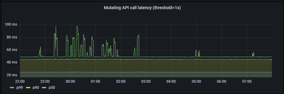

2. Read-only API call latency(scope=resource, threshold=1s)

 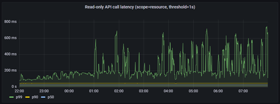

3. Read-only API call latency(scope=namespace, threshold=5s)

 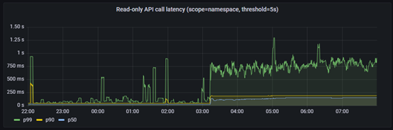

4. Read-only API call latency(scope=cluster, threshold=30s)

 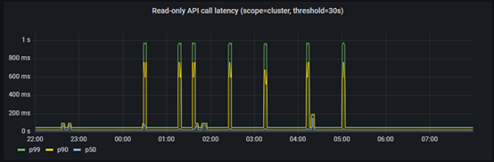

**PodStartupLatency**：

| **metric**         | **p50(ms)** | **p90(ms)** | **p99(ms)** | **SLO(ms)** |
| ------------------ | ----------- | ----------- | ----------- | ----------- |
| pod_startup        | 1688        | 2751        | 4087        | 5000        |
| create_to_schedule | 0           | 0           | 1000        | N/A         |
| schedule_to_run    | 1000        | 1000        | 1000        | N/A         |
| run_to_watch       | 1087        | 1674        | 2265        | N/A         |
| schedule_to_watch  | 1657        | 2724        | 3070        | N/A         |


注：延迟时间理论上应该总是大于零的，因为kube-apiserver不支持RFC339NANO，导致时间戳精度只能达到秒级，故在延迟比较小的情况下，由于精度损失，ClusterLoader2统计到的某些数值为0。

## 结论及分析

在以上的测试结果中，API Call Latency和Pod Startup Latency均符合Kubernetes社区定义的SLIs/SLOs指标。因此，**Kubernetes + KubeEdge集群能够稳定支持100,000边缘节点同时在线，并且管理超过1,000,000的pod**。在实际的生产环境中，因为网络安全、分区管理等相关问题，边缘节点和云端的网络并不会一直保持联通，会根据运维等需要按需连通网络，因此根据实际的边缘节点的在离线比例，单集群可以管理边缘节点的规模可以同比例的放大。此外，在Kubernetes控制面叠加使用数据分片技术，将不同的资源存储到相应的etcd存储，可以很容易突破更大的规模。

### KubeEdge如何实现大规模边缘节点接入

#### 1. 高效的云边消息通道

List-watch是Kubernetes组件内部统一的异步消息处理机制，list-watch由list和watch两部分组成。list通过调用资源的list API获取资源，可以获取资源的全量数据，基于HTTP短链接实现；watch通过调用资源的watch API监测资源变更事件，持续获取资源的增量变化数据，基于HTTP长链接和分块传输编码实现。在原生的Kubernetes中，每个node节点除了list-watch node本身、分配到本节点的pod以及全量的service元数据外，Kubelet 还必须watch（默认）运行的Pod使用数据卷挂载的 Secret 和 ConfigMap，在大规模的集群中，随着节点和pod规模的增加，list-watch的数量是非常大的，极大的增加了Kube-apiserver的负担。


KubeEdge采用双向多路复用的边云消息通道，支持websocket（默认）和quic协议，边缘侧EdgeCore主动发起和云端CloudCore连接，CloudCore list-watch Kubernetes资源的变化，并通过云边双向通道主动将元数据下发至边缘测。上行元数据，如边缘侧节点状态和应用状态，EdgeCore通过云边通道上传至CloudCore，CloudCore将接收到的元数据上报到kube-apiserver。

CloudCore统一负责上行和下行数据的汇聚处理，Kube-apiserver只有来自CloudCore的数个 list-watch请求，极大的降低了Kube-apiserver的负担，集群的性能得到了提高。


在同等节点和pod规模下，原生Kubernetes kube-apiserver的memory使用

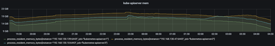

Kubernetes + KubeEdge场景下，kube-apiserver的memory使用

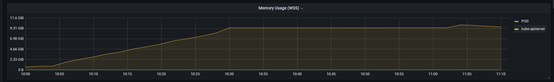

#### 2. 可靠和增量的云边数据传输

在边缘网络拓扑复杂、网络通信质量低的场景下，云边通信面临着网络时延高、闪断闪连、频繁断连等问题。当云边网络恢复，边缘节点重新连接到云端时，边缘到云端会产生大量的全量List请求，从而对Kube-apiserver造成比较大的压力。在大规模场景下，将会给系统稳定性带来不小的挑战。KubeEdge采用基于增量数据的云边推送模式，云端会记录成功发送到边缘侧的元数据版本号，当云边网络中断重新连接时，云端会从记录的元数据版本号开始增量发送，可以解决边缘重连或者watch失败时的重新全量list引发的kube-apiserver压力问题，相比原生Kubernetes架构可以提升系统稳定性，保障在高时延、低质量网络环境下正常工作。

#### 3. 边缘极致轻量+云边消息优化

KubeEdge边缘侧EdgeCore对原生的kubelet进行了裁剪，去除了in-tree volume、cloud-provider等边缘场景下用不到的特性，压缩节点上报的状态信息，以及通过优化边缘代理软件资源占用，EdgeCore最低开销只需70MB内存，最小可支持百兆边缘设备。同时，通过WebSocket通道统一管理所有的云边连接，以及对云边的消息合并，数据压缩等，大幅减少云边的通信压力，减轻了对管理面的访问压力，保障在高时延高抖动下仍可正常工作。


100,000边缘节点接入下，云端ELB连接数为100,000。

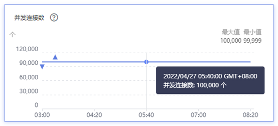

100,000边缘节点以及超过1,000,000 pod场景下，云端ELB网络流入速率约为3MB/s, 平均到每个边缘节点上行带宽约为0.25Kbps。

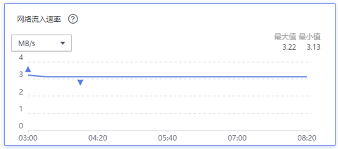

## 下一步计划

目前我们只是测试了大规模场景下节点和pod的场景，下一步我们将对边缘设备device、边云消息、边缘服务网格进行针对性测试。此外，针对边缘的一些特殊场景，如大规模节点网络中断重连、边缘网络高时延、闪断闪连等，我们需要引入新的 SLIs/SLOs来衡量集群的服务质量，并进行进一步的大规模测试。
