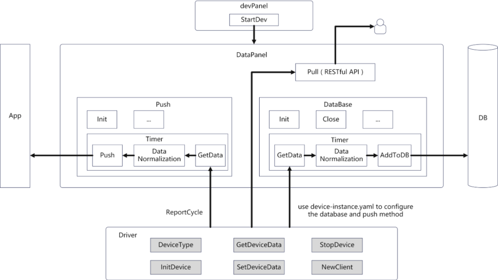

---
authors:
- KubeEdge
categories:
- General
date: 2024-12-24
draft: false
lastmod: 2024-12-24
summary: 本篇文章是系列文章的第二篇，将详细介绍v1.15.0版本在 DMI 数据面的一些工作。

tags:
- KubeEdge
- kubeedge
- edge computing
- kubernetes edge computing
- K8S edge orchestration
- edge computing platform
- security
title: KubeEdge边缘设备管理系列（二）：DMI数据面设计与实现
---

针对新版本 `Device-IoT` 领域的更新，我们计划推出一系列的文章对这些特性进行详细的介绍，大致的文章大纲为：

1. [基于物模型的设备管理 API 设计与实现](/zh/blog/device-mgmt-series-part1)
2. [DMI 数据面能力设计与实现](/zh/blog/device-mgmt-series-part2)
3. [Mapper 开发框架 Mapper-Framework 设计与实现](/zh/blog/device-mgmt-series-part3)
4. [如何使用 Mapper 完成视频流数据处理](/zh/blog/device-mgmt-series-part4)
5. [如何使用 Mapper 实现设备数据写入](/zh/blog/device-mgmt-series-part5)
6. [如何从头开发一个 Mapper（以 `modbus` 为例）](/zh/blog/device-mgmt-series-part6)

在[上一篇文章](/zh/blog/device-mgmt-series-part1)中，我们为适应用户对边缘设备管理的需求，设计实现了基于物模型的设备管理 API。在此基础上，我们完善了 DMI 数据面的能力，提供边缘端处理设备数据的多种方式，让 KubeEdge 能够更灵活、标准化的管理边缘设备。本篇文章是系列文章的第二篇，将详细介绍 v1.15.0 版本在 DMI 数据面的一些工作。

## DMI 框架简介

在 1.12 版本中，KubeEdge 设计了设备管理框架——DMI。DMI 框架提供了统一的设备管理相关接口，设备应用开发者和使用者可以通过实现 DMI 中的标准化接口完成设备管理，让边缘设备以微服务的形式提供服务，更加贴合云原生。

DMI 的架构图如下图所示：


DMI 框架中一个重要的特性是设备管理面与设备数据面解耦。设备管理面基于 Device CRD 承载设备本身的生命周期管理，如图中黄色线条；设备数据面则让设备数据通过微服务的方式向数据消费者应用提供，拥有多种数据推送方式，如图中蓝色线条。

DMI 设备管理面数据主要包括设备的元数据、设备属性、配置、生命周期等，其特点是相对比较稳定，创建后信息更新较少，这类数据会通过云边通道进行传递。设备数据面数据则主要为设备传感器采集到的设备数据，相比于管理面数据来说数据量较大，若通过云边通道传输可能会造成通道阻塞，影响集群正常功能。v1.15.0 版本中 DMI 数据面功能得到完善，通过数据面能以多样化的方式推送设备数据，相比通过云边通道传输数据更加合理。

## DMI 数据面能力支持

DMI 数据面系统架构如下图所示：



在 v1.15.0 版本更新后，DMI 数据面支持如图中四种方式处理推送设备数据：

**1、推送至用户应用。** 按照 v1beta1 版本的 Device Instance API 定义，用户能够在 Device Instance 配置文件中配置 pushMethod 字段，以 HTTP 或者 MQTT 的方式定时将设备数据推送到用户应用中。

**2、推送至用户数据库。** 最新版本的 KubeEdge DMI 内置 InfluxDB、Redis、TDengine、MySQL 数据库的数据推送方式，用户能够在 Device Instance 配置文件中 dbMethod 字段设置相应数据库的参数，将设备数据定时传入数据库。

**3、推送至云端。** 用户能够设置 Device Instance 配置文件中 reportToCloud 字段决定是否将设备数据推送至云端。

**4、用户能够通过 Mapper 提供的 RESTful API 主动拉取设备数据。**

以下是一个使用 DMI 数据面能力处理设备数据的 Device Instance 配置文件示例：

```yaml
apiVersion: devices.kubeedge.io/v1beta1
kind: Device
...
spec:
  properties:
    - name: temp
      collectCycle: 10000   # The frequency of reporting data to the cloud. once every 10 seconds
      reportCycle: 10000    # The frequency of data push to user applications or databases.
      reportToCloud: true   # Device data will be reported to cloud
      desired:
        value: "100"
      pushMethod:
        mqtt:               # define the MQTT config to push device data to user app
          address: tcp://127.0.0.1:1883
          topic: temp
          qos: 0
          retained: false
      dbMethod:
        influxdb2:          # define the influx database config to push device data to user database
          influxdb2ClientConfig:
            url: http://127.0.0.1:8086
            org: test-org
            bucket: test-bucket
          influxdb2DataConfig:
            measurement: stat
            tag:
              unit: temperature
            fieldKey: devicetest
```

在示例文件中，用户可以通过 reportToCloud 字段定义 Mapper 是否将设备数据推送至云端；此外，

- **pushmethod.mqtt** 字段定义了 Mapper 向用户应用推送的配置信息，示例中表示 Mapper 会定时以 MQTT 协议的方式向 127.0.0.1:1883 地址的用户应用推送设备数据；

- **pushmethod.dbMethod** 字段定义了 Mapper 向用户数据库推送的配置信息，示例中表示 Mapper 会定时向 127.0.0.1:8086 地址的 InfluxDB 数据库推送设备数据。

基于 DMI 数据面的能力，用户只需在 Device Instance 配置文件中定义相关字段，即可使用多种方式处理采集到的设备数据，有效降低了云边通道阻塞的风险。

DMI 提供的功能接口最终是由设备管理插件 Mapper 来承载的。Mapper 北向需要实现 DMI 管理接口向 KubeEdge 完成自身的注册以及设备管理。对于用户来说，独立对接 DMI 接口实现自定义的 Mapper 使用门槛依然较高，因此我们在 v1.15.0 版本中推出 Mapper 开发框架 Mapper Framework，能够使用简单的命令自动生成一个 Mapper 工程供用户使用，有效降低用户上手的难度。

在本系列的下一篇文章中，我们会对 Mapper Framework 的架构与使用方法进行详细介绍。

了解更多关于 KubeEdge 的信息，访问：

- KubeEdge: https://kubeedge.io/
- 网站: https://kubeedge.io/
- GitHub 仓库: https://github.com/kubeedge/kubeedge
- 文档: https://kubeedge.io/docs/
- Slack: https://kubeedge.io/docs/community/slack
- X: https://x.com/kubeedge
