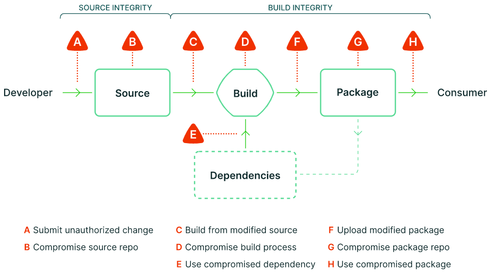

---
authors:
  - Vincent Lin
categories:
  - General
  - Announcements
date: 2023-01-19
draft: false
lastmod: 2023-01-19
summary: 在2023年1月18日发布的v1.13.0版本中，KubeEdge项目已达到SLSA L3等级（包括二进制和容器镜像构件），成为CNCF社区首个达到SLSA L3等级的项目
tags:
  - KubeEdge
  - edge computing
  - slsa
  - Provenance
  - slsa-github-generator
  - sigstore
  - 软件供应链
  - 边缘计算
title: CNCF社区首个！KubeEdge达到软件供应链SLSA L3等级
---

KubeEdge 社区已于 2022 年 7 月份完成整个 KubeEdge 项目的[第三方安全审计](https://github.com/kubeedge/community/blob/master/sig-security/sig-security-audit/KubeEdge-security-audit-2022.pdf)，已发布云原生边缘计算安全威胁分析和防护白皮书，并根据安全威胁模型和安全审计的建议，对 KubeEdge 软件供应链进行持续安全加固。经过社区的不断努力，我们很兴奋地宣布，在 2023 年 1 月 18 日发布的 v1.13.0 版本中，KubeEdge 项目已达到 SLSA L3 等级（包括二进制和容器镜像构件），成为 CNCF 社区首个达到 SLSA L3 等级的项目。

## 为什么说达到 SLSA L3 等级对 KubeEdge 项目十分重要

软件供应链完整性攻击（对软件包的未经授权的修改）在过去三年中呈上升趋势，KubeEdge 实现 SLSA L3 等级标准后，可以端到端的从源码构建到发布流程进行安全加固，保障用户获取到的二进制或容器镜像产物不被恶意篡改。基于 SLSA 安全框架，可以潜在地加强软件构件的完整性。SLSA 提供端到端的指导原则，可以作为软件的一组防御措施，并防止对组成软件产品的软件包的篡改或任何类型的未经授权的修改。采用 SLSA 框架可以保护项目软件免受常见的供应链攻击。

## 关于 SLSA

什么是 SLSA（Supply chain Levels for Software Artifacts 软件构件的供应链级别）：

Google 提出的用于保证整个软件供应链完整性的框架 SLSA，是一套基于行业共识的安全准则，也是一个安全框架、一份标准和控制清单，用于防止篡改、提高完整性以及保护项目、业务或企业中的软件包和基础设施。它不是一个单一的工具，而是一个逐步采用的大纲，以防止工件被篡改和被篡改的工件被使用，并在更高层次上强化构成供应链的平台。生产商遵循 SLSA 准则使他们的软件更加安全，用户则根据软件包的安全状况来做出决策。

截止目前，SLSA 标准处于 alpha 阶段，相关的定义可能会发生变化。

下图描述了软件供应链中已知的攻击点。更多详细描述，可参考https://slsa.dev/。



SLSA 框架引入了许多新的工具和概念，例如：

- Artifact（软件制品）：由构建流水线生成的任何制品文件，如容器镜像、语言包、编译的二进制文件等；
- Provenance （来源证据链）： 构建的元数据包括构建过程、构建源和依赖关系；
- Digest （数字摘要）：加密哈希函数的结果，该函数生成唯一标识工件的固定大小值，例如容器镜像的 SHA-256 哈希；
- Attestation （证书）：一个加密签名的文件，记录当时生成软件产物的来源；
- Immutable references（不可变引用-一种标识符）：，保证始终指向相同的、不可变的软件制品，如特定的容器图像或语言包；
- Build integrity（构建完整性）：验证构建流水线的输出完整性。

## KubeEdge 项目如何达到 SLSA L3

截止目前，SLSA 评估等级共分为 4 个等级 L1~L4，安全性由低到高，每个等级有不同的达标要求，详细的达标要求可参考 SLSA 详细标准（https://slsa.dev/spec/v0.1/requirements）。

在去年 7 月发布的第三方安全审计报告中，KubeEdge 项目在软件供应链 SLSA Provenance 维度暂未达到 L3 等级，经过 SIG-Security 的持续安全加固，在今年 1 月发布的 v1.13.0 版本中，KubeEdge 项目在所有的 SLSA 维度中均达到 L3 等级。以下表格展示了 KubeEdge 在**Source**、**Build**、**Provenance**、**Common**中的达标情况（Y 表示 KubeEdge 已达标，空格表示 SLSA 在该等级下未要求）。

**SLSA 评估表格及达标情况**

| **Requirement**       | **L1** | **L2** | **L3** | **L4** |
| --------------------- | ------ | ------ | ------ | ------ |
| **Source**            |        |        |        |        |
| Version controlled    |        | Y      | Y      | Y      |
| Verified history      |        |        | Y      | Y      |
| Retained indefinitely |        |        | Y      | Y      |
| Two-person reviewed   |        |        |        | Y      |
| **Build**             |        |        |        |        |
| Scripted build        | Y      | Y      | Y      | Y      |
| Build Service         |        | Y      | Y      | Y      |
| Build as code         |        |        | Y      | Y      |
| Ephemeral environment |        |        | Y      | Y      |
| Isolated              |        |        | Y      | Y      |
| Parameterless         |        |        |        | Y      |
| Hermetic              |        |        |        | Y      |
| **Provenance**        |        |        |        |        |
| Available             | Y      | Y      | Y      | TODO   |
| Authenticated         |        | Y      | Y      | TODO   |
| Service generated     |        | Y      | Y      | TODO   |
| Non-falsifiable       |        |        | Y      | TODO   |
| Dependencies complete |        |        |        | TODO   |
| **Common**            |        |        |        |        |
| Security              |        |        |        | Y      |
| Access                |        |        |        | Y      |
| Superusers            |        |        |        | Y      |

本章节将着重介绍 KubeEdge 如何达成 SLSA L3 等级在 Build、Provenance 维度的要求。Build/Provenance Requirements 及 KubeEdge 相应的解决方案如下。

**Build Requirements：**

a) **通过脚本构建：**所有的构建步骤都是通过脚本自动化执行。

b) **通过构建服务进行构建：**所有的构建步骤由构建服务完成，不在开发者本地环境。构建服务如 GitHub Actions、第三方云平台提供的构建服务等。

c) **作为源码构建：**构建服务执行的构建定义文件和配置文件来源于版本控制系统中的文本文件，并且是可验证的。

d) **构建环境临时性：**构建服务确保构建步骤在临时环境中运行，例如容器或 VM，仅为此构建提供，而不是复用先前的构建 。

e) **构建的隔离性：**构建服务确保构建步骤在隔离的环境中运行，不受其他构建实例(无论是先前的还是并发的)的影响。

f) **无用户自定义参数：**除了构建入口点和初始源配置之外，构建输出不会受到用户参数的影响。换句话说，构建完全是通过构建脚本定义的，而不是其他。

g) **封闭性：**所有可传递的构建步骤、源和依赖项都使用不可变引用预先完全声明，并且构建步骤在没有网络访问的情况下运行。

**解决方案：**

KubeEdge 项目所有的构建流程均在 GitHub 上由脚本自动化执行，GitHub Actions 作为构建服务（相关的定义文件和配置文件保存在.github/workflows 目录下），可保障构建过程的可回溯、可验证以及构建环境的临时性、隔离性、构建参数和依赖项不可篡改。

**Provenance Requirements：**

a) **可用性：**Provenance 通过用户可接受的格式提供。应该满足 SLSA Provenance 格式，但如果生产商和用户都同意，并且满足所有其他要求，可以使用另一种格式。

b) **可验证：**Provenance 的真实性和完整性可以由用户验证。这应该通过来自私钥的数字签名来实现，只有生成 Provenance 的服务才能访问私钥。

c) **通过构建服务生成：**Provenance 中的数据必须从构建服务中获得。

d) **不可伪造：**构建服务的用户不能伪造 Provenance。

e) **第三方依赖的完整性：**Provenance 记录运行构建步骤时可用的所有构建依赖项。包括构建的机器、VM 或容器的初始状态。

**解决方案：**

在 KubeEdge 版本发布的产物中，包括二进制文件和容器镜像 2 种格式，通过集成 SLSA 官方的 GitHub 构建项目 slsa-github-generator 来实现 SLSA L3 等级。

在 KubeEdge 版本发布的流程（.github/workflows/release.yml）中，集成了 slsa-framework/slsa-github-generator/.github/workflows/generator_generic_slsa3.yml 和 slsa-framework/slsa-github-generator/.github/workflows/generator_container_slsa3.yml，可保障构建和发布产物（包括二进制文件和容器镜像）的流程满足 SLSA L3 等级的要求。

更多关于 slsa-github-generator 的详细说明请见https://github.com/slsa-framework/slsa-github-generator。

### 关于 Provenance

Provenance 是构建的元数据包括构建过程、构建源和依赖关系，是软件构建和发布执行流程的一种证明，并且是可以被验证的，包括构建的源码仓库、代码分支、配置文件等信息。在 SLSA L3 级别，Provenance 内容是真实的、防篡改的，并且不会被项目维护者更改。二进制发布产物的 Provenance 文件随发布软件包一起发布，名称为 multiple.intoto.jsonl，容器镜像的 Provenance 文件随镜像文件一起上传到 KubeEdge dockerhub 公开仓库中。具体的 Provenance 格式说明，请参考https://github.com/slsa-framework/slsa-github-generator/blob/main/internal/builders/generic/README.md#provenance-format。

### 如何校验 KubeEdge 发布产物是否满足 SLSA L3 等级

详细步骤描述请见https://github.com/kubeedge/kubeedge/pull/4285。

校验示例如下：

```
$ COSIGN_EXPERIMENTAL=1 cosign verify-attestation --type slsaprovenance --policy policy.cue kubeedge/cloudcore:v1.13.0
```

```
{
	"_type": "https://in-toto.io/Statement/v0.1",
	"predicateType": "https://slsa.dev/provenance/v0.2",
	"subject": [{
			"name": "index.docker.io/kubeedge/cloudcore",
			"digest": {
				"sha256": "825642e63ab5b924e2fa0661cd14d544d0be151c4bdba6f3f42796c977fbe211"
			}
		}
	],
	"predicate": {
		"builder": {
			"id": "https://github.com/slsa-framework/slsa-github-generator/.github/workflows/generator_container_slsa3.yml@refs/tags/v1.4.0"
		},
		"buildType": "https://github.com/slsa-framework/slsa-github-generator/container@v1",
		"invocation": {
			"configSource": {
				"uri": "git+https://github.com/kubeedge/kubeedge@refs/tags/v1.13.0",
				"digest": {
					"sha1": "ee357a0d5341241143e88d45df99fde865c987de"
				},
				"entryPoint": ".github/workflows/release.yml"
			},
...
```

## SLSA GitHub generator 签名和验证原理

使用 OpenID Connect (OIDC) 向外部服务 (Sigstore) 证明工作流的身份。OpenID Connect (OIDC) 是身份提供商在网络上使用的标准，用于为第三方证明用户的身份。 GitHub 现在在其工作流程中支持 OIDC。每次运行工作流程时，运行者都可以从 GitHub 的 OIDC 提供商处创建一个唯一的 JWT 令牌。令牌包含工作流身份的可验证信息，包括调用者存储库、提交哈希、触发器以及当前（可重用）工作流路径和引用。

使用 OIDC，工作流向 Sigstore 的 Fulcio 根证书颁发机构证明其身份，后者充当外部验证服务。 Fulcio 签署了一份短期证书，证明运行器中生成的临时签名密钥并将其与工作负载身份相关联。签署出处的记录保存在 Sigstore 的透明日志 Rekor 中。用户可以使用签名证书作为信任方来验证来源是否经过身份验证且不可伪造；它必须是在受信任的构建器中创建的。流程图如下所示。


值得一提的是，SLSA GitHub generator 获得 sigstore 社区 2022 年度徽章 Best User Adopter。


## 总结

SLSA 在 KubeEdge 项目软件供应链安全中发挥着重要作用。基于 sigstore 社区提供的能力，从源码到发布产物，对软件供应链端到端的整个流程进行签名和校验，确保 KubeEdge 软件供应链安全。

**相关参考：**

https://slsa.dev/

https://www.sigstore.dev/

https://github.com/slsa-framework/slsa-github-generator

https://slsa.dev/blog/2022/08/slsa-github-workflows-generic-ga

https://security.googleblog.com/2022/04/improving-software-supply-chain.html

https://blog.sigstore.dev/sigstore-november-roundup-8a852cec10fc/
