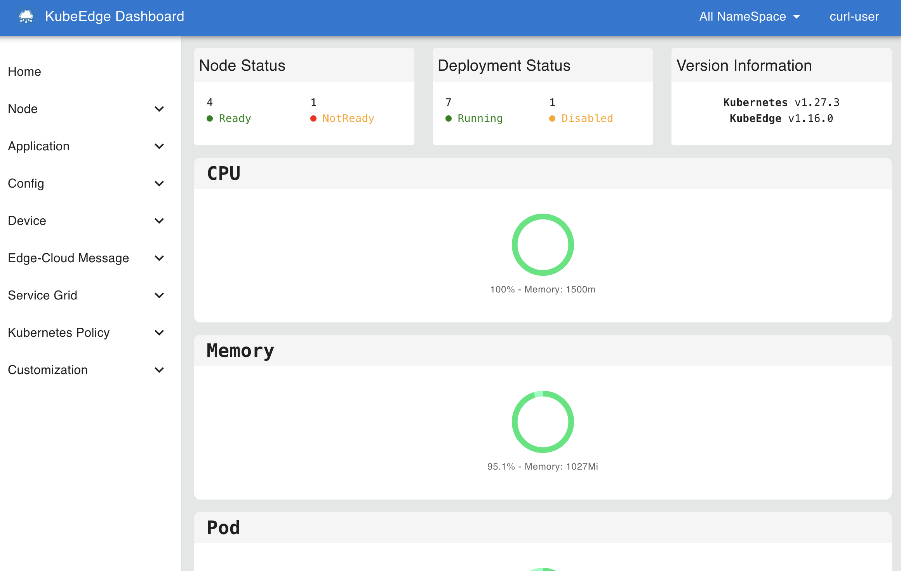

---
authors:
- KubeEdge SIG Release
categories:
- General
- Announcements
date: 2024-10-28
draft: false
lastmod: 2024-10-28
summary: KubeEdge v1.19.0 版本发布！
tags:
- KubeEdge
- edge computing
- kubernetes edge computing
- K8s edge orchestration
- edge computing platform
- cloud native
- iot
- iiot
- dashboard
- release v1.19
- v1.19
title: KubeEdge v1.19.0 版本发布！
---

北京时间2024年10月28日，KubeEdge发布1.19.0版本。新版本在节点和设备方面引入了多个新特性，同时带来了全新版本的 Dashboard。

## KubeEdge v1.19 新增特性：

- [支持边缘节点上报Event](#支持边缘节点上报event)
- [支持边缘节点OTA升级](#支持边缘节点ota升级)
- [Mapper支持设备数据写入](#mapper支持设备数据写入)
- [Mapper框架新增支持OpenTelemetry](#mapper框架新增支持opentelemetry)
- [全新版本Dashboard ](#全新版本dashboard )

## 新特性概览

### 支持边缘节点上报Event

Kubernetes Event作为集群中事件的报告，可以反馈节点、Pods等集群资源的状态变化。在1.19版本中，EdgeCore支持了边缘Event的上报，用户可以直接在云端通过 `kubectl get events` 或者`kubectl describe {resource_type} {resource_name}`获取边缘节点或者pods等状态。

该特性在1.19版本中默认关闭，使用EdgeCore时执行 `--set modules.edged.reportEvent=true` 或者如下修改EdgeCore配置参数并重启EdgeCore。

```yaml
apiVersion: edgecore.config.kubeedge.io/v1alpha2
kind: EdgeCore
featureGates:
  requireAuthorization: true
modules:
  ...
  edged:
    reportEvent: true
...
```

**更多信息可参考:**

https://github.com/kubeedge/kubeedge/pull/5722
https://github.com/kubeedge/kubeedge/pull/5811

### 支持边缘节点OTA升级

新版本在节点升级NodeUpgradeJob基础上新增了边端节点卡点确认和对镜像摘要的验证。卡点确认可以使节点升级下发到边缘节点后，在用户得到确认后才进行升级。镜像摘要验证可以确保在边缘节点待升级的kubeedge/installation-pacakge镜像是安全可靠的。

在1.19版本中，我们可以通过YAML配置NodeUpgradeJob的imageDigestGatter来定义镜像摘要，value用于直接定义摘要的值，registryAPI用于通过registry v2接口获取镜像摘要，两者互斥，如果都没有配置则在升级时不进行镜像摘要的校验，样例：

```yaml
spec:
  ...
  imageDigestGatter:
    value: ""
    registryAPI:
      host: ""
      token: ""
```

我们还可以通过YAML配置NodeUpgradeJob的requireConfirmation来定义是否要在边端进行确认操作，样例：

```yaml
spec:
  ...
  requireConfirmation: true
```

当requireConfirmation设置为true时，在边端节点升级任务下发到边端后，任务状态会更新为confirmation状态等待边端发起确认命令后再继续进行升级。

我们可以通过执行`keadm ctl confirm`指令进行确认，或者调用Metaserver接口进行确认，以继续升级任务：

```yaml
POST http(s)://localhost:<metaserver_port>/confirm
```

**更多信息可参考:**

https://github.com/kubeedge/kubeedge/issues/5589
https://github.com/kubeedge/kubeedge/pull/5761
https://github.com/kubeedge/kubeedge/pull/5863

### Mapper支持设备数据写入

Mapper当前能够采集设备数据并上报，但在设备数据写入方面仍不完善。1.19版本在Mapper-Framework中增加了设备数据写入的能力，允许用户通过Mapper提供的API调用device method，对device property完成数据写入

- Device method API

目前基于物模型的v1beta1版本的设备管理API包含device property的定义，在1.19版本中，新增device method的定义。Device method指设备能够被外部调用的能力或方法，一个device method能够控制多个device property值。用户能在device-instance文件中定义device method，通过device method完成device property的控制、写入。

```yaml
spec:
  ...
  methods:
    - name: ""
      description: ""
      propertyNames:
      - ""
```

- 设备数据写入

在1.19中改进Mapper API能力，新增device method调用接口。用户能够调用相关的接口获取某个设备包含的所有device method，以及device method的调用命令，通过返回的调用命令发起设备写入请求。device method的具体功能实现需要用户自行在Mapper的设备驱动层中完成。

**更多信息可参考：**

https://github.com/kubeedge/kubeedge/pull/5662
https://github.com/kubeedge/kubeedge/pull/5902

### Mapper框架新增支持OpenTelemetry

当前Mapper向用户应用推送设备数据默认内置 HTTP 与 MQTT 两种方式，但仍存在部分应用无法直接以这两种方式进行推送。在1.19版本中我们在数据面引入 OpenTelemetry 观测框架，能够封装设备数据并向多类应用或数据库推送数据，例如GreptimeDB、 Prometheus等，增强Mapper数据面推送设备数据的能力。

```yaml
spec:
  ...
  properties:
    - name: ""
      pushMethod:
        otel：
          endpointURL: ""
```

**更多信息可参考：**

https://github.com/kubeedge/kubeedge/pull/5574
https://github.com/kubeedge/kubeedge/pull/5564

### 全新版本Dashboard

之前发布的KubeEdge Dashboard，新版本使用主流的Next.js框架以及MUI样式库对其进行了重构。在新版本中我们重构并优化了近60个页面与组件，基于KubeEdge最新版本的后端API，我们完善并增加了Device等相关功能页面，并在不影响原有功能的基础上将代码量减少至原先的四分之一。在这个过程中，我们整理完善了Kubernetes以及KubeEdge后端接口的Typescript类型定义，并将依赖的后端接口更新至最新版本，确保其与最新的KubeEdge兼容。



**更多信息可参考：**

https://github.com/kubeedge/dashboard/pull/29

## 版本升级注意事项

- 下个版本（v1.20），EdgeCore的配置项edged.rootDirectory的默认值将会由`/var/lib/edged`切换至`/var/lib/kubelet`，如果您需要继续使用原有路径，可以在使用keadm安装EdgeCore时设置`--set edged.rootDirectory=/var/lib/edged`。

- 从1.19版本开始，请在使用keadm安装KubeEdge时，使用`--kubeedge-version`指定版本，`--profile version`已废弃。