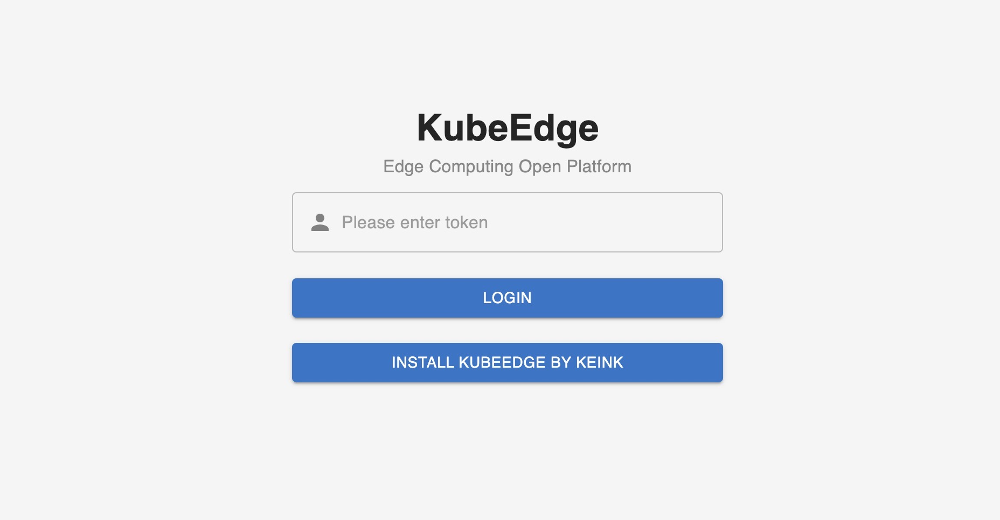
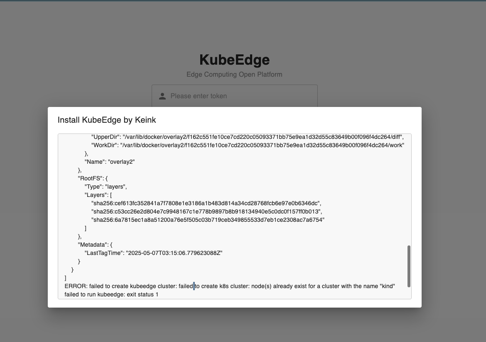

---
authors:
- KubeEdge SIG Release
categories:
- General
- Announcements
date: 2025-06-28
draft: false
lastmod: 2025-06-28
summary: KubeEdge v1.21.0 版本发布！
tags:
- KubeEdge
- edge computing
- kubernetes edge computing
- K8s edge orchestration
- edge computing platform
- cloud native
- iot
- iiot
- dashboard
- release v1.21
- v1.21
title: KubeEdge v1.21.0 版本发布！
---

北京时间2025年6月28日，KubeEdge发布1.21.0版本。新版本对节点任务框架（节点升级、镜像预下载）做了全面更新，并新增云端更新边缘配置的能力，同时Dashboard新增对keink的集成，支持一键部署，在易用性、管理运维能力上做了全面增强。

## KubeEdge v1.21 新增特性：

- [全新节点任务API以及实现](#全新节点任务API以及实现)
- [节点组流量闭环优化](#节点组流量闭环优化)
- [支持在云端更新边缘配置](#支持在云端更新边缘配置)
- [集成kubeedge/keink，支持一键部署Dashboard](#集成kubeedgekeink支持一键部署Dashboard)

## 新特性概览

### 全新节点任务API以及实现

当前KubeEdge中的节点任务资源（节点升级、镜像预下载）的状态设计较为复杂，可读性较差。此外，在执行节点任务的过程中，一些错误不会被记录到状态中导致无法定位任务失败的原因。因此我们对节点状态和运行流程进行了重新设计，设计目标如下：
- 定义一个新的节点任务的状态结构，使其更易于用户和开发者理解
- 跟踪整个流程的错误信息，将其写入状态中展示
- 开发一个更合理的节点任务流程框架

在新的设计中，节点任务的状态由总阶段（phase）和各节点执行任务的状态（nodeStatus）组成。节点任务的阶段（phase）有四个枚举值分别为：Init、InProgress、Completed或Failure，该值通过每个节点的执行状态计算所得。
节点执行任务的状态由阶段（phase）、节点执行的动作流（actionFlow）、节点名称（nodeName）、执行动作流以外的错误原因（reason）以及业务相关的一些字段（如镜像预下载任务的每个镜像下载状态）组成。节点执行任务的阶段（phase）有五个枚举值分别为：Pending、InProgress、Successful、Failure和Unknown。动作流是一个数组结构，记录了每个动作（action）的执行结果，状态（Status）复用了Kubernetes的ConditionStatus，用True和False表示动作的成功或失败，并且记录了动作的失败原因（reason）和执行时间（time）。

节点升级任务的状态YAML样例如下：

```yaml
status:
  nodeStatus:
    - actionFlow:
        - action: Check
          status: 'True'
          time: '2025-05-28T08:12:01Z'
        - action: WaitingConfirmation
          status: 'True'
          time: '2025-05-28T08:12:01Z'
        - action: Backup
          status: 'True'
          time: '2025-05-28T08:12:01Z'
        - action: Upgrade
          status: 'True'
          time: '2025-05-28T08:13:02Z'
      currentVersion: v1.21.0
      historicVersion: v1.20.0
      nodeName: ubuntu
      phase: Successful
  phase: Completed
```

我们对节点任务的云边协作流程也进行了重新设计。为了避免CloudCore多实例导致的节点任务更新产生并发冲突，我们将节点任务的初始化和节点任务的状态计算放在ControllerManager中处理，因为ControllerManager总是单实例运行的。具体流程如下：
- 当节点任务CR被创建后，ControllerManager会初始化匹配的节点的状态；
- CloudCore只会处理ControllerManager处理过的节点任务资源，通过执行器（Executor）和下行控制器（DownstreamController）将节点任务下发给节点；
- EdgeCore接收到节点任务后，通过运行器（Runner）执行动作，并将每个动作的执行结果上报给CloudCore；
- CloudCore通过上行控制器（UpstreamController）接收动作运行的结果并将结果更新到节点任务的状态中；
- ControllerManager监听节点任务资源的变化计算整个节点任务的状态进行更新。

在整个处理流程中，我们将流程中可能产生的错误都记录并更新到了节点任务资源状态的原因字段中。

**更多信息可参考:**

https://github.com/kubeedge/kubeedge/pull/6082
https://github.com/kubeedge/kubeedge/pull/6084

### 节点组流量闭环优化

在 KubeEdge 1.21.0 中，我们对节点组的流量闭环功能进行了全面优化，使其功能更完善、使用更灵活。这一功能的核心能力是：**通过一个 Service 实现“节点组内应用只能访问同组内应用服务，无法访问其他节点组的服务。借助该机制，用户可以轻松实现边缘多区域间的网络隔离，确保不同区域的应用服务之间互不干扰。**

应用场景举例：

以连锁门店为例，企业可将全国各地的门店按区域划分为多个节点组（如华东、华北、西南等），每个区域的门店部署相同类型的应用（如库存管理、收银系统），但业务数据互相隔离。通过流量闭环功能，系统可自动限制服务访问范围，仅在节点组内互通，避免跨区域访问，无需额外配置网络策略。
流量闭环功能为可选项。如果用户不希望开启节点组间的流量隔离，只需在 EdgeApplication 中不配置 Service 模板，系统则不会启用该能力，应用依然可以按原有方式进行通信。

使用样例

```yaml
apiVersion: apps.kubeedge.io/v1alpha1
kind: NodeGroup
metadata:
  name: beijing
spec:
  nodes:
    - node-1
    - node-2
---
apiVersion: apps.kubeedge.io/v1alpha1
kind: NodeGroup
metadata:
  name: shanghai
spec:
  nodes:
    - node-3
    - node-4
---
apiVersion: apps.kubeedge.io/v1alpha1
kind: EdgeApplication
metadata:
  name: test-service
  namespace: default
spec:
  workloadScope:
    targetNodeGroups:
      - name: beijing
        overriders:
          resourcesOverriders:
            - containerName: container-1
              value: {}
      - name: shanghai
        overriders:
          resourcesOverriders:
            - containerName: container-1
              value: {}
  workloadTemplate:
    manifests:
      - apiVersion: v1
        kind: Service
        metadata:
          name: test-service
          namespace: default
        spec:
          ipFamilies:
            - IPv4
          ports:
            - name: tcp
              port: 80
              protocol: TCP
              targetPort: 80
          selector:
            app: test-service
          sessionAffinity: None
          type: ClusterIP
      - apiVersion: apps/v1
        kind: Deployment
        metadata:
          labels:
            kant.io/app: ''
          name: test-service
          namespace: default
        spec:
          replicas: 1
          selector:
            matchLabels:
              app: test-service
          template:
            metadata:
              labels:
                app: test-service
            spec:
              containers:
                - name: container-1
                  ...
              terminationGracePeriodSeconds: 30
              tolerations:
                - effect: NoSchedule
                  key: node-role.kubernetes.io/edge
                  operator: Exists
```

**更多信息可参考:**

https://github.com/kubeedge/kubeedge/pull/6097
https://github.com/kubeedge/kubeedge/pull/6077

### 支持在云端更新边缘配置

相较于登录每个边缘节点手动更新EdgeCore的配置文件edgecore.yaml，能够直接从云端更新edgecorer.yaml要更便利。尤其是对于批量节点操作，同时更新多个边缘节点的配置文件，能够提高管理效率，节约很多运维成本。

在v1.21.0中，我们引入了ConfigUpdateJob CRD，允许用户在云端更新边缘节点的配置文件。CRD中的updateFields用于指定需要更新的配置项。

CRD示例：

```yaml
apiVersion: operations.kubeedge.io/v1alpha2
kind: ConfigUpdateJob
metadata:
  name: configupdate-test
spec:
  failureTolerate: "0.3"
  concurrency: 1
  timeoutSeconds: 180
  updateFields:
    modules.edgeStream.enable: "true"
  labelSelector:
    matchLabels:
      "node-role.kubernetes.io/edge": ""
      node-role.kubernetes.io/agent: ""
```

:::note

* 该特性在1.21中默认关闭，如需使用，请启动云端的controllermamager和taskmanager以及边缘端的taskmanager模块
* 更新边缘配置会涉及EdgeCore重启

:::

**更多信息可参考:**

https://github.com/kubeedge/kubeedge/pull/6338

### 集成kubeedge/keink，支持一键部署Dashboard

新版本对Dashboard进行了增强，为 KubeEdge 控制面板设计了一个 BFF（Backend for Frontend）层，以连接前端用户界面层和 KubeEdge 后端 API。它作为数据传输和处理中心，提供专用的后端服务，简化了前端的数据检索逻辑，提高了性能和安全性。此外，为了让开发人员快速体验和部署kubeedge，我们与 kubeedge/keink 项目深度集成。只需一键操作，在 dashboard 上就能快速启动 kubeedge环境，对其功能进行完整的演示和验证。





**更多信息可参考:**
https://github.com/kubeedge/dashboard/pull/50

## 版本升级注意事项

### 节点任务

新版本默认开启v1alpha2版本的节点任务，CRD定义会向下兼容，如果想继续使用v1alpha1版本的NodeUpgradeJob和ImagePrePullJob，可以通过设置ControllerManager和CloudCore的特性门切换。

ControllerManager 添加启动参数
```
--feature-gates=disableNodeTaskV1alpha2
```

CloudCore 修改配置文件
```
kubectl edit configmap -n kubeedge cloudcore
```

修改配置内容：
```yaml
  apiVersion: cloudcore.config.kubeedge.io/v1alpha2
  kind: CloudCore
+ featureGates:
+   disableNodeTaskV1alpha2: true
```

:::note
v1alpha2版本节点任务的CRD能兼容v1alpha1，但是它们不能相互切换，v1alpha1的代码逻辑会破坏v1alpha2 节点任务CR的数据。
:::

v1alpha1的节点任务基本不会再进行维护，v1.23版本后将删除v1alpha1版本节点任务的相关代码。另外，节点任务在边端已成为一个默认关闭的Beehive模块，如果要正常使用节点任务功能的话，需要修改边端edgecore.yaml配置文件开启：
```yaml
  modules:
    ...
+   taskManager:
+     enbale: true
```

### 边缘节点升级

我们对Keadm边缘节点升级的相关命令（备份、升级、回滚）做了调整：
- 升级命令不会自动执行备份命令，备份命令需要手动触发；
- 升级命令隐藏了业务相关的参数，v1.23版本后会清理废弃的代码；
- 升级的相关命令都使用三级命令：
```
 keadm edge upgrade
 keadm edge backup
 keadm edge rollback
```