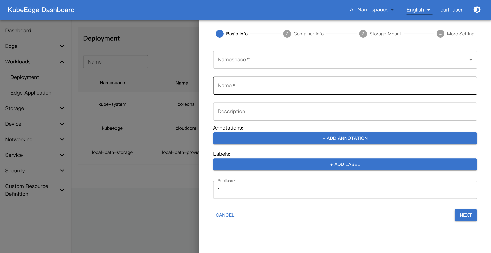
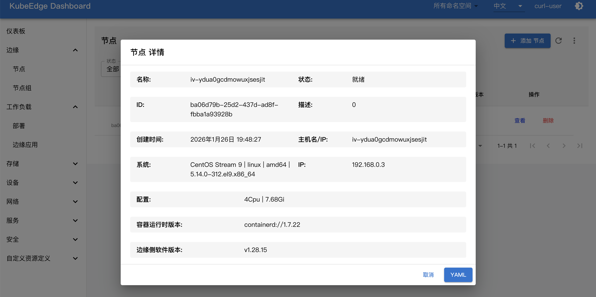

---
authors:
- KubeEdge SIG Release
categories:
- General
- Announcements
date: 2026-03-13
draft: false
lastmod: 2026-03-13
summary: KubeEdge v1.23.0 版本发布！
tags:
- KubeEdge
- edge computing
- kubernetes edge computing
- K8s edge orchestration
- edge computing platform
- cloud native
- iot
- iiot
- release v1.23
- v1.23
title: KubeEdge v1.23.0 版本发布！
---

北京时间2026年3月11日，KubeEdge 发布 1.23.0 版本。新版本通过深度优化 Windows 兼容性、引入设备异常检测框架以及重构边缘数据库，显著提升了边缘侧的运维能力、数据处理可靠性和整体性能。同时发布了新版本 Dashboard，在用户交互上带来全新体验。

## KubeEdge v1.23 新增特性：

- [Windows 操作系统下的 EdgeCore 与 Keadm 能力增强](#windows-操作系统下的-edgecore-与-keadm-能力增强)
- [新增设备异常检测能力](#新增设备异常检测能力)
- [优化边缘侧查询节点流程，降低边云通道带宽占用](#优化边缘侧查询节点流程降低边云通道带宽占用)
- [使用 Gorm 替换 Beego，并重构边缘数据库](#使用-gorm-替换beego并重构边缘数据库)
- [升级 K8s 依赖到1.32](#升级k8s依赖到132)
- [Dashboard 新版本发布：国际化（中文）支持、性能提升与页面优化](#dashboard-新版本发布国际化中文支持性能提升与页面优化)

## 新特性概览

### Windows 操作系统下的 EdgeCore 与 Keadm 能力增强

在1.23.0版本中，我们对 EdgeCore 和 keadm 在 Windows OS 的能力进行了如下增强：

- 提供了本地DMI服务：由于 Windows 不支持 Unix Domain Socket，我们引用了Windows 命名管道（Named Pipes）实现本地网络通信。
- keadm 升级/下载增强：在v1.23.0中，keadm 会检测本地`edgecore.exe`的版本信息，如果有更高版本可用，则自动重新下载 EdgeCore 包，避免因本地已存在`edgecore.exe`而导致升级被跳过
- 可观测性增强：在新版本中，EdgeCore 日志会被重定向到可配置的日志文件，优化Windows环境下的运维与故障排查。

**更多信息可参考：**

https://github.com/kubeedge/kubeedge/pull/6563
https://github.com/kubeedge/kubeedge/pull/6580
https://github.com/kubeedge/kubeedge/pull/6565

### 新增设备异常检测能力

v1.23.0 引入了设备异常检测框架，您可在 Device CRD 的 pushMethod 字段中指定异常检测相关配置：

```
apiVersion: devices.kubeedge.io/v1beta1
kind: Device
spec:
     properties:
   pushMethod:
   anomalyDetection:
   ... // 指定异常检测字段，如设备工作状态等
```

同时我们在 Mapper 中实现了设备异常检测处理逻辑，您可以定制化设计处理设备异常数据。另外，我们在 Example 仓库提供了设备异常检测的Demo，方便您快速了解并试用新的能力，详情请查看https://github.com/kubeedge/examples/pull/163。

**更多信息可参考：**

https://github.com/kubeedge/kubeedge/pull/6478
https://github.com/kubeedge/kubeedge/pull/6543

### 优化边缘侧查询节点流程，降低边云通道带宽占用

之前的版本中，EdgeCore 需要通过边云通道远程查询节点信息，在大规模场景下，边云通道带宽消耗尤其显著。在新版本中，EdgeCore 直接从边缘数据库查询节点，同时，CloudCore 检测到节点信息更新时会自动同步到边缘数据库，显著提升了大规模边缘场景下的系统性能和可靠性。

**更多信息可参考：**

https://github.com/kubeedge/kubeedge/pull/6489

### 使用 Gorm 替换Beego，并重构边缘数据库

原有的边缘数据库使用的 Beego 框架，实际上仅用到了 ORM 部分。在新版本中，我们使用更轻量的 Gorm 替换 Beego 框架。同时，对边缘数据库进行重构，在 MetaManager 中引入统一的数据库操作入口，使数据库交互更清晰、易维护。

**更多信息可参考：**

https://github.com/kubeedge/kubeedge/issues/6296
https://github.com/kubeedge/kubeedge/pull/6585

### 升级K8s依赖到1.32

新版本将依赖的Kubernetes版本升级到v1.32.10，您可以在云和边缘使用新版本的特性。

**更多信息可参考：**

https://github.com/kubeedge/kubeedge/pull/6549

### Dashboard 新版本发布：国际化（中文）支持、性能提升与页面优化

Dashboard v0.2.0正式发布，包括如下更新：

- 引入 Backend-for-Frontend（BFF）架构，建立数据处理中间层，优化数据处理逻辑，提升前端性能
- 引入国际化语言框架，并新增中文语言包支持
- 全面优化Dashboard的UI体验，统一页面风格，重点优化PodTable、TableView等表单组件，提升用户交互体验。





**更多信息可参考：**

https://github.com/kubeedge/dashboard/tree/v0.2.0

## 版本升级注意事项

v1.23.0 开始，Device CRD 的 `Status` 字段将分离出来，单独作为 `DeviceStatus CRD` 使用。该变更兼容旧版CRD，但需注意，在后续版本中设备状态需要通过新的 `DeviceStatus CRD` 获取。
