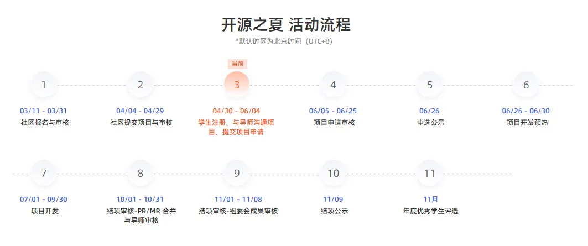

---
authors:
- KubeEdge
categories:
- General
- Announcements
date: 2024-04-30
draft: false
lastmod: 2024-04-30
summary: 开源之夏2024重磅来袭！KubeEdge社区18个课题报名启动
tags:
- KubeEdge
- edge computing
- kubernetes edge computing
- K8s edge orchestration
- edge computing platform
- cloud native
- 开源之夏
title: 开源之夏2024重磅来袭！KubeEdge社区18个课题报名启动
---
## 开源之夏介绍
开源之夏是由中国科学院软件研究所“开源软件供应链点亮计划”发起并长期支持的一项暑期开源活动，旨在鼓励在校学生积极参与开源软件的开发维护，培养和发掘更多优秀的开发者，促进优秀开源软件社区的蓬勃发展，助力开源软件供应链建设。学生通过远程线上协作方式，通过社区资深导师指导，参与到开源社区各组织项目开发中，并收获证书及最高12000元奖金。活动官网：[https://summer-ospp.ac.cn/](https://summer-ospp.ac.cn) 

开源之夏学生报名4月30日正式开启。KubeEdge云原生边缘计算社区已连续4年参与开源之夏，在本届开源之夏共带来 ***18个*** 精选课题，包括应用与 ***算法创新、AI大模型、机器学习、深度学习、系统研发与集成*** 等多个领域，由来自 ***高校、产业等资深学者、产业巨擘与技术领英组成的导师带队***，为同学们引领迈向顶尖开发者之路。历届开源之夏KubeEdge社区课题聚焦行业前沿方向，为学生职业生涯增添浓墨重彩的一笔，多位入选组委会官方优秀学生。

为帮助学生更好地了解与选报课题，KubeEdge社区将于 ***5月8日、5月9日*** 开展课题线上宣讲会（详见下文），同学们不可错过。

## KubeEdge云原生边缘计算社区
 
KubeEdge[(https://github.com/kubeedge)]（https://github.com/kubeedge） 是 ***业界首个云原生边缘计算框架、云原生计算基金会内部唯一孵化级边缘计算开源项目*** 。KubeEdge 连接云原生和边缘计算生态，聚焦于提供一致的云边资源协同、数据协同、智能协同和应用协同体验，为边缘计算领域的应用提供更好的支持和解决方案，在全球已拥有 ***1500+*** 贡献者和 ***100*** 贡献组织，在GitHub获得 ***7.3k+Stars***和 ***2.1k+Forks***。

KubeEdge社区持续开拓创新，目前已完成业界最大规模云原生边云协同高速公路项目（统一管理10万边缘节点/50万边缘应用）、业界首个云原生星地协同卫星、业界首个云原生车云协同汽车、业界首个云原生油田项目，开源业界首个分布式协同AI框架Sedna及业界首个边云协同终身学习范式。

## KubeEdge开源之夏2024课题

### 项目1：支持边缘节点上报event

  - ***项目编号***：2498a0328
  - ***项目难度***：进阶/Advanced
  - ***导师联系***：鲍玥 baoyue2@huawei.com
  - ***项目简述***：在目前的KubeEdge版本中，由于云边通道没有开发event相关接口，因此用户无法在云端获取到边缘pod的事件，尤其当pod状态异常时，用户必须要登录边缘节点获取pod事件，运维成本比较高。本项目希望能在云边通道增加event接口，支持边缘节点上报event，提高KubeEdge易用性与运维效率。
  - ***项目链接***
https://summer-ospp.ac.cn/org/prodetail/2498a0328?lang=zh&list=pro

### 项目2：基于KubeEdge的移动自组织网络边缘计算架构设计与实现

  - ***项目编号***：2498a0330
  - ***项目难度***：进阶/Advanced
  - ***导师联系***：赖俊宇（ Jason）laijy@uestc.edu.cn
  - ***项目简述***：边缘计算（Edge Computing）与移动自组织网络（MANET）的结合，在应急等场景下有广泛的需求和良好的前景。本项目拟基于业界最流行的云原生云边协同计算架构KubeEdge，设计和实现面向无人机/无人系统集群等典型MANET场景的边缘计算架构，以更好支持MANET中的“云-边”协同、“边-边”协同计算能力。
  - ***项目链接***：
https://summer-ospp.ac.cn/org/prodetail/2498a0330?lang=zh&list=pro

### 项目3：使用 KubeEdge 实现基于深度学习的设备故障检测场景

  - ***项目编号***：2498a0332
  - ***项目难度***：进阶/Advanced
  - ***导师联系***：张红兵（Hongbing） hongbing.zhang@daocloud.io
  - ***项目简述***：边缘计算作为人工智能的最后一公里，跟 AI 结合的应用场景也很广泛。在工业制造领域，边缘 AI 发挥着越来越重要的作用。场景：面向生产制造过程，刀具、冲压设备等声音检测，将老师傅听音多年经验迁移至算法模型，设备运行故障及时发现，提升设备巡检运维效率。1. 使用 KubeEdge 将故障检测模型应用下发至边缘节点，模型应用的资源消耗不超过4c8g；2. 运行模型应用，通过模拟modbus设备采集声音信号，模型应用能够通过设备声音识别出设备故障，控制边缘模拟灯泡的亮灭，并录制视频；3. （可选）将终端设备接入平台纳管。
  - ***项目链接***：
https://summer-ospp.ac.cn/org/prodetail/2498a0332?lang=zh&list=pro

### 项目4： Sedna 联合推理、联邦学习控制器优化

  - ***项目编号***：2498a0315
  - ***项目难度***：进阶/Advanced
  - ***导师联系***：唐明 ming.tang@daocloud.io
  - ***项目简述***：Sedna是在KubeEdge SIG AI中孵化的一个边云协同AI项目。得益于KubeEdge提供的边云协同能力，Sedna可以实现跨边云的协同训练和协同推理能力，如联合推理、增量学习、联邦学习、终身学习等。Sedna支持目前广泛使用的AI框架，如TensorFlow/Pytorch/PaddlePaddle/MindSpore等，现有AI类应用可以无缝迁移到Sedna, 快速实现边云协同的训练和推理，可在降低成本、提升模型性能、保护数据隐私等方面获得提升。但是当前 Sedna 项目中联合推理、联邦学习控制器依然存在一些功能缺陷需要解决，主要表现在以下方面：联合推理：1、在创建联合推理任务或联邦学习任务以后，其生成的云和边的任务实例在出现故障或手动删除以后不会自动重建，即缺少自愈能力；2、联合推理任务CR在被删除以后，其生成的任务实例以及service配置不会被级联删除，该缺陷会导致后续再次创建联合推理任务失败。需要做的事情：对当前Sedna的联合推理和联邦学习控制器进行优化以解决上述功能缺陷。
  - ***项目链接***：
https://summer-ospp.ac.cn/org/prodetail/2498a0315?lang=zh&list=pro

### 项目5：大语言模型边侧基准测试套件：基于KubeEdge-Ianvs实现

  - ***项目编号***：2498a0318
  - ***项目难度***：进阶
  - ***导师联系***：胡创 hchuchuang@gmail.com
  - ***项目简述***：由于模型尺寸和数据规模，LLMs往往在云端训练。同时由于大语言模型使用过程往往涉及商业机密或用户隐私，在边侧设备部署LLMs也逐渐成为了研究热点。LLMs量化技术正在使能LLMs边侧推理，然而，边侧设备的有限资源对云端训练LLMs的推理延迟和推理精度产生了影响。Ianvs旨在利用容器资源管理能力和边云协同能力对云端训练LLMs做边侧部署基准测试。
  - ***项目链接***：
https://summer-ospp.ac.cn/org/prodetail/2498a0318?lang=zh&list=pro

### 项目6：行业大模型基准测试套件：基于KubeEdge-Ianvs实现

  - ***项目编号***：2498a0319
  - ***项目难度***：进阶
  - ***导师联系***：郑子木 zimu.zheng@huawei.com
  - ***项目简述***：大模型进入规模化应用时代，云已为大模型提供基础设施和服务，相关客户进一步提出包括个性化、数据合规、实时性等边缘侧的针对性应用需求，而云边协同的人工智能服务成为大趋势。但是，当前在产品定义、服务质量、服务资质、行业影响力等方面，存在通用竞争力和客户信任问题两大挑战，其症结在于，当前大模型基准测试聚焦对通用基础能力的考核，未能从行业角度牵引大模型应用。本项目从大模型产业以及云边协同人工智能角度、藉由行业应用反映大模型真实价值，以行业基准测试牵引大模型应用孵化。本项目基于协同人工智能基准测试套件KubeEdge-Ianvs，补充大模型测试工具接口，配套测试数据集，并构建政务等行业大模型测试套件。
  - ***项目链接***：
https://summer-ospp.ac.cn/org/prodetail/2498a0319?lang=zh&list=pro

### 项目7：代码大模型基准测试套件：基于 KubeEdge-Ianvs 构建

  - ***项目编号***：2498a0323
  - ***项目难度***：进阶/Advanced
  - ***导师联系***：韩洋（Brooks） yangbrooks.han@gmail.com
  - ***项目简述***：大语言模型(LLMs) 在代码生成、自动编程、代码分析等任务中展现出了强大的能力。然而,这些模型通常基于通用的代码数据进行训练,无法充分利用软件工程师在实际工作中的协作和反馈。为了构建更加智能、高效的代码生态系统,有必要建立一个代码大模型数据集和评测基准,通过LLMs促进代码工程项目与软件工程师的紧密协作。本项目将基于开源的协同人工智能基准测试套件KubeEdge-Ianvs,构建一个面向LLMs的协作式代码智能体对齐数据集和评测基准。该数据集将包含软件工程师在开发过程中的行为轨迹、反馈和迭代过程,以及相关的代码版本和注释信息。通过这些数据,我们将设计评测指标和基准,以衡量LLMs在代码生成、推荐和分析等任务上的性能,并促进LLMs与软件工程师的协作。
  - ***项目链接***：
https://summer-ospp.ac.cn/org/prodetail/2498a0323?lang=zh&list=pro

### 项目8：大语言模型云边协同推理：基于KubeEdge-Ianvs实现

  - ***项目编号***：2498a0324
  - ***项目难度***：进阶/Advanced
  - ***导师联系***：胡时京 sjhu21@m.fudan.edu.cn
  - ***项目简述***：目前以Llama2-70b，Qwen-72b为首的百亿、千亿参数规模的LLM模型大多只能部署在算力充足的云端提供推理服务。然而对于边缘终端的用户来说，一方面云端LLM服务面临推理速度慢、响应时延长的问题，另一方面将边缘的隐私数据上传云端处理可能面临隐私泄露的风险。同时在边缘环境可以部署的LLM模型（如TinyLlama-1.1b）推理准确率相较云端LLM有较大差距。因此，单独使用云端LLM或是边缘LLM都无法同时兼顾隐私保护、推理实时性和推理准确率，所以我们需要通过云边协同的策略结合云端LLM推理准确率高和边缘LLM推理隐私性强、速度快的优势，从而更好满足边缘用户的需求。
  - ***项目链接***：
https://summer-ospp.ac.cn/org/prodetail/2498a0324?lang=zh&list=pro

### 项目9：多语言mapper支持

  - ***项目编号***：2498a0316
  - ***项目难度***：进阶/Advanced
  - ***导师联系***：刘家伟（jiawei） jiawei.liu@daocloud.io
  - ***项目简述***：所有的设备都可以通过厂商的驱动进行连接和控制，但是从设备拿到的信息需要转换成Kubeedge所理解的格式。Mapper就是Kubeedge和devices之间相互联系的应用程序。Mapper-framework 是一个框架，通过提供mapper运行时库和用于脚手架和代码生成的工具来生成新的mapper，使编写mapper变得更容易。目前社区有基于go语言实现的Mapper-framework，但其它语言(c、java、python)在实际业务中也有需求。需要做的事情：基于 (c、java、python)中至少一种语言实现。
  - ***项目链接***：
https://summer-ospp.ac.cn/org/prodetail/2498a0316?lang=zh&list=pro

### 项目10：KubeEdge边缘设备管理插件Mapper支持设备发现

  - ***项目编号***：2498a0331
  - ***项目难度***：进阶/Advanced
  - ***导师联系***：王彬丞 wangbincheng4@huawei.com
  - ***项目简述***：目前KubeEdge使用Mapper插件管理边缘设备，能够将边缘设备以设备孪生的形式纳管至KubeEdge集群中，以云原生的方式对边缘设备进行生命周期管理。目前Mapper管理边缘设备时，需要用户实现并提交设备CRD文件至KubeEdge集群，Mapper根据CRD文件中的定义连接并管理设备。但部分情况下设备支持自动发现，例如Onvif网络摄像头设备。本项目计划为边缘设备管理插件Mapper提供设备发现功能，能够让Mapper自动扫描发现设备，并将其纳管至KubeEdge集群，简化用户操作流程。
  - ***项目链接***：
https://summer-ospp.ac.cn/org/prodetail/2498a0331?lang=zh&list=pro

### 项目11：大语言模型智能体（LLM Agent）个性化研究：基于KubeEdge-Ianvs云边协同终身学习

  - ***项目编号***：2498a0333
  - ***项目难度***：进阶
  - ***导师联系***：杨步芳 bfyang@link.cuhk.edu.hk
  - ***项目简述***：大语言模型 (LLM)由于其卓越的推理能力和零样本能力受到广泛关注。其中，LLM Agent被视作LLM在物理世界中的一个重要落地方向。一个LLM Agent可以通过任务规划、工具调用、自我反思和任务执行，在物理世界中实现各种复杂的任务。本项目旨在通过利用云边协同框架，结合云端大模型的回答和边侧基于隐私数据生成的回答，实现个性化LLM Agent。我们计划基于KubeEdge-lanvs边云协同平台终身学习（知识库维护用户个性化的数据，终身学习本身可以支持不同边缘上有不同的模型）开发一个个性化LLM Agent。该系统能够结合云端大型LLM的泛化能力和边缘设备上的个性化用户数据，生成高质量、个性化的回答。
  - ***项目链接***：
https://summer-ospp.ac.cn/org/prodetail/2498a0333?lang=zh&list=pro

### 项目12：面向标注稀缺问题的联邦类增量学习研究：基于KubeEdge-Ianvs实现

  - ***项目编号***：2498a0334
  - ***项目难度***：进阶
  - ***导师联系***：陈浩锐 sechenhr@mail.scut.edu.cn
  - ***项目简述***：在边缘环境中，数据随时间不断到达边缘设备，其所包含的类别随时间不断增加。受制于赋予标记所需的成本，这些数据之中仅有少量数据带有标注。为了利用这些数据优化模型，可以通过联邦学习的方式在边缘设备间进行协作分布式模型训练。然而，传统的联邦学习仅考虑在数据不变的场景中进行有监督学习，无法在动态变化且标注稀缺的数据集上进行训练。本项目旨在充分利用不同边缘设备上标注稀缺的流式数据，通过联邦学习的方式对模型进行分布式训练，从而缓解模型在类增量学习场景中的遗忘程度，提升模型的泛化能力。
  - ***项目链接***：
https://summer-ospp.ac.cn/org/prodetail/2498a0334?lang=zh&list=pro

### 项目13：面向高移动场景的异构多边协同神经网络推理

  - ***项目编号***：2498a0335
  - ***项目难度***：进阶
  - ***导师联系***：李蕴哲 yunzhe.li@sjtu.edu.cn
  - ***项目简述***：在高速公路、高铁等高移动场景下，个人终端设备与基站等边缘设备连接不稳定，使得基于云的服务质量难以保证。然而，近几年，AI技术已经深入我们生活的方方面面，我们在高移动场景下也需要使用有高计算、存储需求且延迟敏感的AI技术，例如对话大模型等，这给边缘AI服务带来了新的挑战。本项目旨在利用边缘的多个异构计算单元（例如个人的手机、平板、手环、笔记本电脑等多个计算设备）进行协同的AI神经网络推理，使得AI任务可以利用更近的边缘设备以较低的延迟执行完毕，提高用户的使用体验。
  - ***项目链接***：
https://summer-ospp.ac.cn/org/prodetail/2498a0335?lang=zh&list=pro

### 项目14：批量节点接入

  - ***项目编号***：2498a0325
  - ***项目难度***：基础/Basic
  - ***导师联系***：侯玲玉（lingyu） lingyu.hou@daocloud.io
  - ***项目简述***：KubeEdge将Kubernetes的能力延伸到了边缘场景中，为云和边缘之间的网络，应用部署和元数据同步提供基础架构支持。在边缘场景中，边端节点可能处于私网中，无法从云端访问边端节点，因此需要从边端节点接入云端，反向建立双向通信链路。目前kubeedge只支持了单个节点接入，但是实际业务场景中，可能存在大量的边端节点，单个接入非常麻烦，所以需要支持批量接入节点。需要做的事情：支持批量接入节点，可以借助脚本或者其它方式实现 。
  - ***项目链接***：
https://summer-ospp.ac.cn/org/prodetail/2498a0325?lang=zh&list=pro

### 项目15：提供一个通用的 MQTT 协议

  - ***项目编号***：2498a0326
  - ***项目难度***：基础/Basic
  - ***导师联系***：方志颖（Zhiying） zhiying.fang@daocloud.io
  - ***项目简述***：在设备硬件市场中，MQTT协议是较为常见的设备协议。我们希望能有一个通用的MQTT Mapper来处理这些使用MQTT协议的设备，并且它能够支持常见的序列化方式（json、yaml 和 xml）中获取属性值。为了实现上述需求，我们需要您完成这些任务：1. 我们期望您使用最新的Mapper-Framework框架在 kubeedeg/mappers-go 项目中新增 MQTT 协议的Mapper；2. 我们期望这个Mapper能够从指定MQTT服务的Topic获取报文，并且能用常见序列化方式（json、xml）从报文中解析出属性值；3. （可选）我们期望您能提供一个更有扩展性的方案来从更多的自定义报文中解析属性值；
  - ***项目链接***：
https://summer-ospp.ac.cn/org/prodetail/2498a0326?lang=zh&list=pro

### 项目16：边缘节点支持OTA升级

  - ***项目编号***：2498a0327
  - ***项目难度***：基础/Basic
  - ***导师联系***：胡炜 wei.hu@daocloud.io
  - ***项目简述***：
为了使边缘节点更为方便、迅速的得到升级，我们将一种远程升级方案OTA（Over-The-Air）引入到 KubeEdge 中，在OTA主要流程（制作升级包-> 下载升级包 -> 验签升级包 -> 固件更新）中，我们已经实现了大多步骤。我们发布版本会生成新的名为installation-package的镜像版本，然后通过NodeUpgradeJob CRD定义实现在边端节点获取镜像中的安装工具 keadm 执行升级命令升级边端节点。但在这个过程中如果黑客在节点中伪装镜像，这会导致 keadm 是不受信的，我们需要在keadm执行升级前，对镜像的摘要进行验证，也就是第三步验签升级包。并且在一些业务场景下（车联网、物联网）我们还需要提供一个可选项，使节点在等待收到一个有权限者确认后，再执行升级操作。为了实现上述需求，我们需要您完成这些任务：1. 我们期望您在边端节点升级前完成对升级镜像包摘要的验证；2. 我们期望您在NodeUpgradeJob CRD中新增一个参数，用于定义是否需要边端进行确认，如果需要，等待确认后再执行节点更新；3. 我们期望您在 MetaService 中提供确认边端节点升级的 AP I接口，并且在 `keadm ctl` 子命令中提供确认边端节点升级的命令操作；
  - ***项目链接***：
https://summer-ospp.ac.cn/org/prodetail/2498a0327?lang=zh&list=pro

### 项目17：KubeEdge支持边缘节点离线场景下对数据面资源的操作

  - ***项目编号***：2498a0352
  - ***项目难度***：进阶/Advanced
  - ***导师联系***：杨志佳 2938893385@qq.com
  - ***项目简述***：边缘计算场景中，边缘节点常处于离线状态，用户需要在离线状态下查看本节点的数据面资源，比如pod，device,在某些场景下可能还需要对资源进行操作，比如重启pod，修改device instance等，同时在离线场景中开发一些资源操作的API供用户或上层应用。①在kubeedge1.17中将支持边缘节点离线时对pod的重启和状态查看，还需要进一步扩展离线状态下数据面操作的功能，比如对pod的logs/exec/describe ②离线状态下支持对device资源查看，device资源的修改，上线后与云端自动同步 ③提供离线状态下操作数据面资源的API，供上层应用使用 ④保证边缘节点从离线到在线后，边缘数据同步到云
  - ***项目链接***：
https://summer-ospp.ac.cn/org/prodetail/2498a0352?lang=zh&list=pro

### 项目18：Windows非WSL虚拟化节点环境，改造mapper支持 Windows节点运行

  - ***项目编号***：2498a0428
  - ***项目难度***：进阶
  - ***导师联系***：吕涛涛（ttlv） steven.lv@nio.com
  - ***项目简述***：汽车试验台架，Windows的环境下，devops自动化流水线，不开启WSL虚拟化的Windows上位机环境，将边缘的Windows节点做为边缘设备纳管的同时，依托云端的device和deviceModel的CRD定义和edgecore的devicetwin以及evenbus模块，将边缘侧的mapper做为统一的业务处理模块，实现批量下发测试多业务场景的测试任务并且实时反馈测试结果的需求。
  - ***项目链接***：
https://summer-ospp.ac.cn/org/prodetail/2498a0428?lang=zh&list=pro

## 如何报名开源之夏课题？

#### 报名对象 

- 本活动面向年满 18 周岁的高校在校学生。
- 暑期即将毕业的学生，只要申请时学生证处在有效期内，就可以报名活动。
- 中国籍学生参与活动时需提供身份证、学生证、教育部学籍在线验证报告（学信网）或在读证明。
- 外籍学生参与活动时需提供护照，同时提供录取通知书、学生卡、在读证明等文件用于证明学生身份。

#### 报名时间 
*** 4月30日-6月4日*** ，学生可在系统（https://summer-ospp.ac.cn/） 注册账号并填写个人资料，资料审核通过的学生可在系统提交项目申请书。注：个人资料应在06/03 15:00 UTC+8 前完成填写并提交审核，项目申请书应在06/04 18:00 UTC+8 前完成提交。

#### 我可以在开源之夏获得什么？

- 结识开源界小伙伴和技术大牛
- 获得社区导师的专业指导，与开源项目开发者深度交流
- 丰富项目实践经验，提升项目开发技能
- 为学习方向提供参考，为职业发展积累人脉
- 通过结项考核的学生将获得结项奖金和结项证书（***基础难度税前8000元RMB，进阶难度税前12000元RMB***），更有机会获选优秀学生

#### 如何快速选定项目
对KubeEdge社区开源之夏课题感兴趣的同学，可以 ***通过本文上方导师邮箱***，及时联系导师沟通锁定课题。为方便同学们更快了解与找到最适合自己的课题方向，KubeEdge社区将于 ***5月8日、5月9日特别组织18个课题线上宣讲会，大咖导师空降***，为你娓娓道来，欢迎同学们通过以下方式参会：https://zoom.us/my/kubeedge

