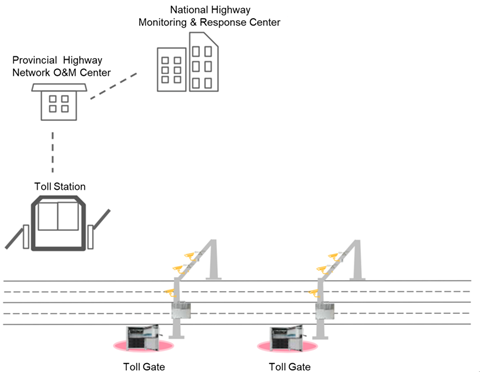
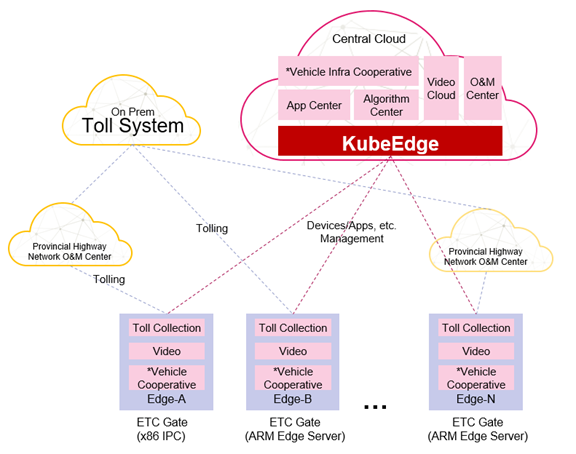
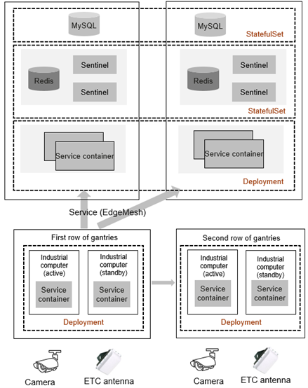

# Managing 100,000 Edge Nodes on China's Highways Using KubeEdge

This KubeEdge-based system for Electronic Toll Collection (ETC) manages nearly 100,000 edge nodes and more than 500,000 edge applications across 29 of China's 34 provinces, cities and autonomous regions. With these applications, the system processes more than 300 million data records daily and supports continuous update of ETC services on highways. With this KubeEdge-based system, the traffic efficiency at the toll stations have improved by 10 times.

## Project Background

More than 200 million drivers in China are now equipped with electronic toll collection (ETC) devices to pay automatically when driving on the country's highways.

In order to improve the efficiency and compatibility of ETC systems on highways in China, Beijing Internet Zhilian Technology initiated a project to connect all ETC systems to one unified network and remove segregated, provincial toll stations. As a result, ETC gantries needed to be deployed on highways nationwide to collect license plate and transaction information when vehicles pass through toll booths.

In this modernization project, nearly 100,000 gantries, controllers, and edge devices were deployed at the edge on highways. More than 500,000 applications were deployed on edge nodes to collect and upload information to provincial centers and Highway Monitoring & Response Center through the toll collection private network.

The project faced the following challenges:

- Low quality network connections between centers and edge devices, with frequent delays, packet loss, and low bandwidth
- Unified management of nearly 100,000 heterogeneous devices, including Arm and x86 devices
- Lifecycle management of more than 500,000 applications

After a comparative analysis of different architectures including cloud native and traditional ones, Beijing Internet Zhilian Technology selected a cloud-native based architecture proposed by Huawei, with KubeEdge as the key solution addressing the project's problems.

## Why Cloud Native?

In this project, the applications deployed at the edge are as complex as those in the cloud. For example, they comprise multiple microservices. Since Kubernetes is ideal for deploying and managing microservice applications at scale, the project had a goal to bring the benefits of Kubernetes to edge environments.

The project had the following typical deployment requirements:

- Hot standby
- Multi-active mutual backup
- Associated applications must be deployed on the same node to improve the interaction efficiency between applications.
- Different instances of the same application must be deployed on different nodes to improve availability.
- Applications must be deployed in different edge node groups based on the properties of edge nodes.
- Application deployment should be defined as an independent object and also applications must be automatically deployed after new edge nodes that meet requirements are brought online.

These requirements could be addressed by standard Kubernetes APIs, such as Deployments, ReplicaSets, and DaemonSets.

In addition, however, there were some requirements unique to the edge environment so that just using Kubernetes was not sufficient.

## Why KubeEdge?

The project had two issues for its edge environment that standard Kubernetes could not address well:

#### Highly complex hardware management and application operations

Because they were deployed nationwide, the edge nodes in the ETC system were highly distributed, provided by multiple vendors, and span heterogeneous hardware architectures.

Some edge industrial computers were so small they only had a 1 quad-core ARM SoC and 1 GB memory. Thus, the ETC solution needed to use as few resources as possible to manage edge nodes.

Additionally, the ETC system included six different management layers for applications, starting from the Highway Monitoring & Response Center out to the final road section. This could lead to complex operations and maintenance (O&M) and high costs. The ETC solution needed to address these issues by simplifying edge setup, minimizing the probability of problem occurrences, and reducing O&M costs.

#### Complex and unreliable network connectivity

The ETC network divides into two layers: one is from the Highway Monitoring & Response Center to each provincial center, and the other is from each provincial center to toll stations on highways. A proxy server forwards data between the two layers.

Across these network layers and proxy, edge devices must be highly flexible and support multiple modes of access through private line, proxy, and public network, in either wired or wireless mode.

The network infrastructure varies significantly between each province. In some provinces, the network bandwidth is as low as 3 Mbit/s. The ETC solution must minimize the usage of the management network between the edge and cloud to fit within this low bandwidth. In addition, the network quality on some highways is very poor, which frequently causes network disconnections. The solution must have the ability to continue to operate offline in the case of network loss.

KubeEdge proved to be the ideal solution to address these issues. It provides both a highly lightweight edge engine to fit into small computers, as well as robust optimizations for the unstable network between the cloud and edge environments.

## Project overall design

As shown below, the ETC project uses KubeEdge to manage large-scale edge nodes and a large number of services on the edge nodes from the cloud.

The project provided a solution across three main areas:

- Application Deployment
- Large-Scale Node Access
- High Availability of Edge Services

## Application Deployment

The edge application services for the ETC system are as complex as any running in a cloud datacenter. They use cloud-native architecture and comprise multiple microservices. Additionally, they must also adapt to various heterogeneous hardware and operating systems, while still facilitating unified management.

As shown below, the microservice architecture consists of a front end and a back end. The front end deploys services on ETC gantries as Deployments and communicates with the back end through EdgeMesh. In this way, frontend and backend pods of microservices can communicate with each other. Redis and MySQL are deployed using StatefulSets. This deployment model perfectly encapsulates and automates the entire set of highly available systems at the edge.

However, the deployment model in the preceding figure could be applied to only one toll station at a time. In this project, a road section has hundreds or thousands of toll stations. It is labor-consuming to deploy these toll stations one by one. Therefore, a workflow engine system was constructed based on Kubernetes to define each step for deploying a microservice as a job. In this way, hundreds of thousands of identical microservice systems and environments can be rapidly deployed in batches.

## Large-Scale Node Access

In addition to the challenge of application deployment, the ETC solution also addressed many other key issues:

- Each province was managing its own nodes. One Kubernetes cluster was configured for each province, and a unified management layer was deployed to process complex cross-cluster data, allowing the central site to manage the edge side of each province. This method is called multi-cluster management.
- After a network upgrade was performed at the Highway Monitoring & Response Center or a provincial center, all edge nodes in the provinces were disconnected from their Kubernetes clusters in case of a network failure. After the network recovers, all edge nodes would simultaneously connect to the Kubernetes cluster at the central side. A large number of concurrent connections would impact the system at the central site and cause application exceptions. Therefore, a dynamic back-off algorithm was used to relieve such impacts.
- As mentioned earlier, the infrastructure varies in each province. The network bandwidth in some provinces was as low as 3 Mbit/s. Therefore, the information reported by NodeStatus and PodStatus was simplified to reduce the impact of data reporting on the network.

Hierarchical acceleration of the container registry mirror effectively reduces the impact on the central site and improves the efficiency of large-scale deployment.

## High Availability of Edge Services

The standard way to update Kubernetes applications in clouds is that the system deletes the pod of the old version, pulls the new image tag, and creates a new pod. This operation is acceptable when the cloud's network is in good condition. However, in this ETC edge environment, services will be interrupted for a long time, and the toll data will be lost. Therefore, the application upgrade process was also optimized for this project.

The first optimization is to send a notification to instruct the edge node to pre-download the image of the new version. After the image is downloaded, the system deletes the old pod and starts the new application. In this way, the overall service interruption duration during the upgrade was shortened from minutes to less than 10 seconds, greatly reducing the impact on the services.

Edge devices are deployed in active/standby mode, but they cannot communicate with each other through services like Elastic Load Balance (ELB), a service deployed only in the cloud. To prevent single point of failures (SPOFs), Keepalived was configured for containers on edge nodes. In this way, the containers could provide services for cameras and other devices in the gantry systems through their virtual IP addresses (VIPs).

## Summary

The general deployment and scheduling model of Kubernetes is suitable for deployment of large-scale edge applications. KubeEdge, integrated with the Kubernetes cloud native management capability, provides better support for deployment and management of edge services.

This KubeEdge-based edge management system manages nearly 100,000 edge nodes and more than 500,000 edge applications across 29 of China's 34 provinces, cities and autonomous regions. With these applications, the system processes more than 300 million data records daily and supports continuous update of ETC services on highways. Time used passing through toll station is reduced from 29s to 3s for trucks, and from 15s to 2s for cars.

This project also provides a platform for innovative services such as V2X and autonomous driving.

Huawei worked closely with Beijing Internet Zhilian Technology in this project to develop these optimizations for KubeEdge and Kubernetes and bring them back upstream into the CNCF open source community.

