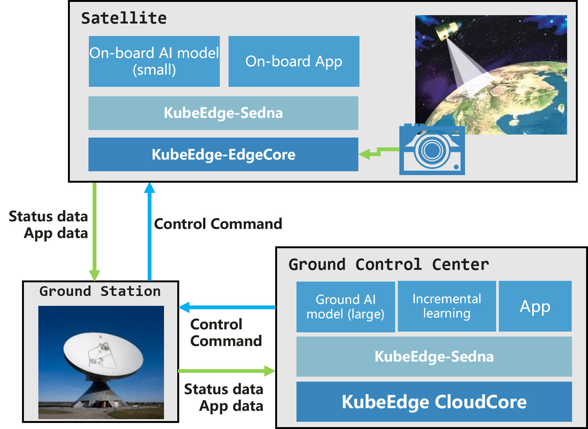

# Global First Cloud-Native Edge Computing Satellite Cloud-Edge Integrated Solution Verified in Space

Since 2020, the data volume generated by satellites has, for the first time, exceeded the data transmission volume. A large amount of data urgently needs on-orbit computing processing, 
and satellites desperately need to become "intelligent". The emergence of cloud-native edge computing platforms effectively lowered the experimental threshold for space-based computing, 
making satellite management as simple as managing ground servers - "a click of the mouse on the ground, a tremor in the satellite in space".

## Background: Satellite Aims to Solve On-Orbit Computing Challenges

Traditional satellites are closed architectures, with satellites customized for specific tasks, payloads tailored for specific satellites, 
and software designed for specific payloads. One satellite, one mission, one launch defining its entire lifecycle. 
This closed system architecture necessarily leads to hardware and software incompatibility, inability to interchange and reuse, 
and very slow technological iteration.

To address these issues, satellite manufacturers both domestically and internationally proposed software-defined satellites from a software-defined perspective. 
Software-defined satellites are a new type of intelligent satellite centered on space-based computing, adopting an open system architecture that supports plug-and-play payloads and on-demand application loading. 
They can conveniently redefine satellite functions through software updates, flexibly adapting to multiple tasks and user types. Examples include SmartSat, GSky-1, Eutelsat Quantum, and OneSat, etc.

However, software-defined satellites still face numerous difficulties in software or application packaging, distribution, deployment, upgrades, and maintenance. 
They struggle to meet the satellite's on-orbit business requirements for rapid iteration, instant deployment, grayscale release, and continuous evolution. 
As a result, both domestic and international efforts are trying to develop a new generation of intelligent satellites.

## Breakthrough: From Nothing to Something, Breaking On-Orbit Computing Barriers

On December 7, 2021, the world's first cloud-native satellite was successfully launched. As the global first cloud-native satellite, 
it leverages container technology, microservices, and agile methods to achieve continuous application delivery through DevOps, with the following advantages:

- **Rapid Deployment:** Cloud-native satellites use agile development and DevOps, enabling users to quickly develop programs, automatically deploy applications, 
and continuously update onboard applications. This allows applications to keep up with changing demands, and even guide demand evolution.

- **Elastic Scaling:** Cloud-native satellites inherently possess cloud computing characteristics, with resources that can be scaled according to actual conditions, 
improving resource utilization.

- **Security and Reliability:** Relying on container orchestration and microservices, cloud-native satellites enable onboard applications with capabilities like automatic recovery, 
fault tolerance, and fault isolation. This helps address complex space environments, keeping applications constantly available.

- **High Autonomy:** Using containerization technology, onboard applications run within containers, independent of location and environment. The dependencies, 
configuration files, and backend services required to build applications are integrated, achieving self-management.

By utilizing cloud-native edge computing technology, satellites can process data in space, significantly reducing transmission pressure and meeting the diverse needs of aerospace fields. 
Traditional communication and remote sensing satellites only have storage capabilities, merely storing data to be transmitted back to the ground, without onboard processing capabilities.

**Significance: Giving Satellites "Apps", Enabling "Business in Space and Services in Orbit"**

As shown in the diagram, by reconstructing the KubeEdge system and lightweight AI inference model Sedna according to satellite characteristics, empowering satellites with cloud-native edge computing capabilities, and achieving collaborative AI inference between satellites and ground stations, the following was accomplished:
- In remote sensing scenarios, on-orbit target identification accuracy improved by over 50%
- Satellite data transmission volume reduced by 90%
- Support for in-orbit continuous AI model updates

The arrival of cloud-native satellites brings enormous transformation to flood prevention and disaster mitigation. In the past, when a flood occurred, 
ground control first had to transmit instructions to the satellite to "photograph disaster area images", then the satellite would transmit the captured images back. 
The need for on-orbit computing was urgent.

Especially in Southwest China, 80%-90% of data is obscured by cloud layers and is useless, yet satellites would still transmit this data back to the ground. 
After transmitting all images, ground stations would perform cloud detection and water area extraction, typically generating monitoring reports in one day. 
Since satellites lack filtering and processing capabilities, all data must be transmitted to the ground for further application, making on-orbit computing a pressing demand.

With cloud-native edge computing, when a flood occurs, satellites can:
- Use on-orbit AI inference to discard low-quality image data covered by clouds or snow by more than 50%, reducing transmission pressure
- After transmitting effective images, utilize high-precision AI models at ground-based computing resource-rich center nodes
- Further shorten image preprocessing, water area extraction, and monitoring report generation time
- Reduce emergency response time from days to hours

Beyond reducing emergency response time from days to hours, satellite edge tasks can be updated on-demand. Through on-orbit AI inference, satellites can:
- Compare images before and after heavy rainfall
- Detect potential mountain collapse risks
- Discover geological disaster hazards in advance
- Provide early warnings

After successfully verifying cloud-native edge computing in space, subsequent developments aim to form a collaborative computing network in space. 
In the future, this technology hopes to better serve aerospace, emergency communications, ecological monitoring, disaster prevention and mitigation, and urban construction.