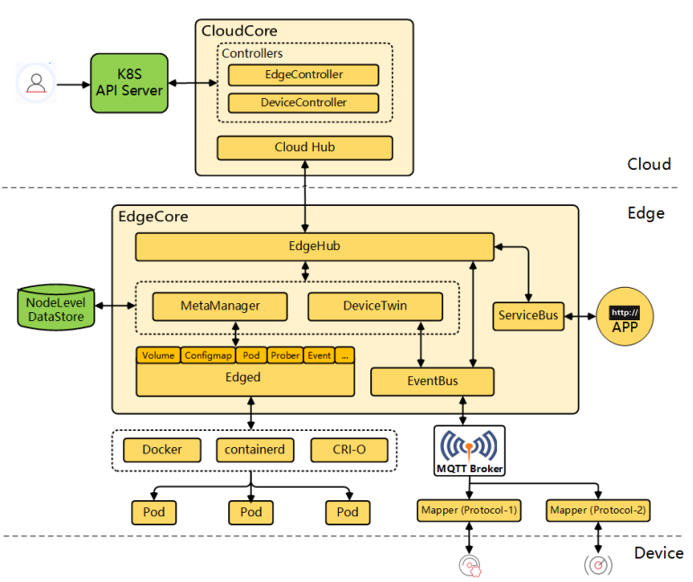
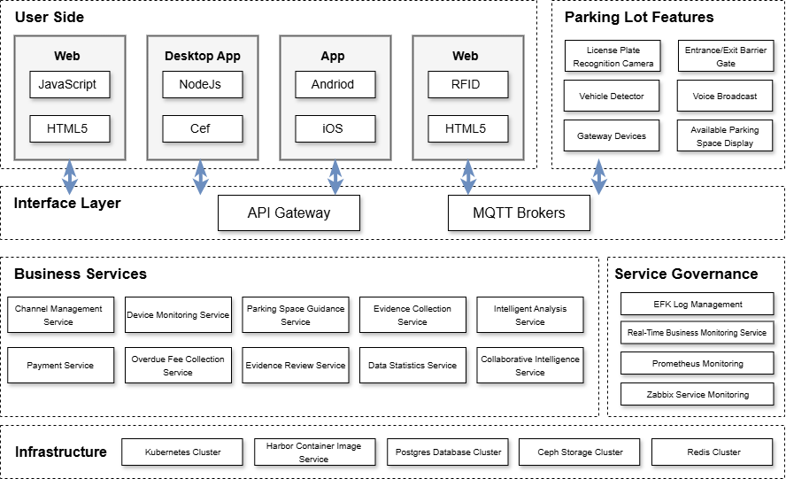
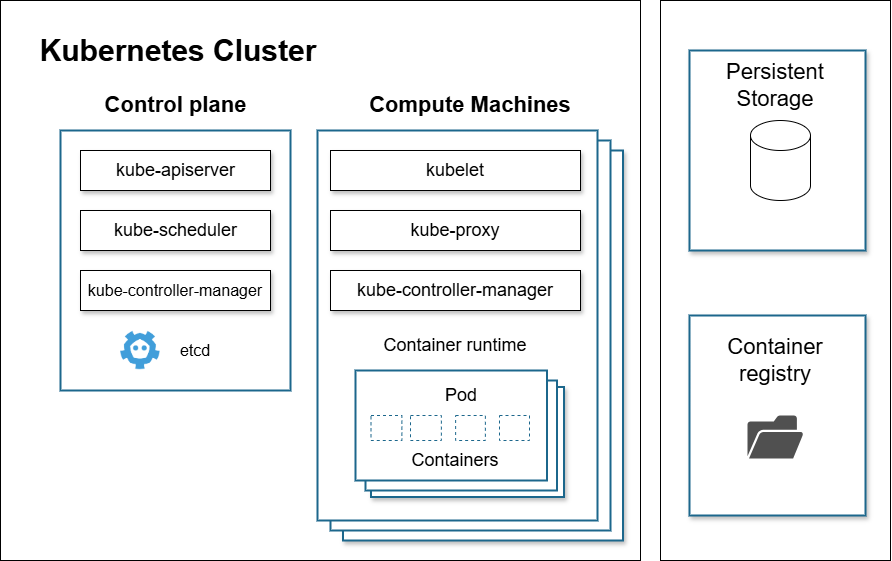
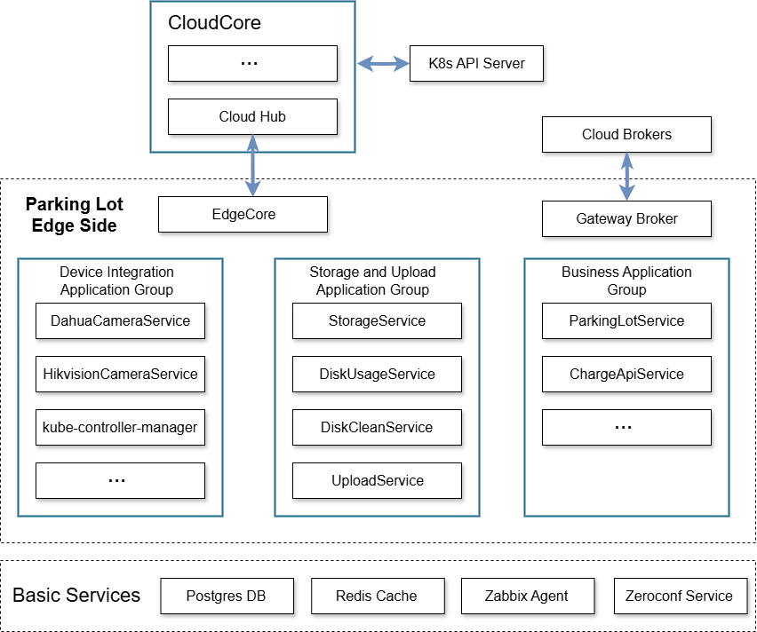
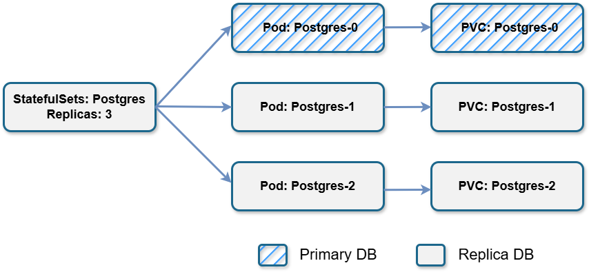

# ZCITC practice in smart parking base on KubeEdge

As cities continue to integrate diverse parking resources and expand application scenarios, edge applications are becoming increasingly complex.
The number of edge nodes is growing rapidly, generating massive data, and presenting challenges for managing edge applications. The main challenges include:

(1) Complex network topology and unstable network access. During the transformation of traditional parking lots into smart facilities and the construction of 
new intelligent parking lots, the network planning depends on project requirements, physical locations, and road layouts. Large parking lots with fiber optic 
conditions can use dedicated lines, while others must rely on mobile networks due to physical constraints. The network quality varies, and municipal construction 
can occasionally cause power and network outages, impacting system availability.

(2) Highly customized requirements and rapid iteration updates. Cities host a variety of parking resources, such as public street parking, commercial lots, 
residential lots, and shared spaces. Each parking lot has unique technologies, operators, and fee policies, making a single application version insufficient. 
Even after construction, applications require updates to accommodate operations like promotional discounts during events. These factors demand excellent version control, 
scalability, and elastic deployment capabilities.

(3) Challenges of heterogeneous edge gateway hardware. Parking lot sizes and computational demands vary significantly. Small lots may only have one entry/exit and a few spaces, 
while larger lots have multiple zones and unique pricing policies. These differences lead to diverse hardware requirements, including x86_64, aarch32, and aarch64 CPU architectures, 
adding complexity to the technical stack and increasing management challenges for development teams.

Zhejiang Zhicheng Software Co., Ltd. specializes in city-wide smart parking solutions, leveraging big data for intelligent parking resource integration. 
To address the needs of unattended parking lots for high security, reliability, efficiency, and maintainability, the Zhicheng team increasingly deploys 
containerized applications on edge nodes at parking lots.

# Cloud-Native Edge Computing Technology

Edge computing is a distributed architecture that processes data closer to the user, reducing latency and improving transmission speeds compared to cloud computing. 
Cloud-native methods build and run applications using open-source technologies like Kubernetes and Docker. They rely on microservice architectures, 
agile methodologies, and DevOps practices to enable flexibility, scalability, and automation.

As computing demands grow, combining cloud-native and edge computing creates a new technical trend: cloud-native edge computing. 
This approach brings cloud capabilities to edge devices, enabling offline operations, edge-cloud collaboration, and massive device connectivity. 
KubeEdge is a leading solution implementing this paradigm, extending Kubernetes’ capabilities to the edge.

# Smart Parking OS Based on Cloud-Native Architecture

## Overall Architecture

The integrated smart parking platform combines on-street and off-street parking resources, fuses static and dynamic traffic data, 
and supports multiple operators to create an open ecosystem. It provides operational services and solutions for parking managers and users. 
Using a cloud-native architecture, Zhicheng containerized all parking lot services, deploying them either in the cloud or on edge nodes as needed. 
Together, the cloud services, on-site sensors, control devices, and edge applications form a parking cloud service system.

## Technical Implementation

Kubernetes offers a model for cloud-native application orchestration, while KubeEdge extends these capabilities to the edge. This ensures support 
for complex edge scenarios and high availability. Below is an overview of the relationship between Kubernetes clusters and their components.

The edge side of parking lots comprises loosely coupled containerized applications leveraging Kubernetes and KubeEdge to meet functional demands.

Key applications deployed on the edge include:

(1) **Core Service Group:** Uses Postgres for data storage, Redis for caching to reduce disk I/O, Zabbix for physical machine monitoring, 
and Zeroconf Service for gateway discovery for user interfaces like toll booths.

(2) **Gateway Broker:** Provides message subscription, publication, and bi-directional communication with the cloud platform.

(3) **Device Integration Applications:** Independent services for cameras, gates, display screens, voice announcements, and vehicle detectors. 
These services are low-coupled, allowing flexible deployment.

(4) **Storage and Upload Applications:** Manage local storage and upload of sensor data like images and videos, monitor disk usage, 
and perform periodic data cleanup.

(5) **Business Applications:** Handle vehicle entry/exit, order generation, channel control, and payment calculations.

### Functional Features:

1. **Edge Database Master-Slave Configuration:**
   For large-scale parking lots, dual or multiple machine hot-standby solutions are implemented. PostgreSQL and Redis applications use StatefulSet mechanisms for stable re-scheduling.

2. **Multi-Active Redundancy:**
   Kubernetes ReplicaSet ensures multiple application replicas are active simultaneously for load balancing and high availability.

3. **Node Deployment of Related Applications:**
   Parking management applications and device control services are co-deployed to optimize communication and response times.

4. **Cross-Node Deployment of Application Instances:**
   Instances of the same application are deployed across nodes to improve availability.

5. **Grouped Deployment Based on Edge Node Properties:**
   Applications are deployed based on edge node labels for different CPU architectures or device types.

6. **Automatic Deployment of New Nodes:**
   Newly added nodes are labeled, and applications are automatically deployed.

7. **Inter-Linked Parking Lots:**
   Complex scenarios requiring communication between parking lots use KubeEdge’s EdgeMesh for lightweight, integrated service discovery.

## Results

Currently, Zhicheng's smart parking operating system has undergone domestic innovation transformation, with containerized applications fully adapted to computing platforms with x86_64, 
aarch32, and aarch64 CPU architectures, elastically adapting to parking lot scale and construction costs. Gateway devices use lightweight MQTT protocol for message communication, 
achieving low consumption and stability while greatly reducing bandwidth pressure. Kubernetes' container orchestration capabilities bring rapid deployment and high availability to 
parking lot systems.

In practice, implementation teams can deploy one or several edge gateway devices with appropriate computing power as edge computing platforms according to parking lot size and turnover rate, 
following a "one block, one strategy, one solution" approach. Edge computing provides the following capabilities for the cloud platform:

(1) Intelligent access to parking lot devices. Achieves collection and reporting of sensor data from entrance/exit cameras and vehicle detectors, and networked control of barriers, 
space display screens, voice broadcasting, and other control units.
(2) Two-way synchronization of business data. Real-time communication with the cloud, receiving basic information like parking lot, channel, and vehicle whitelist information from the cloud; 
pre-processing vehicle entry/exit information, generating parking orders, and calculating fees based on charging schemes. Business data has two-way synchronization capability while ensuring data consistency.
(3) Short-term offline working capability. Provides limited services to drivers during short disconnections, such as barrier opening for entry, whitelist and free order barrier opening for exit, 
and offline parking fee calculation. Data automatically synchronizes when network connection is restored to maintain cloud and edge data consistency.
(4) Load balancing and high availability. Elastic deployment, with some critical businesses meeting "single-point multi-active" and "cloud-edge" multi-site active scenarios, 
providing load balancing and high availability for parking lot business.
(5) Continuous delivery, rapid deployment, and application updates. Fully containerized applications, combined with Kubernetes and KubeEdge orchestration deployment capabilities, 
achieve rapid iteration and continuous delivery of parking lot business, with automated deployment, update, and rollback operational management capabilities for edge nodes.

## Conclusion

Currently, unmanned fee collection services and online operations are in the early blue ocean market and provide core value of cost reduction and efficiency improvement for users. In the future, 
Zhicheng will continue to focus on IoT, edge computing, and other technologies to provide intelligent operation capabilities for parking lots, dedicated to improving parking space turnover and occupancy rates, 
reducing labor costs, and thereby increasing parking lot operational benefits.
